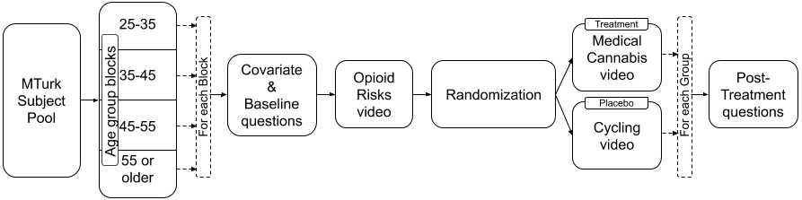
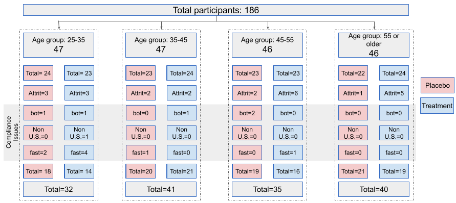

```{r include=FALSE, message = FALSE, warning = FALSE}
# load packages
library(data.table)
library(foreign)
library(knitr)                          
library(AER)
library(dplyr) 
library(sandwich)   
library(ggplot2)
library(corrplot)
library(RColorBrewer)
library(egg)
library(ggthemes)
library(cowplot)
library(lmtest)
library(multiwayvcov)                  
library(stargazer)
```

```{r echo = FALSE, include=FALSE, message = FALSE}
# Clear environment
rm(list = ls())

# Removes hash from output
knitr::opts_chunk$set(comment = NA)


# Set default theme for ggplot
theme_set(theme_bw())

# Calculates robust standard errors
compute_robust_ct <- function(model) {
  model$vcovHC <- vcovHC(model, type="HC0")
  return(coeftest(model, vcov. = model$vcovHC))
}

significance_stars = function(p) {
	stars = symnum(p, na = F, cutpoints = c(0, .001, .01, .05, .1, 1), 
						symbols=c("**`***`**","**`** `**", "**`*  `**", "**.  **", "   "))
	return(stars)
}

```

\pagebreak

\begin{center}
Abstract
\end{center}
>The United States is in the midst of an opioid crisis caused primarily by a dependence on opioids as painkillers. Yet, the US is also plagued by misinformation about a potential substitute painkiller - medical cannabis. This experiment examined whether American adults were more likely to want to learn about medical cannabis as a potential painkiller substitute for opioids when presented with scientifically grounded information on the subject. We created two surveys, one placebo and one treatment, and distributed each to a different set of American adults over the age of 25. The subjects were blocked by age and then randomly selected and assigned to a group. We examined four outcome variables and found a statistically significant result - that American adults are likely to want to learn more about the medical benefits of cannabis when presented with scientifically-grounded information on this topic.

# Background  

Did you know that September is Pain Awareness month?$^{[1]}$. Pain is regarded as chronic when it lasts or recurs for more than 6 months. According to the Centers for Disease Control and Prevention (CDC)$^{[2]}$, in 2016, approximately 20% of U.S. adults experienced chronic pain (approximately 50 million individuals) and 8% of U.S. adults (approximately 20 million individuals) experienced high-impact chronic pain. In addition causing literal pain, the CDC$^{[2]}$ estimates that chronic pain also costs Americans at least 560 billion USD per year in medical expenses, lost productivity, and disability programs. Chronic pain can additionally lead to mental health issues, including anxiety and depression.

The U.S. Department of Health and Human Services (HHS)$^{[3]}$ has a developmental objective to “decrease the prevalence of adults having high-impact chronic pain”. According to the HHS, treatment for chronic pain usually focuses not on curing the pain but on managing it - reducing the pain and increasing people’s ability to move and function so their day-to-day life can improve. Treatment options include prescription pain medications, acupuncture, physical therapy, relaxation techniques, biofeedback, massage therapy, psychotherapy, and behavior modification.  

In the United States, individuals who suffer from pain are often prescribed opioids$^{[4]}$ to treat their conditions. Over-dependence on opioids has contributed to what has been dubbed as an 'opioid crisis' in the U.S. The dangers of prescription misuse, opioid use disorder, and overdose have been a growing problem throughout the U.S. From 1999 to 2018, more than 232,000 people died in the U.S. from overdoses involving prescription opioids. Overdose deaths involving prescription opioids were more than four times higher in 2018 than in 1999, according to CDC$^{[5]}$. Even as the amount of opioids prescribed and sold for pain has increased, the amount of pain that Americans report has not similarly changed. At present, this is almost a disproportionately American problem - the U.S. constitutes less than 5 percent of the world’s population yet consumes 80 percent of the world's opioid supply.  

Doctors now struggle to balance caring for patients with debilitating pain and meeting new standards and guidelines for opioid prescriptions. It is clear that opioids cannot be the end solution for chronic pain due the ongoing opioid crisis in the United States. Solving the 'chronic pain problem' represents a lucrative opportunity. Consequently, researchers have begun to explore alternatives to opioids, such as medical marijuana.

According to the National Institutes of Health’s National Center for Complementary and Integrative Health$^{[6]}$, medical marijuana, also known as cannabis, has been used in medical treatment for more than 3,000 years for a plethora of conditions, including pain relief, digestive issues, and psychological disorders. Some studies have concluded that medical cannabis may be a viable alternative for opioids$^{[7]}$.  

# Research Question  

In the U.S., the use of cannabis for medical purposes is legal in nearly 40 states, as well as in four out of five permanently inhabited U.S. territories and the District of Columbia$^{[9]}$. It is estimated that 2.1 million Americans (approximately 0.64% of U.S. adults) use medical cannabis, whereas approximately 50 million Americans (approximately 20% of U.S. adults) have chronic pain. The disparities between these numbers demonstrate the opportunity for medical cannabis as a painkiller.

The chemistry of cannabis is anything but straightforward, and its complexity has made it difficult to discern long and short-term effects on participants. Consequently it is difficult to easily write a digestible FAQ on the benefits and risks of the substance. Furthermore, cannabis is generally considered to be a political subject in the United States. As a result of its politicized nature, a lot of Americans  write and share opinions about cannabis that do not necessarily rely on data or scientific analysis. This onslaught of non-scientific information on the subject has lead to a copious amount of misinformation on the use of marijuana. As people are dying in the U.S. from overdoses involving prescription opioids, can we educate people suffering from chronic pain about the benefits of medical cannabis? If yes, will they opt to try using medical cannabis?

Our research question is, __*‘Does providing initial, scientifically-grounded information on the benefits of medical cannabis for chronic pain increase participants' desire to learn more about the benefits of medical cannabis?’*__  

# Prior Beliefs
The following beliefs will be validated with the experiment:  
1. U.S. residents are interested in learning more about the medical benefits of cannabis when they first receive some initial authoritative information on this topic.  
2. Cannabis is portrayed as more harmful than it actually is.  
3. There is a lot of misinformation getting circulated among U.S. residents about medical cannabis.  
4. U.S. residents believe that medical cannabis is addictive.  

# Research Design  

## Idealized experimental design
Since chronic pain is a global issue, our idealized experiment would include participants living across the globe. We would only select participants who experience chronic pain and who live in areas where medical marijuana is legal. Ideally, we would recruit more than a million participants. Doing so would ensure that our participants are roughly representative of the global population and consequently that the results can be applied globally. Participants on pain medication and not on medical cannabis could be recruited through social media ads and print media advertisements. We will evaluate the treatment participants' prior knowledge on cannabis by giving a simple exam on this topic before the treatment. During the experiment execution phase, participants will be given one-on-one informational sessions on the medical benefits of cannabis.

A further optimization to this idealized experiment could involve a natural experiment, in which the researchers put up a control advertisement in certain cities and a treatment advertisement in other cities. The researchers could then observe participants interacting with the advertisements and measure the corresponding effects. This would also allow us to cluster our participants based on physical location. We believe that this idealized natural experiment would have the same properties as a true, controlled experiment.

An alternative optimization would be to examine cannabis and opiate-related advertisements in states where cannabis is legal versus those in states where cannabis is not legal. This would allow the researchers to get observational data clustered by city and infer a reasonable conclusion based on this data.

## Non-idealized, realistic design given constraints  
The idealized experimental design involves more time and money than we have available to us. As a result, we will narrow the scope of the experimental design. We will narrow the scope of our participants to only U.S. participants. We will accept participants from any U.S. state and who have experienced all levels of pain (including none at all).

Due to the ongoing COVID-19 pandemic, we will be unable to conduct our surveys in person. Consequently, we will conduct our research in an online setting - participants will be recruited through Amazon Mechanical Turk (MTurk) and will complete a survey through Qualtrics.

## Hypotheses  
__Primary Outcome__  
Desire to learn more about medical cannabis  
$H_{0}$: *There is no desire to learn more about medical cannabis's benefits for chronic pain after providing some info on medical cannabis benefits.*

$H_{a}$: *There is a desire to learn more about medical cannabis's benefits for chronic pain after providing some info on medical cannabis benefits.*

__Other Outcomes__  

Medical cannabis is generally portrayed as more harmful than it actually is  
$H_{0}$: *Cannabis is not portrayed as more harmful than it actually is.*

$H_{a}$: *Cannabis is portrayed as more harmful than it actually is.*


Lot of misinformation about medical cannabis  
$H_{0}$: *There is no misinformation about medical cannabis.*

$H_{a}$: *There is misinformation about medical cannabis.*


Medical cannabis is addictive  
$H_{0}$: *Medical cannabis is not addictive.*

$H_{a}$: *Medical cannabis is addictive.*


## Analytic Plan
The following is our analytic plan:    
1. Analyze the distribution of outcome measures.  
2. Compute the average treatment effect (ATE) using regression.  
3. Compute robust standard errors.  
4. Compute heterogeneous treatment effects.  

## Participants

__How participants are recruited__   

The opioid epidemic is by far the most prevalent in the U.S.. Consequently, we believe it is acceptable to limit this experiment to American participants (around 150~200 participants). Since there is a risk of non-homogeneity of participants that we may get through social media, participants will be recruited using Amazon Mechanical Turk (MTurk)$^{[10]}$. 

After a subject from MTurk starts the survey, that subject is randomly assigned to either the placebo or the treatment group. We are able to achieve complete randomization by employing Qualtrics' survey technology to completely and blindly assign participants to one group. We recognize that often times deliberate variation within subgroups via an intervention can sometimes be more useful in terms of observing a treatment effect than pure randomization. Having said that, in this specific case we felt that complete randomization of participants within age blocks (as detailed later in this paper) is more appropriate for this specific experiment. We believe this is the case because we did not want to further divide participants based on other subject attributes (e.g. gender, ethnicity) and potentially introduce bias from the experimenters' preconceived notions. Complete randomization within age blocks allows us to be confident that our experimental results are representative of American adults.

__Location of participants__   

The legalization status of marijuana varies from U.S. state to U.S. state. Additionally, recent elections have also affected the legalization of cannabis in different states. Each U.S. state falls into one of the following categories: (Marijuana is completely illegal, Only medical marijuana is legal, Recreational and medical marijuana are legal, Medical marijuana is not yet legal but was legalized in the 2020 election, Recreational marijuana is not yet legal but was legalized in the 2020 election). We will collect information on what state an individual is from and the legal status of marijuana in that state and consider it as a covariate in this analysis.

We recognize that we could have considered clustering participants based on location (clustering on American state). We do not believe that that this is appropriate for this experiment. Clustering normally comes into play when it is impossible to randomly assign participants to group within a given attribute like location. Since we are able to randomly assign participants to group within location, we choose not to use clustering in this experimental design.

__Age of participants__   

The legal age for consuming cannabis varies from state to state in the US. Generally the legal age to consume cannabis is 21 years of age or older. Consequently, we will not examine participants who are aged less than 21 years old. MTurk blocks participants at 18-25 and unfortunately we cannot break this block into the more granular blocks of 18-21 and 21-25. Since we can only ignore the block of participants age 18-25, we will only allow participants to participate who are at least 25 years old.  We believe it is important to use MTurk's blocks because it helps us minimize potential *noncompliance issues*, such as the participants lying about their age so that they can get paid to take the survey.

Consequently, our experiment uses blocking. We believe that blocking on age can only be beneficial to experiment. We believe that normally using MTurk participants would cause an imbalance in subject age, likely skewing younger as younger participants are more likely to be familiar with MTurk technology and this employment opportunity. We believe that blocking on age will allow for more precision by not conducting a randomization on the age covariate, which we believe would normally be very imbalanced.

The reader should note that excluding participants that fall within an age group is common for experiments with small samples. Having said that, we recognize that this introduces a concern around subject imbalance. We believe that we are able to maintain an even distribution across age due to our blocking of age. The consequences of excluding the youngest age group of adults (age 21-24) is that our participants will skew older than the overall adult population of the United States. As a result, this implies that our experimental results may not be valid for American adults aged 21-24.

Although out the outset it seems that excluding the youngest age group of American adults might prove to be a detriment to our experiment, we believe that ignoring the age block of 21-24 is acceptable since the CDC reports$^{[14]}$ that chronic pain is only present in 8.5 percent of the population for the age group (18-29). We suspect that this number is even lower for participants aged 21-24. 

## Block Random Assignment  

The participants are blocked by age a)25-35, b)35-45, c)45-55 and d)55 or older.  Our use of blocking increases the statistical power of this experiment because the severity of the chronic pain varies across age groups. This blocking also reduces sampling variability and improves the precision of the estimated treatment effect and will help us conduct further analysis based on age groups. Randomization will be done within each block, and participants will be assigned to treatment and placebo groups accordingly.  

  
&nbsp;
```{r echo=FALSE, fig.align = 'center', fig.id="randomization_chart", fig.cap="Randomization flowchart", fig.cap.style="Image Caption", out.width = "100%"}
#
```

## Treatment  

All the participants will be given an initial questionnaire, generated by Qualtrics, to get information on the covariates. We will randomize the participants within the block and assign them to treatment and placebo groups. The treatment group will be shown two videos: "Opioids - Risks & Side effects" and  "Benefits of Medical Cannabis". In contrast, the placebo group will be shown these two videos: "Opioids - Risks & Side effects" (the same one that the treatment group participants saw) and "Benefits of Cycling". In the end, the participants will respond to several post-treatment five-point Likert scale questions. The experiment duration will be short and the results will be collected from the Qualtrics service.

__Treatment group videos__  

| Video     | Title     | Link     |  Duration            |
|--------------|--------------|--------------|--------------|
| 1 | Opioids - Risks & Side effects | [[Opioids]](https://youtu.be/y0mfzDAs1BE)| 2 min. and 19 sec. |
| 2| Benefits of Medical Cannabis | [[Med. Cannabis]](https://youtu.be/OhJ0YaJXrJo)  | 5 min. and 3 sec. |


__Placebo group videos__  

| Video     | Title     | Link     |  Duration            |
|--------------|--------------|--------------|--------------|
| 1 | Opioids - Risks & Side effects | [[Opioids]](https://youtu.be/y0mfzDAs1BE)| 2 min. and 19 sec. |
| 2 | Benefits of Cycling | [[Cycling]&nbsp;&nbsp;&nbsp;&nbsp;&nbsp;&nbsp;&nbsp;&nbsp;&nbsp;&nbsp;](https://youtu.be/xWo0FOwZVX0)  | 5 min. and 3 sec.  |


## Assumptions

__Random Assignment__  
Participants are randomly assigned to either the placebo or the treatment group within each age block by using the same random procedure (Qualtrics randomizer).  

__Excludability__  
The excludability restriction is not violated because all participants in the treatment group are exposed only to treatment, and participants in the placebo group are never exposed to treatment. The experimental design ensures that the same procedures are used to measure outcomes in the placebo and treatment groups. We strongly believe that no other treatments, research activities, or third-party interventions occurred during the experiment as the survey used in the experiment can be completed in 5 minutes after randomized group assignment.

__Non-Interference (SUTVA)__  
Care was taken in the experiment's design and execution to avoid Non-Interference/ Stable Unit Treatment Value Assumption (SUTVA) violations. We addressed this in several ways. First, we recruited the participants throughout the U.S. so that the participants' are extremely unlikely to interact with one another. We recruited 186 participants from 41 states. Second, we minimized the treatment and placebo videos length to 5 minutes total so that participants can complete their parts of the experiment soon after random assignment. Consequently, we anticipate negligible interference from participants discussing these surveys with one another.  Thirdly, we launched the experiment on a weekend to avoid the possibility of participants who are coworkers discussing this experiment. Finally, we examined each participant's IP address. If participants are from the same household, they will have the same IP address and our program will flag them to be filtered out of the experimental results. We strongly believe that our experiment upholds the Non-Interference / Stable Unit Treatment Value Assumption (SUTVA) assumption.   

## Covariates  
We monitored some of the covariates like Gender (Male/Female/Other), Race/Ethnicity (American Indian or Alaska Native, Hispanic or Latino, White/Caucasian, Black or African American, Asian, Native Hawaiian or Other Pacific Islander, Other), Education (Less than high school, High school, Some college, Bachelor’s degree or higher), Employment status (Employed, Not employed). We also include an important covariate about the participant's existing chronic pain - ‘Do you experience chronic pain?’.  

1. Gender: Male/Female/Other.
2. Age groups: a)25-35, b)35-45, c)45-55 and d)55 or older.
3. Ethnic background (White/Caucasian, Black or African American, Hispanic/Latino, Asian, Other).
4. Education (Less than high school, High school, Some college, Bachelor’s degree or higher).
5. Employment status (Employed, Not Employed).
6. State (available from Qualtrics meta information). Note: Using State covariate, created another covariate on medical cannabis legality type (Legal, Illegal).
7. Political beliefs (Liberal, Conservative, Independent/Other).  

__Pre-treatment__   

8. Do you experience chronic pain? (Yes/No)

The following question provides the baseline on the participants knowledge of prescription opioids and the problems associated with:  

9. Deaths due to overdoses involving prescription opioids are increasing (Likert 5 point scale).  

__Post-treatment Questions__(Likert 5 point scale)    

10. Do you have a desire to learn about the benefits of medical cannabis for chronic pain?
11. Medical cannabis is generally portrayed as more harmful than it actually is
12. There is a lot of misinformation about medical cannabis
13. Medical cannabis is addictive  

## Participant Consent and Data Privacy  
To participate in this survey, the participant has to consent that:  
1. Voluntarily agree to participate.  
2. Share history with pain (if they have any).  
3. At least 21 years of age.  

We are cautious to not collect too much personal information about our participants in order to honor the HIPAA (Health Insurance Portability and Accountability Act) regulations that protect participants' personally identifiable information (PII) and protected health information (PHI). The HIPAA regulations are not violated by this experiment as we do not collect any individually identifiable health information. Consequently, we also do not store or transmit any such data. The data we collect cannot uniquely identify a person and is used for statistical analysis only. Please note that we do collect each participant's IP address. However, in order to ensure we do not violate any HIPAA regulations, we do not view the IP addresses directly and instead only view a hashed version of the IP address (generated using the MD5 algorithm with 128 bits). 
 
&nbsp;
  

## Risks  

We recognize that one major risk to this study is that the current COVID-19 pandemic might influence  participants' opinions captured in our survey. There is no way for us to ensure participants will respond in the same way now as they would have before the COVID-19 pandemic. Another risk is that, due to time and budget constraints, as well as HIPAA regulations, we cannot select exclusively participants who experience chronic pain. A third risk is that we are choosing to not ask about the severity of each subject's chronic pain, where the pain is, how long the pain lasts, and so on and so forth. We feel justified in this choice as such data might violate HIPAA regulations. However, not collecting this data will make it more difficult to identify potential covariates or confounding variables. The final risk that we identify here is that we are having subject's answer questions rather than relying on official medical records. As a result, there may be some data inaccuracies captured by this survey.

## Fair pay    
Since fair pay and realistic completion times significantly impact data quality from crowdsourced surveys$^{[15]}$, we will offer fair compensation. We calculated fair compensation by first estimating how long it will take to complete this survey (approximately 10 minutes). We then looked at the U.S. federal minimum wage (7.25 USD per hour) and offered each user more than the federal minimum wage by paying them 1.50 USD for 10 minutes of work (or 9 USD per hour). 

## Pilot experiment  

In the pilot experiment, we recruited 40 participants from the U.S. to improve upon our research design before conducting a full experiment. We blocked participants in two age groups (25-30 and 45-55) in order to pilot the experiment with one younger group and one older group. Each group had 20 participants. 

__Power__
```{r echo = FALSE, message = FALSE}
# All

#https://www.rdocumentation.org/packages/stats/versions/3.6.2/topics/power.t.test

# standard deviation calculation
# d_sd <- d[, sd(MC_DesireToLearn, na.rm=TRUE)]
# The SD above will have some noise as we are cleaning up the data later. If we call this function at the end of it, we will get SD as 1.03. Otherwise, we get 1.004.
# So, hardcoded sd here as 1.03
d_sd <- 1.03
# power - power of test (1 minus Type II error probability)
p <- power.t.test(delta=0.3, sd=d_sd, sig.level = 0.05, power = 0.80, 
                 alternative = "one.sided")
p
```
To achieve 80% power with a treatment effect of ~0.3 and standard deviation of 1.03, we need ~150 participants for our full experiment. Considering attrition, we chose to recruit 186 participants for the full experiment.  

__Changes made based on the pilot experiment results__  
Based on the results of our pilot experiment, we changed the following elements of our experimental design for our full experiment:  

- Changed the political affiliation question *"Generally speaking, do you usually think of yourself as a Republican, a Democrat, an Independent, or Something else?"* to *"In general, how would you classify your political beliefs? Liberal,  Conservative, Independent/Other"* in order to generalize political leanings away from American political parties.
- Added one more outcome measure *"Medical cannabis is generally portrayed as more harmful than it actually is"* with 5 point Likert scale. 
- Changed the time of experiment launch to better accommodate daytime hours across multiple time zones. We launched the pilot experiment around 5:00 pm (PST) and as a result most of our participants lived on the West Coast. In order to get participants from all over the U.S., we instead launched the full experiment around 11:00 am (PST).


## Distribution of full experiment participants
 
  
The above map shows Medical Cannabis Legal(including states which allow only Cannabidiol [CBD] oil) and Illegal status by state and the participants count in each state. We can observe that the participants are uniformly distributed across the U.S.

# Data Analysis

## Attrition Analysis

```{r echo = FALSE, include=FALSE, message = FALSE}
# Load data
d <- fread("./Full-Data.csv")
d[1:10]
``` 


```{r echo = FALSE, include=FALSE, message = FALSE}
# Add/Rename columns
# Surya

# Rename columns
setnames(d, 
         c("LocationLatitude","LocationLongitude","Q_RecaptchaScore","Duration (in seconds)","OpiodsDeathsIncreasing"), 
         c("Latitude", "Longitude", "RecaptchaScore","Duration","OpioidsDeathsInc"))
```

```{r echo = FALSE, include=FALSE, message = FALSE}
# Display column names
column_names <- colnames(d)
#cat(paste(shQuote(column_names, type="cmd"), collapse=", "))
cat(paste(column_names, collapse=", "))
```

```{r echo = FALSE, include=FALSE, message = FALSE}
# Select required columns for analysis. Add additional columns based on the need

d <- d[, c(
  "Duration", "Finished", "RecaptchaScore", "Gender", 
  "AgeGroup","Ethnicity","Education","Employed","PoliticalBelief",
  "ChronicPain","OpioidsDeathsInc","AssignmentGroup",
  "MC_DesireToLearn","MC_PortrayedHarm","MC_MisInfo","MC_Addictive","IPAddress",
  "Region","Country","MC_Legal",
  "ResponseId"
)]


```

```{r echo = FALSE, include=FALSE, message = FALSE}
# Only required columns
d[1:10]
```

```{r echo = FALSE, include=FALSE, message = FALSE}

# Add columns
# Treatment
d[,treated:=ifelse(AssignmentGroup=='Treatment',1,0)]

# Missing
d[,missing:=ifelse(Finished=='TRUE',0,1)]

#Add MC state legal
d[,MC_Legal_State:=ifelse(MC_Legal=='Legal',1,0)]


# Add any derived columns based on the need

# Factors
# stackoverflow.com/questions/39279238/why-use-as-factor-instead-of-just-factor
# Use the complete scale. Otherwise, we might miss the ordering if one value
# is missing in the total responses

# AgeGroup
# Blocked by age
d[, AgeGroup := factor(AgeGroup, levels = c("25-35", "35-45", "45-55", 
                                              "55 and Older"), 
                         ordered = TRUE)]

# Gender
# What is your Gender?
d[, Gender := factor(Gender, levels = c("Male", "Female", "Other"), 
                       ordered = FALSE)]

# Ethnicity
# Please specify your ethnicity
d[, Ethnicity := factor(Ethnicity,
  levels = c(
    "White/Caucasian", "Black or African Am.",
    "Hispanic/Latino", "Asian", "Other"
  ),
  ordered = FALSE
)]

# Education
# What is the highest level of school you have completed or the highest degree
# you have received?
d[, Education := factor(Education,
  levels = c(
    "Less than high school", "High school",
    "Some college",
    ">=Bachelor's degree"
  ),
  ordered = TRUE
)]

# Employed
# What is your Employment status?
d[, Employed := factor(Employed,
  levels = c("No", "Yes"),
  ordered = FALSE
)]

# PoliticalBelief
# Generally speaking, do you usually think of yourself as a Republican,
# a Democrat, an Independent, or Something else?
d[, PoliticalBelief := factor(PoliticalBelief,
  levels = c(
    "Liberal",
    "Conservative",
    "Ind./Other"
  ),
  ordered = FALSE
)]


# Handle Likert scale
# Add the new variables based on Likert scale

# Numeric values for Likert scale
likertscale <- c(
  "Strongly disagree" = 1,
  "Somewhat disagree" = 2,
  "Neither agree nor disagree" = 3,
  "Somewhat agree" = 4,
  "Strongly agree" = 5
)

likertscale_breaks <- c( "1", "2", "3", "4", "5")
likertscale_labels <- c( "Strongly disagree", "Somewhat disagree", 
                         "Neither agree nor disagree", "Somewhat agree", 
                         "Strongly agree")

# Q: Deaths due to overdoses involving prescription opioids are increasing.
# Baseline/pre-treatment
d[, OpioidsDeathsInc := likertscale[OpioidsDeathsInc]]
likert_levels <- c(1, 2, 3, 4, 5)
d[, OpioidsDeathsInc_f := factor(OpioidsDeathsInc,
  levels = likert_levels, ordered = TRUE
)]

# Q: Do you have a desire to learn about the benefits of medical cannabis for 
# chronic pain?
# MC-DesireToLearn
d[, MC_DesireToLearn := likertscale[MC_DesireToLearn]]
d[, MC_DesireToLearn_f := factor(MC_DesireToLearn,
  levels = likert_levels, ordered = TRUE
)]

# Q: Medical cannabis is generally portrayed as more harmful than it actually is
# MC_PortrayedHarm
d[, MC_PortrayedHarm := likertscale[MC_PortrayedHarm]]
d[, MC_PortrayedHarm_f := factor(MC_PortrayedHarm,
  levels = likert_levels, ordered = TRUE
)]

# Q:There is a lot of misinformation about medical cannabis.
# MC-MisInfo
d[, MC_MisInfo := likertscale[MC_MisInfo]]
d[, MC_MisInfo_f := factor(MC_MisInfo,
  levels = likert_levels, ordered = TRUE
)]


# Q: Medical cannabis is addictive.
# MC-Addictive
d[, MC_Addictive := likertscale[MC_Addictive]]
d[, MC_Addictive_f := factor(MC_Addictive,
  levels = likert_levels, ordered = TRUE
)]


```


```{r echo = FALSE, message = FALSE}
# Take a copy for attrition analysis
dt = copy(d)
# Attrition analysis
da <- dt[, .(progress_status = ifelse(missing==0,"Complete","Incomplete")), by=.(AssignmentGroup)]
```


```{r echo = FALSE, message = FALSE, fig.height=3.5, fig.width=7}
# Attrition analysis
# Plot
p1 <- ggplot(data = da[,.N,by=.(AssignmentGroup,progress_status)], aes(x = AssignmentGroup, fill = progress_status,y=N)) +
  theme(axis.text.x = element_text(angle = 0, vjust = -0.5, hjust = 0.5)) +
  geom_bar(position="dodge", stat="identity")+labs(x='AssignmentGroup',y='Subject Count',fill="Progress Status",title="")+scale_fill_brewer(palette = "Pastel1")+geom_text(aes(label = N), vjust = -0.2,
              position = position_dodge(width = 0.9))


p1
```

```{r echo = FALSE, message = FALSE}
# Attrition analysis
assignmentgroup_progress <- table(da$AssignmentGroup,da$progress_status)
assignmentgroup_progress
```

```{r echo = FALSE, message = FALSE}
# Attrition analysis
 
attrition_percentage <- paste0(formatC(as.numeric(100*by(dt$missing, dt$AssignmentGroup, 
															 mean)), digits = 1, 
									 format = "f", drop0trailing = FALSE), "%")

#attrition_percentage
```
```{r echo = FALSE, message = FALSE}
# Attrition analysis
chisq.test(assignmentgroup_progress)
```
Based on the above Chi-squared test results, the p-value is not statistically significant at 0.05 significance level which indicates that there is no differential attrition between the Placebo and Treatment assignment groups.  
      
```{r echo = FALSE, message = FALSE}
# Attrition analysis

#head(dt)

#lmtest <- lm(missing ~ ChronicPain + OpioidsDeathsInc+Gender + Education +Employed+PoliticalBelief+Ethnicity, data=dt, subset = (AssignmentGroup == "Treatment"))
#compute_robust_ct(lmtest)
#summary(lmtest)

Assignment_Groups <- c("Placebo", "Treatment")
lm_results <- Map(function(x) 
	compute_robust_ct(lm(missing ~ ChronicPain + OpioidsDeathsInc+Gender + AgeGroup+ Education +Employed+PoliticalBelief+Ethnicity+MC_Legal_State, subset = AssignmentGroup == x, 
			data=dt)), Assignment_Groups)

#Debug
#lm_results
lm_results_stars <- lapply(lm_results, function(x) 
	apply(x, 1, function(y) paste0(formatC(y[1], digits = 3, format = "f", 
														drop0trailing = FALSE), 
											 significance_stars(y[4]), " (", 
											 formatC(y[2], digits = 3, 
											 		  format = "f", drop0trailing = FALSE), 
											 ")")))

lm_results_combined <- matrix(unlist(lm_results_stars), byrow = FALSE, nrow = 17, ncol = 2)
rownames(lm_results_combined) <- c("(Intercept)", "ChronicPain", "OpioidsDeathsInc", 
                      "Gender_Female", "AgeGroup.L", "AgeGroup.Q", "AgeGroup.C",
							 "Education.L", "Education.Q", 
							 "Employed_Yes", "PoliticalBelief_Conservative", 
							 "PoliticalBelief_Ind./Other", "Ethnicity_Black or African Am", 
							 "Ethnicity_Hispanic/Latino", "Ethnicity_Asian", 
							 "Ethnicity_Other","MC_Legal_State")
colnames(lm_results_combined) <- Assignment_Groups

```
__Missing participant estimates based on covariates using regression__

```{r echo = FALSE, message = FALSE}
kable(lm_results_combined, align = "r")
```
Based on the above results, we can say that the attrition (missing) is not dependent on the covariates as the results are not statistically significant. Only employed (yes) came as statistically significant. Majority of the participants in our experiment are employed. We strongly believe that the attrition in our experiment is random and is not dependent on the covariates.  

__Extreme Values Bounds__  
We did some analysis by replacing the outcome measures for the attrition data with extreme values (low and high) bounds. The results are in the Appendix section.  

```{r echo = FALSE, message = FALSE}

# Copy the data tables
d_low = copy(d)
d_high = copy(d) 

# Fill with low values 

# Age 25-35: Treated
MC_DesireToLearn_age_25_35_treat_low <- d[missing == 0 & AgeGroup=='25-35' & treated==1, min(MC_DesireToLearn) ]
d_low[missing == 1 & AgeGroup=='25-35' & treated==1, MC_DesireToLearn := MC_DesireToLearn_age_25_35_treat_low]

MC_PortrayedHarm_age_25_35_treat_low <- d[missing == 0 & AgeGroup=='25-35' & treated==1, min(MC_PortrayedHarm) ]
d_low[missing == 1 & AgeGroup=='25-35' & treated==1, MC_PortrayedHarm := MC_PortrayedHarm_age_25_35_treat_low]

MC_MisInfo_age_25_35_treat_low <- d[missing == 0 & AgeGroup=='25-35' & treated==1, min(MC_MisInfo) ]
d_low[missing == 1 & AgeGroup=='25-35' & treated==1, MC_MisInfo := MC_MisInfo_age_25_35_treat_low]

MC_Addictive_age_25_35_treat_low <- d[missing == 0 & AgeGroup=='25-35' & treated==1, min(MC_Addictive) ]
d_low[missing == 1 & AgeGroup=='25-35' & treated==1, MC_Addictive := MC_Addictive_age_25_35_treat_low]

# Age 25-35: Placebo
MC_DesireToLearn_age_25_35_placebo_low <- d[missing == 0 & AgeGroup=='25-35' & treated==0, min(MC_DesireToLearn) ]
d_low[missing == 1 & AgeGroup=='25-35' & treated==0, MC_DesireToLearn := MC_DesireToLearn_age_25_35_placebo_low]

MC_PortrayedHarm_age_25_35_placebo_low <- d[missing == 0 & AgeGroup=='25-35' & treated==0, min(MC_PortrayedHarm) ]
d_low[missing == 1 & AgeGroup=='25-35' & treated==0, MC_PortrayedHarm := MC_PortrayedHarm_age_25_35_placebo_low]

MC_MisInfo_age_25_35_placebo_low <- d[missing == 0 & AgeGroup=='25-35' & treated==0, min(MC_MisInfo) ]
d_low[missing == 1 & AgeGroup=='25-35' & treated==0, MC_MisInfo := MC_MisInfo_age_25_35_placebo_low]

MC_Addictive_age_25_35_placebo_low <- d[missing == 0 & AgeGroup=='25-35' & treated==0, min(MC_Addictive) ]
d_low[missing == 1 & AgeGroup=='25-35' & treated==0, MC_Addictive := MC_Addictive_age_25_35_placebo_low]

# Age 35-45: Treated
MC_DesireToLearn_age_35_45_treat_low <- d[missing == 0 & AgeGroup=='35-45' & treated==1, min(MC_DesireToLearn) ]
d_low[missing == 1 & AgeGroup=='35-45' & treated==1, MC_DesireToLearn := MC_DesireToLearn_age_35_45_treat_low]

MC_PortrayedHarm_age_35_45_treat_low <- d[missing == 0 & AgeGroup=='35-45' & treated==1, min(MC_PortrayedHarm) ]
d_low[missing == 1 & AgeGroup=='35-45' & treated==1, MC_PortrayedHarm := MC_PortrayedHarm_age_35_45_treat_low]

MC_MisInfo_age_35_45_treat_low <- d[missing == 0 & AgeGroup=='35-45' & treated==1, min(MC_MisInfo) ]
d_low[missing == 1 & AgeGroup=='35-45' & treated==1, MC_MisInfo := MC_MisInfo_age_35_45_treat_low]

MC_Addictive_age_35_45_treat_low <- d[missing == 0 & AgeGroup=='35-45' & treated==1, min(MC_Addictive) ]
d_low[missing == 1 & AgeGroup=='35-45' & treated==1, MC_Addictive := MC_Addictive_age_35_45_treat_low]

# Age 35-45: Placebo
MC_DesireToLearn_age_35_45_placebo_low <- d[missing == 0 & AgeGroup=='35-45' & treated==0, min(MC_DesireToLearn) ]
d_low[missing == 1 & AgeGroup=='35-45' & treated==0, MC_DesireToLearn := MC_DesireToLearn_age_35_45_placebo_low]

MC_PortrayedHarm_age_35_45_placebo_low <- d[missing == 0 & AgeGroup=='35-45' & treated==0, min(MC_PortrayedHarm) ]
d_low[missing == 1 & AgeGroup=='35-45' & treated==0, MC_PortrayedHarm := MC_PortrayedHarm_age_35_45_placebo_low]

MC_MisInfo_age_35_45_placebo_low <- d[missing == 0 & AgeGroup=='35-45' & treated==0, min(MC_MisInfo) ]
d_low[missing == 1 & AgeGroup=='35-45' & treated==0, MC_MisInfo := MC_MisInfo_age_35_45_placebo_low]

MC_Addictive_age_35_45_placebo_low <- d[missing == 0 & AgeGroup=='35-45' & treated==0, min(MC_Addictive) ]
d_low[missing == 1 & AgeGroup=='35-45' & treated==0, MC_Addictive := MC_Addictive_age_35_45_placebo_low]


# Age 45-55: Treated
MC_DesireToLearn_age_45_55_treat_low <- d[missing == 0 & AgeGroup=='45-55' & treated==1, min(MC_DesireToLearn) ]
d_low[missing == 1 & AgeGroup=='45-55' & treated==1, MC_DesireToLearn := MC_DesireToLearn_age_45_55_treat_low]

MC_PortrayedHarm_age_45_55_treat_low <- d[missing == 0 & AgeGroup=='45-55' & treated==1, min(MC_PortrayedHarm) ]
d_low[missing == 1 & AgeGroup=='45-55' & treated==1, MC_PortrayedHarm := MC_PortrayedHarm_age_45_55_treat_low]

MC_MisInfo_age_45_55_treat_low <- d[missing == 0 & AgeGroup=='45-55' & treated==1, min(MC_MisInfo) ]
d_low[missing == 1 & AgeGroup=='45-55' & treated==1, MC_MisInfo := MC_MisInfo_age_45_55_treat_low]

MC_Addictive_age_45_55_treat_low <- d[missing == 0 & AgeGroup=='45-55' & treated==1, min(MC_Addictive) ]
d_low[missing == 1 & AgeGroup=='45-55' & treated==1, MC_Addictive := MC_Addictive_age_45_55_treat_low]

# Age 45-55: Placebo
MC_DesireToLearn_age_45_55_placebo_low <- d[missing == 0 & AgeGroup=='45-55' & treated==0, min(MC_DesireToLearn) ]
d_low[missing == 1 & AgeGroup=='45-55' & treated==0, MC_DesireToLearn := MC_DesireToLearn_age_45_55_placebo_low]

MC_PortrayedHarm_age_45_55_placebo_low <- d[missing == 0 & AgeGroup=='45-55' & treated==0, min(MC_PortrayedHarm) ]
d_low[missing == 1 & AgeGroup=='45-55' & treated==0, MC_PortrayedHarm := MC_PortrayedHarm_age_45_55_placebo_low]

MC_MisInfo_age_45_55_placebo_low <- d[missing == 0 & AgeGroup=='45-55' & treated==0, min(MC_MisInfo) ]
d_low[missing == 1 & AgeGroup=='45-55' & treated==0, MC_MisInfo := MC_MisInfo_age_45_55_placebo_low]

MC_Addictive_age_45_55_placebo_low <- d[missing == 0 & AgeGroup=='45-55' & treated==0, min(MC_Addictive) ]
d_low[missing == 1 & AgeGroup=='45-55' & treated==0, MC_Addictive := MC_Addictive_age_45_55_placebo_low]


# Age 55 and Older: Treated
MC_DesireToLearn_age_55_Old_treat_low <- d[missing == 0 & AgeGroup=='55 and Older' & treated==1, min(MC_DesireToLearn) ]
d_low[missing == 1 & AgeGroup=='55 and Older' & treated==1, MC_DesireToLearn := MC_DesireToLearn_age_55_Old_treat_low]

MC_PortrayedHarm_age_55_Old_treat_low <- d[missing == 0 & AgeGroup=='55 and Older' & treated==1, min(MC_PortrayedHarm) ]
d_low[missing == 1 & AgeGroup=='55 and Older' & treated==1, MC_PortrayedHarm := MC_PortrayedHarm_age_55_Old_treat_low]

MC_MisInfo_age_55_Old_treat_low <- d[missing == 0 & AgeGroup=='55 and Older' & treated==1, min(MC_MisInfo) ]
d_low[missing == 1 & AgeGroup=='55 and Older' & treated==1, MC_MisInfo := MC_MisInfo_age_55_Old_treat_low]

MC_Addictive_age_55_Old_treat_low <- d[missing == 0 & AgeGroup=='55 and Older' & treated==1, min(MC_Addictive) ]
d_low[missing == 1 & AgeGroup=='55 and Older' & treated==1, MC_Addictive := MC_Addictive_age_55_Old_treat_low]

# Age 55 and Older: Placebo
MC_DesireToLearn_age_55_Old_placebo_low <- d[missing == 0 & AgeGroup=='55 and Older' & treated==0, min(MC_DesireToLearn) ]
d_low[missing == 1 & AgeGroup=='55 and Older' & treated==0, MC_DesireToLearn := MC_DesireToLearn_age_55_Old_placebo_low]

MC_PortrayedHarm_age_55_Old_placebo_low <- d[missing == 0 & AgeGroup=='55 and Older' & treated==0, min(MC_PortrayedHarm) ]
d_low[missing == 1 & AgeGroup=='55 and Older' & treated==0, MC_PortrayedHarm := MC_PortrayedHarm_age_55_Old_placebo_low]

MC_MisInfo_age_55_Old_placebo_low <- d[missing == 0 & AgeGroup=='55 and Older' & treated==0, min(MC_MisInfo) ]
d_low[missing == 1 & AgeGroup=='55 and Older' & treated==0, MC_MisInfo := MC_MisInfo_age_55_Old_placebo_low]

MC_Addictive_age_55_Old_placebo_low <- d[missing == 0 & AgeGroup=='55 and Older' & treated==0, min(MC_Addictive) ]
d_low[missing == 1 & AgeGroup=='55 and Older' & treated==0, MC_Addictive := MC_Addictive_age_55_Old_placebo_low]

# Fill with High values 

# Age 25-35: Treated
MC_DesireToLearn_age_25_35_treat_high <- d[missing == 0 & AgeGroup=='25-35' & treated==1, max(MC_DesireToLearn) ]
d_high[missing == 1 & AgeGroup=='25-35' & treated==1, MC_DesireToLearn := MC_DesireToLearn_age_25_35_treat_high]

MC_PortrayedHarm_age_25_35_treat_high <- d[missing == 0 & AgeGroup=='25-35' & treated==1, max(MC_PortrayedHarm) ]
d_high[missing == 1 & AgeGroup=='25-35' & treated==1, MC_PortrayedHarm := MC_PortrayedHarm_age_25_35_treat_high]

MC_MisInfo_age_25_35_treat_high <- d[missing == 0 & AgeGroup=='25-35' & treated==1, max(MC_MisInfo) ]
d_high[missing == 1 & AgeGroup=='25-35' & treated==1, MC_MisInfo := MC_MisInfo_age_25_35_treat_high]

MC_Addictive_age_25_35_treat_high <- d[missing == 0 & AgeGroup=='25-35' & treated==1, max(MC_Addictive) ]
d_high[missing == 1 & AgeGroup=='25-35' & treated==1, MC_Addictive := MC_Addictive_age_25_35_treat_high]

# Age 25-35: Placebo
MC_DesireToLearn_age_25_35_placebo_high <- d[missing == 0 & AgeGroup=='25-35' & treated==0, max(MC_DesireToLearn) ]
d_high[missing == 1 & AgeGroup=='25-35' & treated==0, MC_DesireToLearn := MC_DesireToLearn_age_25_35_placebo_high]

MC_PortrayedHarm_age_25_35_placebo_high <- d[missing == 0 & AgeGroup=='25-35' & treated==0, max(MC_PortrayedHarm) ]
d_high[missing == 1 & AgeGroup=='25-35' & treated==0, MC_PortrayedHarm := MC_PortrayedHarm_age_25_35_placebo_high]

MC_MisInfo_age_25_35_placebo_high <- d[missing == 0 & AgeGroup=='25-35' & treated==0, max(MC_MisInfo) ]
d_high[missing == 1 & AgeGroup=='25-35' & treated==0, MC_MisInfo := MC_MisInfo_age_25_35_placebo_high]

MC_Addictive_age_25_35_placebo_high <- d[missing == 0 & AgeGroup=='25-35' & treated==0, max(MC_Addictive) ]
d_high[missing == 1 & AgeGroup=='25-35' & treated==0, MC_Addictive := MC_Addictive_age_25_35_placebo_high]

# Age 35-45: Treated
MC_DesireToLearn_age_35_45_treat_high <- d[missing == 0 & AgeGroup=='35-45' & treated==1, max(MC_DesireToLearn) ]
d_high[missing == 1 & AgeGroup=='35-45' & treated==1, MC_DesireToLearn := MC_DesireToLearn_age_35_45_treat_high]

MC_PortrayedHarm_age_35_45_treat_high <- d[missing == 0 & AgeGroup=='35-45' & treated==1, max(MC_PortrayedHarm) ]
d_high[missing == 1 & AgeGroup=='35-45' & treated==1, MC_PortrayedHarm := MC_PortrayedHarm_age_35_45_treat_high]

MC_MisInfo_age_35_45_treat_high <- d[missing == 0 & AgeGroup=='35-45' & treated==1, max(MC_MisInfo) ]
d_high[missing == 1 & AgeGroup=='35-45' & treated==1, MC_MisInfo := MC_MisInfo_age_35_45_treat_high]

MC_Addictive_age_35_45_treat_high <- d[missing == 0 & AgeGroup=='35-45' & treated==1, max(MC_Addictive) ]
d_high[missing == 1 & AgeGroup=='35-45' & treated==1, MC_Addictive := MC_Addictive_age_35_45_treat_high]

# Age 35-45: Placebo
MC_DesireToLearn_age_35_45_placebo_high <- d[missing == 0 & AgeGroup=='35-45' & treated==0, max(MC_DesireToLearn) ]
d_high[missing == 1 & AgeGroup=='35-45' & treated==0, MC_DesireToLearn := MC_DesireToLearn_age_35_45_placebo_high]

MC_PortrayedHarm_age_35_45_placebo_high <- d[missing == 0 & AgeGroup=='35-45' & treated==0, max(MC_PortrayedHarm) ]
d_high[missing == 1 & AgeGroup=='35-45' & treated==0, MC_PortrayedHarm := MC_PortrayedHarm_age_35_45_placebo_high]

MC_MisInfo_age_35_45_placebo_high <- d[missing == 0 & AgeGroup=='35-45' & treated==0, max(MC_MisInfo) ]
d_high[missing == 1 & AgeGroup=='35-45' & treated==0, MC_MisInfo := MC_MisInfo_age_35_45_placebo_high]

MC_Addictive_age_35_45_placebo_high <- d[missing == 0 & AgeGroup=='35-45' & treated==0, max(MC_Addictive) ]
d_high[missing == 1 & AgeGroup=='35-45' & treated==0, MC_Addictive := MC_Addictive_age_35_45_placebo_high]


# Age 45-55: Treated
MC_DesireToLearn_age_45_55_treat_high <- d[missing == 0 & AgeGroup=='45-55' & treated==1, max(MC_DesireToLearn) ]
d_high[missing == 1 & AgeGroup=='45-55' & treated==1, MC_DesireToLearn := MC_DesireToLearn_age_45_55_treat_high]

MC_PortrayedHarm_age_45_55_treat_high <- d[missing == 0 & AgeGroup=='45-55' & treated==1, max(MC_PortrayedHarm) ]
d_high[missing == 1 & AgeGroup=='45-55' & treated==1, MC_PortrayedHarm := MC_PortrayedHarm_age_45_55_treat_high]

MC_MisInfo_age_45_55_treat_high <- d[missing == 0 & AgeGroup=='45-55' & treated==1, max(MC_MisInfo) ]
d_high[missing == 1 & AgeGroup=='45-55' & treated==1, MC_MisInfo := MC_MisInfo_age_45_55_treat_high]

MC_Addictive_age_45_55_treat_high <- d[missing == 0 & AgeGroup=='45-55' & treated==1, max(MC_Addictive) ]
d_high[missing == 1 & AgeGroup=='45-55' & treated==1, MC_Addictive := MC_Addictive_age_45_55_treat_high]

# Age 45-55: Placebo
MC_DesireToLearn_age_45_55_placebo_high <- d[missing == 0 & AgeGroup=='45-55' & treated==0, max(MC_DesireToLearn) ]
d_high[missing == 1 & AgeGroup=='45-55' & treated==0, MC_DesireToLearn := MC_DesireToLearn_age_45_55_placebo_high]

MC_PortrayedHarm_age_45_55_placebo_high <- d[missing == 0 & AgeGroup=='45-55' & treated==0, max(MC_PortrayedHarm) ]
d_high[missing == 1 & AgeGroup=='45-55' & treated==0, MC_PortrayedHarm := MC_PortrayedHarm_age_45_55_placebo_high]

MC_MisInfo_age_45_55_placebo_high <- d[missing == 0 & AgeGroup=='45-55' & treated==0, max(MC_MisInfo) ]
d_high[missing == 1 & AgeGroup=='45-55' & treated==0, MC_MisInfo := MC_MisInfo_age_45_55_placebo_high]

MC_Addictive_age_45_55_placebo_high <- d[missing == 0 & AgeGroup=='45-55' & treated==0, max(MC_Addictive) ]
d_high[missing == 1 & AgeGroup=='45-55' & treated==0, MC_Addictive := MC_Addictive_age_45_55_placebo_high]


# Age 55 and Older: Treated
MC_DesireToLearn_age_55_Old_treat_high <- d[missing == 0 & AgeGroup=='55 and Older' & treated==1, max(MC_DesireToLearn) ]
d_high[missing == 1 & AgeGroup=='55 and Older' & treated==1, MC_DesireToLearn := MC_DesireToLearn_age_55_Old_treat_high]

MC_PortrayedHarm_age_55_Old_treat_high <- d[missing == 0 & AgeGroup=='55 and Older' & treated==1, max(MC_PortrayedHarm) ]
d_high[missing == 1 & AgeGroup=='55 and Older' & treated==1, MC_PortrayedHarm := MC_PortrayedHarm_age_55_Old_treat_high]

MC_MisInfo_age_55_Old_treat_high <- d[missing == 0 & AgeGroup=='55 and Older' & treated==1, max(MC_MisInfo) ]
d_high[missing == 1 & AgeGroup=='55 and Older' & treated==1, MC_MisInfo := MC_MisInfo_age_55_Old_treat_high]

MC_Addictive_age_55_Old_treat_high <- d[missing == 0 & AgeGroup=='55 and Older' & treated==1, max(MC_Addictive) ]
d_high[missing == 1 & AgeGroup=='55 and Older' & treated==1, MC_Addictive := MC_Addictive_age_55_Old_treat_high]

# Age 55 and Older: Placebo
MC_DesireToLearn_age_55_Old_placebo_high <- d[missing == 0 & AgeGroup=='55 and Older' & treated==0, max(MC_DesireToLearn) ]
d_high[missing == 1 & AgeGroup=='55 and Older' & treated==0, MC_DesireToLearn := MC_DesireToLearn_age_55_Old_placebo_high]

MC_PortrayedHarm_age_55_Old_placebo_high <- d[missing == 0 & AgeGroup=='55 and Older' & treated==0, max(MC_PortrayedHarm) ]
d_high[missing == 1 & AgeGroup=='55 and Older' & treated==0, MC_PortrayedHarm := MC_PortrayedHarm_age_55_Old_placebo_high]

MC_MisInfo_age_55_Old_placebo_high <- d[missing == 0 & AgeGroup=='55 and Older' & treated==0, max(MC_MisInfo) ]
d_high[missing == 1 & AgeGroup=='55 and Older' & treated==0, MC_MisInfo := MC_MisInfo_age_55_Old_placebo_high]

MC_Addictive_age_55_Old_placebo_high <- d[missing == 0 & AgeGroup=='55 and Older' & treated==0, max(MC_Addictive) ]
d_high[missing == 1 & AgeGroup=='55 and Older' & treated==0, MC_Addictive := MC_Addictive_age_55_Old_placebo_high]

```


```{r echo = FALSE, message = FALSE}
dae <- dt[, .(Employed), by=.(AssignmentGroup)]
assignmentgroup_empstatus <- table(dae$AssignmentGroup,dae$Employed)
#assignmentgroup_empstatus

daem <- dt[missing==1, .(Employed), by=.(AssignmentGroup)]
assignmentgroup_empstatus <- table(daem$AssignmentGroup,daem$Employed)
#assignmentgroup_empstatus
```


```{r echo = FALSE, message = FALSE}
# Find the records who doesn't complete (Finished = FALSE) and 
# filter them out after some analysis.

initial_count <- d[,.N]
not_finished_count <- d[Finished == 'FALSE', .N ]

# Consider FINISHED at present. Will remove this once the attrition logic is
# ready
d <- d[Finished=='TRUE',]

final_count <- d[,.N]

```
Total participants count is **`r initial_count`**. Total participants who didn't finish the Survey is **`r not_finished_count`**.  Participants count after excluding attrition is **`r final_count`**.  

## Non-U.S. participants  

Using the Qualtrics metadata information, found that some of the participants are not from the U.S.  
```{r echo = FALSE, message = FALSE, fig.height=3.5, fig.width=7}
# EDA
# Surya

# Country
# ggplot(data = d) +geom_bar(mapping = aes(x = Country, fill=Country))
p1 <- ggplot(data = d, aes(x = Country, fill = Country)) +
  geom_bar(fill = "slategray2", color = "black") +
  geom_text(stat = "count", aes(label = ..count..), vjust = -0.2)+
  labs(x = "Country", y = "Subject Count", title = "")

p2 <- ggplot(data = d_low, aes(x = Country, fill = Country)) +
  geom_bar(fill = "slategray2", color = "black") +
  geom_text(stat = "count", aes(label = ..count..), vjust = -0.2)+
labs(x = "Country(includes attrition)", y = "Subject Count", title = "")

plot_grid(p1,p2, nrow = 1, ncol = 2)


d <- d[Country == "United States", ]
d_low <- d_low[Country == "United States", ]
d_high <- d_high[Country == "United States", ]

```
Excluding attrition data, found one non-U.S. participant. Including attrition data, found 2 non-U.S. participants. We excluded the non-U.S. participants based on our compliance criteria.   

## Bots  
Included a CAPTCHA at the beginning to prevent bots from taking the Survey. Qualtrics uses Google reCAPTCHA technology. According to Qualtrics, if the score is less than 0.5, the response can be flagged as a bot. We filtered out participants where the CAPTCHA score is less than 0.5.  

```{r echo = FALSE, message = FALSE}
# Find the records whose RecaptchaScore is less and 
# filter them out after some analysis.
initial_count <- d[,.N]
low_recaptcha_score_count <- d[RecaptchaScore < 0.5, .N]
d <- d[RecaptchaScore >= 0.5, ]
final_count <- d[,.N]

# Low and high data tables recaptcha scores will be same
initial_count_lowhigh <- d_low[,.N]
low_recaptcha_score_count_lowhigh <- d_low[RecaptchaScore < 0.5, .N]
d_low <- d_low[RecaptchaScore >= 0.5, ]
d_high <- d_high[RecaptchaScore >= 0.5, ]
final_count_lowhigh <- d_low[,.N]
```

Total participants with CAPTCHA score of less than 0.5 are **`r low_recaptcha_score_count`** (excludes attrition). Participants count after removal of less CAPTCHA score is **`r final_count`**.  


```{r echo = FALSE, include=FALSE, message = FALSE}
# Order the columns (Treatment, Outcomes, covariates, other)
d <- d[, c( # Treatment dummy
  "treated",

  # Outcome variables
  "MC_DesireToLearn", "MC_DesireToLearn_f",
  "MC_PortrayedHarm", "MC_PortrayedHarm_f",
  "MC_MisInfo", "MC_MisInfo_f",
  "MC_Addictive", "MC_Addictive_f",

  # Baseline/Pre-treatment
  "OpioidsDeathsInc",
  "OpioidsDeathsInc_f",

  # Covariates
  "ChronicPain", 
  "Gender", 
  "AgeGroup",
  "Education",
  "Employed",
  "PoliticalBelief", 
  "Ethnicity",

  # Other
  "AssignmentGroup",
  "RecaptchaScore",
  "Duration",
  "Finished",
  "IPAddress",
  "Region",
  "Country",
  "MC_Legal_State",
  "ResponseId"
)]

d_low <- d_low[, c( # Treatment dummy
  "treated",

  # Outcome variables
  "MC_DesireToLearn", "MC_DesireToLearn_f",
  "MC_PortrayedHarm", "MC_PortrayedHarm_f",
  "MC_MisInfo", "MC_MisInfo_f",
  "MC_Addictive", "MC_Addictive_f",

  # Baseline/Pre-treatment
  "OpioidsDeathsInc", 
  "OpioidsDeathsInc_f",

  # Covariates
  "ChronicPain",
  "Gender",
  "AgeGroup", 
  "Education",
  "Employed", 
  "PoliticalBelief",
  "Ethnicity",

  # Other
  "AssignmentGroup",
  "RecaptchaScore",
  "Duration",
  "Finished",
  "IPAddress",
  "Region",
  "Country",
  "MC_Legal_State",
  "ResponseId"
)]

d_high <- d_high[, c( # Treatment dummy
  "treated",

  # Outcome variables
  "MC_DesireToLearn",  "MC_DesireToLearn_f",
  "MC_PortrayedHarm", "MC_PortrayedHarm_f",
  "MC_MisInfo",  "MC_MisInfo_f",
  "MC_Addictive", "MC_Addictive_f",

  # Baseline/Pre-treatment
  "OpioidsDeathsInc",
  "OpioidsDeathsInc_f",

  # Covariates
  "ChronicPain",
  "Gender",
  "AgeGroup",
  "Education",
  "Employed",
  "PoliticalBelief", 
  "Ethnicity", 

  # Other
  "AssignmentGroup",
  "RecaptchaScore",
  "Duration",
  "Finished",
  "IPAddress",
  "Region",
  "Country",
  "MC_Legal_State",
  "ResponseId"
)]

```

```{r echo = FALSE, include=FALSE, message = FALSE}
d[1:10]
```


```{r echo = FALSE, include=FALSE, message = FALSE}
# descriptive statistics
# Surya

d_original = copy(d) 

#summary(d)
summary(d[,list(treated,MC_DesireToLearn_f,MC_PortrayedHarm_f,MC_MisInfo_f,MC_Addictive_f,OpioidsDeathsInc_f,ChronicPain,Gender, AgeGroup,Education,Employed,PoliticalBelief,Ethnicity,RecaptchaScore,Duration,Finished)])

```


## Exceptionally fast outliers  

We filtered out the participants' whose total time to complete the survey were statistically fast outliers (1 standard deviation below the mean of the time taken).

The upper bound of participant completion time was small - very few participants took even one hour to complete the survey. We chose not to exclude these participants since we administered the survey over a weekend and we reason that unexpected tasks that increase the survey completion time could come up during the weekend (e.g. taking care of kids).

Note: Initially, we thought of using attention check questions. However, since attention check questions would increase the threat of post-treatment bias, we chose not to include such questions.

```{r echo = FALSE, message = FALSE, fig.height=3, fig.width=7}
p <- ggplot(d, aes(x = Duration)) +
  geom_histogram(fill = "slategray2", color = "black", bins = 16) +
  labs(x = "Duration (seconds)", y = "Subject Count", title = "")
p + geom_vline(aes(xintercept = mean(Duration)),
  color = "blue", linetype = "dashed", size = 1
)

```


```{r echo = FALSE, message = FALSE}
sd_duration <- sd(d$Duration)
```


```{r echo = FALSE, message = FALSE}
# Find the records whose Duration is less and
# filter them out after some analysis.
duration_mean <- mean(d$Duration)
duration_sd <- sd(d$Duration)
# s[(Duration <  (duration_mean -duration_sd)) |
# (Duration >  (duration_mean +duration_sd)),]

less_duration <- d[
  Duration < (duration_mean - duration_sd),
  list(
    Duration, AssignmentGroup, AgeGroup, 
    ResponseId
  )
]
kable(less_duration)

d <- d[Duration >= (duration_mean - duration_sd), ]


# Low/high data table
duration_mean_lowhigh <- mean(d_low$Duration)
duration_sd_lowhigh <- sd(d_low$Duration)

less_duration_lowhigh <- d_low[
  Duration < (duration_mean - duration_sd),
  list(
    Duration, AssignmentGroup, AgeGroup, 
    ResponseId
  )
]

#kable(less_duration_lowhigh)
d_low <- d_low[Duration >= (duration_mean_lowhigh - duration_sd_lowhigh), ]
d_high <- d_high[Duration >= (duration_mean_lowhigh - duration_sd_lowhigh), ]

```
Exceptionally fast outliers count is **`r nrow(less_duration)`**.  

## Duplicate participants  
Since we launched and completed this experiment during the same weekend, we assume no participants were in the office. We can validate this assumption by checking the participant IP address, as participant office public IP address will be the same. If we find any duplicate IP addresses, we can safely assume that all participants with that IP address are in the same location (e.g. house) and exclude them. 

```{r echo = FALSE, message = FALSE}
# Find the records whose IPAddress is duplicated and
# filter them out after some analysis.
dup_ip_addresses <-
  duplicated(pull(d, IPAddress)) |
    duplicated(pull(d, IPAddress), fromLast = TRUE)
dup_ip_addresses <- d[dup_ip_addresses, ]

#head(dup_ip_addresses, n = 10)

dup_ip_address_responses <- dup_ip_addresses[, ResponseId]
if( length(dup_ip_address_responses) > 0){
  kable(dup_ip_addresses[, .(AssignmentGroup, Gender, AgeGroup, Region, ResponseId )])
}


d <- d[!ResponseId %in% dup_ip_address_responses, ]

#Low/High data table
dup_ip_addresses_lowhigh <-
  duplicated(pull(d_low, IPAddress)) |
    duplicated(pull(d_low, IPAddress), fromLast = TRUE)
dup_ip_addresses_lowhigh <- d_low[dup_ip_addresses_lowhigh, ]

#head(dup_ip_addresses_lowhigh, n = 10)

#Couldn't find any duplicate IP

dup_ip_address_responses_lowhigh <- dup_ip_addresses_lowhigh[, ResponseId]
if(length(dup_ip_address_responses_lowhigh) > 0){
  cat("Duplicate IP addresses","\n")
  kable(dup_ip_addresses_lowhigh[, .(AssignmentGroup, Gender, AgeGroup, Region, ResponseId )])
}


d_low <- d_low[!ResponseId %in% dup_ip_address_responses_lowhigh, ]
d_high <- d_high[!ResponseId %in% dup_ip_address_responses_lowhigh, ]

```
Found the above participants with duplicate IP addresses if we include attrition data also.  

__Summary (Attrition and Compliance issues)__  

  
Total participants after filtering are **`r nrow(d)`**.  

## Covariate Balance Check  

Much of the analysis we do relies on the assumption that (except for some key characteristics) participants are random. By 'random', we mean that participants have random personal backgrounds and histories (e.g. race, religion, political affiliation) and that there is not a strong presence of one background over another in our subject sample.

To validate our assumption of complete randomness, we now conduct a covariate balance check. The purpose of the covariate balance check is to ensure that we have relatively balanced responses to each of the potential covariates that we have identified in this study.

It is important to note that age ranges are automatically balanced because we blocked with an equal number of participants in each age group and were able to enforce those blocks thanks to MTurk.

To increase our confidence, we employ Bartlett's test for homogeneity of variances. This test will allow us to see if there is different variation between the variables. The null hypothesis will be that the variance is equal for all variables, so if we can reject this null hypothesis then we can be more confident in the fact that the covariates are balanced.

Please refer to the appendix for the full Bartlett's test results. Please also note that we will run these tests on each of the three data tables that we have due to our handling of the extreme value bounds. One table removed extreme values, one replaced these values with the lowest value, and one replaced these values with the highest value.

We can see from our Bartlett's test of homogeneity of variances that we cannot reject the null hypothesis that any of these covariates are homogeneous. The means that we do not have a violation of the homogeneity of variance between groups with respect to proceeding with an ANOVA test on the difference in means for our covariates of interest. This analysis is identical for all three of our tables (1-exclude attrition, 2-low value bound, and 3-high value bound) generated from our extreme value bounds handling.

With each of the tables, we first ran a Bartlett’s test to test the homogeneity of variance. Found that no violation of homogeneity of variance, meaning similar variation across groups. This is good because it indicates there is no statistically significant bias in one group over another and indicates that randomness likely has worked.

To gain additional confidence, we proceed with an ANOVA test on the difference in means for our covariates of interest. This analysis is identical for all three of our tables (1-exclude attrition, 2-low value bound, and 3-high value bound) generated from our extreme value bounds handling.

```{r echo = FALSE, message = FALSE}
# Replace table
## First, fit the simplest model

null_mod <- d[ , lm(treated ~ 1)]

## Now, the more complex model 
full_mod <- d[ , lm(treated ~ 1 + ChronicPain + 
  Gender + 
  AgeGroup + 
  Education + 
  Employed + 
  PoliticalBelief + 
  Ethnicity+
  MC_Legal_State)]

#summary(full_mod)

# use an F-test to evaluate whether the additional model terms were useful in predicting whether someone was in the treatment or the control group
anova_mod <- anova(full_mod, null_mod, test = 'F')
anova_mod

```

```{r eval = FALSE, include=FALSE, message = FALSE, warning = FALSE}
# Low table
## First, fit the simplest model
null_mod <- d_low[ , lm(treated ~ 1)]

## Now, the more complex model 
full_mod <- d_low[ , lm(treated ~ 1 + ChronicPain + 
  Gender + 
  AgeGroup + 
  Education + 
  Employed + 
  PoliticalBelief + 
  Ethnicity+
  MC_Legal_State)]
summary(full_mod)

# use an F-test to evaluate whether the additional model terms were useful in predicting whether someone was in the treatment or the control group
anova_mod <- anova(full_mod, null_mod, test = 'F')
anova_mod

# High table
## First, fit the simplest model
null_mod <- d_high[ , lm(treated ~ 1)]

## Now, the more complex model 
full_mod <- d_high[ , lm(treated ~ 1 + ChronicPain + 
  Gender + 
  AgeGroup + 
  Education + 
  Employed + 
  PoliticalBelief + 
  Ethnicity+
  MC_Legal_State)]
summary(full_mod)

# use an F-test to evaluate whether the additional model terms were useful in predicting whether someone was in the treatment or the control group
anova_mod <- anova(full_mod, null_mod, test = 'F')
anova_mod
```

In this test, we are checking whether any of the covariates predict to which assignment group (placebo/treatment) they have been assigned to. The results from our F-test are not statistically significant. As a result, we can say that randomization has worked!

One note for the reader: we examined whether it was appropriate to use a difference-in-difference (DID) check to further validate our examination of the placebo and treatment groups. These techniques typically require time series data from a control and a treatment group over time to examine whether there is a difference between the changes in the two groups over time. Since this experiment does not use any time series data, we believe that it is not appropriate to use DID techniques for this experiment, and thus we have not included this sort of analysis in this paper.


## Assignment and Demographic data

```{r echo = FALSE, message = FALSE, fig.height=8, fig.width=7}

p1 <- ggplot(data = d, aes(x = AssignmentGroup, fill = AssignmentGroup)) +
  geom_bar() +scale_fill_brewer(palette = "Pastel1")+
  theme(legend.position = "none") +
  theme(axis.text.x = element_text(angle = 90, vjust = 0.5, hjust = 1)) +
  geom_text(stat = "count", aes(label = ..count..), vjust = -0.2)
p2 <- ggplot(data = d, aes(x = as.factor(ChronicPain), 
                           fill = as.factor(ChronicPain))) +
  geom_bar()  + scale_fill_brewer(palette = "Pastel1")+
  scale_x_discrete(labels= c("No","Yes")) +
  theme(legend.position = "none") + xlab("Chronic Pain") +
  theme(axis.text.x = element_text(angle = 90, vjust = 0.5, hjust = 1)) +
  geom_text(stat = "count", aes(label = ..count..), vjust = -0.2)

p3 <- ggplot(data = d, aes(x = Gender, fill = Gender)) +
  geom_bar()  + scale_fill_brewer(palette = "Pastel1")+
  theme(legend.position = "none") +
  theme(axis.text.x = element_text(angle = 90, vjust = 0.5, hjust = 1)) +
  geom_text(stat = "count", aes(label = ..count..), vjust = -0.2)

p4 <- ggplot(data = d, aes(x = AgeGroup, fill = AgeGroup)) +
  geom_bar()  + scale_fill_brewer(palette = "Pastel1")+
  theme(legend.position = "none") +
  theme(axis.text.x = element_text(angle = 90, vjust = 0.5, hjust = 1)) +
  geom_text(stat = "count", aes(label = ..count..), vjust = -0.2)

p5 <- ggplot(data = d, aes(x = Education, fill = Education)) +
  geom_bar() + scale_fill_brewer(palette = "Pastel1")+
  theme(legend.position = "none") +
  theme(axis.text.x = element_text(angle = 90, vjust = 0.5, hjust = 1)) +
  geom_text(stat = "count", aes(label = ..count..), vjust = -0.2)

p6 <- ggplot(data = d, aes(x = Employed, fill = Employed)) +
  geom_bar() + scale_fill_brewer(palette = "Pastel1")+
  theme(legend.position = "none") +
  theme(axis.text.x = element_text(angle = 90, vjust = 0.5, hjust = 1)) +
  geom_text(stat = "count", aes(label = ..count..), vjust = -0.2)

plot_grid(p1, p2, p3, p4, p5, p6, nrow = 2, ncol = 3)
#plot_grid(p1, p2, p3, p4, nrow = 1, ncol = 4)

```
\pagebreak

```{r echo = FALSE, message = FALSE, fig.height=8, fig.width=7}

p7 <- ggplot(data = d, aes(x = PoliticalBelief, 
                           fill = PoliticalBelief)) +
  geom_bar() + scale_fill_brewer(palette = "Pastel1")+
  theme(legend.position = "none") +
  theme(axis.text.x = element_text(angle = 90, vjust = 0.5, hjust = 1)) +
  geom_text(stat = "count", aes(label = ..count..), vjust = -0.2)

p8 <- ggplot(data = d, aes(x = Ethnicity, fill = Ethnicity)) +
  geom_bar() + scale_fill_brewer(palette = "Pastel1")+
  theme(legend.position = "none") +
  theme(axis.text.x = element_text(angle = 90, vjust = 0.5, hjust = 1)) +
  geom_text(stat = "count", aes(label = ..count..), vjust = -0.2)

p9 <- ggplot(data = d, aes(x = as.factor(OpioidsDeathsInc), fill = as.factor(OpioidsDeathsInc))) +
  geom_bar() + scale_fill_brewer(palette = "Pastel1")+
   theme(legend.position = "none") + xlab("OpioidsDeaths") +
  theme(axis.text.x = element_text(angle = 90, vjust = 0.5, hjust = 1)) +
  geom_text(stat = "count", aes(label = ..count..), vjust = -0.2)


p10 <- ggplot(data = d, aes(x = as.factor(MC_Legal_State), 
                           fill = as.factor(MC_Legal_State))) +
  geom_bar()  + scale_fill_brewer(palette = "Pastel1")+
  scale_x_discrete(labels= c("No","Yes")) +
  theme(legend.position = "none") + xlab("State Legal") +
  theme(axis.text.x = element_text(angle = 90, vjust = 0.5, hjust = 1)) +
  geom_text(stat = "count", aes(label = ..count..), vjust = -0.2)

plot_grid(p7, p8, p9, p10, nrow = 2, ncol = 3)
#plot_grid(p1, p2, p3, p4, nrow = 1, ncol = 4)

```

We can observe the following:  
1. Placebo and Treatment groups are uniformly distributed even after removing the attrites and non-compliance participants.  
2. There are many participants with chronic pain.  
3. The majority of the participants have completed Bachelor’s degree or higher education, employed, White/Caucasian, and from a Cannabis legal state.  
5. Majority of the participants believe that deaths due to Opioids are increasing.


## EDA

```{r echo = FALSE, message = FALSE, fig.height=9, fig.width=8}
# Correlation between pre-treatment/outcome variables
par(mfrow=c(2,1))
cor.mtest <- function(mat, ...) {
    mat <- as.matrix(mat)
    n <- ncol(mat)
    p.mat<- matrix(NA, n, n)
    diag(p.mat) <- 0
    for (i in 1:(n - 1)) {
        for (j in (i + 1):n) {
            tmp <- cor.test(mat[, i], mat[, j], ...)
            p.mat[i, j] <- p.mat[j, i] <- tmp$p.value
        }
    }
  colnames(p.mat) <- rownames(p.mat) <- colnames(mat)
  p.mat
}

d_c <- d[, .(ChronicPain, OpioidsDeathsInc, MC_DesireToLearn, MC_PortrayedHarm,
             MC_MisInfo,  MC_Addictive)]
d_n <- sapply(d_c,as.numeric)
# matrix of the p-value of the correlation
p.mat <- cor.mtest(d_n)

colPalette <- colorRampPalette(c("#BB4444", "#EE9988", "#FFFFFF", "#77AADD", "#4477AA"))
c1 <- corrplot(cor(d_n), tl.col="black", method="square",col=colPalette(200),
         diag=FALSE,
         # Combine with significance
         #addCoef.col = "black", # Add coefficient of correlation
         p.mat = p.mat, sig.level = 0.05, insig = "blank")

# Correlation between all
d_c <- d[, .(Gender, AgeGroup, Education, Employed, 
             PoliticalBelief, Ethnicity, MC_Legal_State, ChronicPain, 
             OpioidsDeathsInc, MC_DesireToLearn, MC_PortrayedHarm,
             MC_MisInfo, MC_Addictive)]
d_n <- sapply(d_c,as.numeric)
# matrix of the p-value of the correlation
p.mat <- cor.mtest(d_n)
c2 <- corrplot(cor(d_n), tl.col="black", method="square",col=colPalette(200),
         diag=FALSE,
         # Combine with significance
         #addCoef.col = "black", # Add coefficient of correlation
         p.mat = p.mat, sig.level = 0.05, insig = "blank")


```

The major takeaways from these graphs are that the outcome variables are slightly correlated with one another. Participants with chronic pain is correlated with desire to learn more on the benefits of medical cannabis. Based on the second correlation plot, the result is expected - we did not anticipate 'identity variables' such as ethnicity or political affiliation to strongly affect any of the other variables in this setting.  

\pagebreak

__Outcome measures (Excludes Attrition)__  

We can now examine our outcome variables to see how they vary between placebo and treatment groups.  

```{r echo = FALSE, include= FALSE, message = FALSE, fig.height=8, fig.width=7}
# This block doesn't knit 
  
title_text <- ""

p1 <- ggplot(data = d) +
  geom_col(aes(x = AssignmentGroup, y = MC_DesireToLearn, 
                   fill = AssignmentGroup), show.legend = FALSE) + scale_fill_brewer(palette = "Pastel1")+
  labs(x = "Desire to Learn about MC", title = "")+
  scale_x_discrete(labels=likertscale_labels)+ggtitle(title_text) 

p2 <- ggplot(data = d) +
  geom_col(aes(x = AssignmentGroup, y = MC_PortrayedHarm, 
                   fill = AssignmentGroup), show.legend = FALSE) + scale_fill_brewer(palette = "Pastel1")+
  labs(x = "MC is portrayed harmful", title = "")+
  scale_x_discrete(breaks=likertscale_breaks,labels=likertscale_labels)

p3 <- ggplot(data = d) +
  geom_col(aes(x = AssignmentGroup, y = MC_MisInfo, 
                   fill = AssignmentGroup), show.legend = FALSE) + scale_fill_brewer(palette = "Pastel1")+
  labs(x = "Lot of Misinfo. about MC", title = "")+
  scale_x_discrete(breaks=likertscale_breaks, labels=likertscale_labels)


p4 <- ggplot(data = d) +
  geom_col(aes(x = AssignmentGroup, y = MC_Addictive, 
                   fill = AssignmentGroup), show.legend = FALSE) + scale_fill_brewer(palette = "Pastel1")+
  labs(x = "MC is addictive", title = "")+
  scale_x_discrete(breaks=likertscale_breaks, labels=likertscale_labels)

plot_grid(p1, p2, p3, p4,nrow = 4, ncol = 1)
```

```{r echo = FALSE, message = FALSE, fig.height=8, fig.width=7}
title_text <- ""


p1 <- ggplot(data = d[AssignmentGroup=="Placebo",], aes(x = MC_DesireToLearn)) +
  geom_histogram(binwidth = 1,fill = "#fbb4ae", color = "black") +ggtitle(title_text) +
 labs(x = "Desire to Learn about MC(Placebo)", title = "")+
geom_vline(aes(xintercept = mean(MC_DesireToLearn)),
  color = "blue", linetype = "dashed", size = 1
)

p2 <- ggplot(data = d[AssignmentGroup=="Treatment",], aes(x = MC_DesireToLearn)) +
  geom_histogram(binwidth = 1,fill = "#b3cde3", color = "black") +
 labs(x = "Desire to Learn about MC(Treatment)", title = "")+
geom_vline(aes(xintercept = mean(MC_DesireToLearn)),
  color = "blue", linetype = "dashed", size = 1
)

p3 <- ggplot(data = d[AssignmentGroup=="Placebo",], aes(x = MC_PortrayedHarm)) +
  geom_histogram(binwidth = 1,fill = "#fbb4ae", color = "black") +
 labs(x = "MC is portrayed harmful(Placebo)", title = "")+
geom_vline(aes(xintercept = mean(MC_PortrayedHarm)),
  color = "blue", linetype = "dashed", size = 1
)

p4 <- ggplot(data = d[AssignmentGroup=="Treatment",], aes(x = MC_PortrayedHarm)) +
  geom_histogram(binwidth = 1,fill = "#b3cde3", color = "black") +
 labs(x = "MC is portrayed harmful(Treatment)", title = "")+
geom_vline(aes(xintercept = mean(MC_PortrayedHarm)),
  color = "blue", linetype = "dashed", size = 1
)

p5 <- ggplot(data = d[AssignmentGroup=="Placebo",], aes(x = MC_MisInfo)) +
  geom_histogram(binwidth = 1,fill = "#fbb4ae", color = "black") +
 labs(x = "Lot of Misinfo. about MC(Placebo)", title = "")+
geom_vline(aes(xintercept = mean(MC_MisInfo)),
  color = "blue", linetype = "dashed", size = 1
)

p6 <- ggplot(data = d[AssignmentGroup=="Treatment",], aes(x = MC_MisInfo)) +
  geom_histogram(binwidth = 1,fill = "#b3cde3", color = "black") +
 labs(x = "Lot of Misinfo. about MC(Treatment)", title = "")+
geom_vline(aes(xintercept = mean(MC_MisInfo)),
  color = "blue", linetype = "dashed", size = 1
)

p7 <- ggplot(data = d[AssignmentGroup=="Placebo",], aes(x = MC_Addictive)) +
  geom_histogram(binwidth = 1,fill = "#fbb4ae", color = "black") +
 labs(x = "MC is addictive(Placebo)", title = "")+
geom_vline(aes(xintercept = mean(MC_Addictive)),
  color = "blue", linetype = "dashed", size = 1
)

p8 <- ggplot(data = d[AssignmentGroup=="Treatment",], aes(x = MC_Addictive)) +
  geom_histogram(binwidth = 1,fill = "#b3cde3", color = "black") +
 labs(x = "MC is addictive(Treatment)", title = "")+
geom_vline(aes(xintercept = mean(MC_Addictive)),
  color = "blue", linetype = "dashed", size = 1
)

plot_grid(p1, p2, p3, p4, p5, p6, p7, p8, nrow = 4, ncol = 2)
```
We see here that the outcome measures are largely the same between the two groups. One main difference is that for "Desire to Learn", the mean is below 4 in the control group and above 4 in the treatment group. Another main difference is that, for the outcome measure "MC is addictive", the treatment group has more people slightly agreeing that medical cannabis is addictive rather than not having an opinion on the subject (although the means between the two groups are similar).

```{r echo = FALSE, include= FALSE, message = FALSE, fig.height=8, fig.width=7}
# This block doesn't knit 
#\pagebreak
#__Outcome measures (Low value bound)__  

title_text <- ""

p1 <- ggplot(data = d_low) +
  geom_col(aes(x = AssignmentGroup, y = MC_DesireToLearn, 
                   fill = AssignmentGroup), show.legend = FALSE) + scale_fill_brewer(palette = "Pastel1")+
  labs(x = "", y = "Desire to Learn about MC", title = "")+
  scale_x_discrete(labels=likertscale_labels)+ggtitle(title_text) 

p2 <- ggplot(data = d_low) +
  geom_col(aes(x = AssignmentGroup, y = MC_PortrayedHarm, 
                   fill = AssignmentGroup), show.legend = FALSE) + scale_fill_brewer(palette = "Pastel1")+
  labs(x = "", y = "MC is portrayed harmful", title = "")+
  scale_x_discrete(labels=likertscale_labels)

p3 <- ggplot(data = d_low) +
  geom_col(aes(x = AssignmentGroup, y = MC_MisInfo, 
                   fill = AssignmentGroup), show.legend = FALSE) + scale_fill_brewer(palette = "Pastel1")+
  labs(x = "", y = "Lot of Misinfo. about MC", title = "")+
  scale_x_discrete(labels=likertscale_labels)


p4 <- ggplot(data = d_low) +
  geom_col(aes(x = AssignmentGroup, y = MC_Addictive, 
                   fill = AssignmentGroup), show.legend = FALSE) + scale_fill_brewer(palette = "Pastel1")+
  labs(x = "Group", y = "MC is addictive", title = "")+
  scale_x_discrete(labels=likertscale_labels)

plot_grid(p1, p2, p3, p4,nrow = 4, ncol = 1)
```


```{r echo = FALSE, include= FALSE,message = FALSE, fig.height=8, fig.width=7}
# This block doesn't knit
#\pagebreak
#__Outcome measures (High value bound)__      

title_text <- ""

p1 <- ggplot(data = d_high) +
  geom_col(aes(x = AssignmentGroup, y = MC_DesireToLearn, 
                   fill = AssignmentGroup), show.legend = FALSE) + scale_fill_brewer(palette = "Pastel1")+
  labs(x = "", y = "Desire to Learn about MC", title = "")+
  scale_x_discrete(labels=likertscale_labels)+ggtitle(title_text) 

p2 <- ggplot(data = d_high) +
  geom_col(aes(x = AssignmentGroup, y = MC_PortrayedHarm, 
                   fill = AssignmentGroup), show.legend = FALSE) + scale_fill_brewer(palette = "Pastel1")+
  labs(x = "", y = "MC is portrayed harmful", title = "")+
  scale_x_discrete(labels=likertscale_labels)

p3 <- ggplot(data = d_high) +
  geom_col(aes(x = AssignmentGroup, y = MC_MisInfo, 
                   fill = AssignmentGroup), show.legend = FALSE) + scale_fill_brewer(palette = "Pastel1")+
  labs(x = "", y = "Lot of Misinfo. about MC", title = "")+
  scale_x_discrete(labels=likertscale_labels)


p4 <- ggplot(data = d_high) +
  geom_col(aes(x = AssignmentGroup, y = MC_Addictive, 
                   fill = AssignmentGroup), show.legend = FALSE) + scale_fill_brewer(palette = "Pastel1")+
  labs(x = "Group", y = "MC is addictive", title = "")+
  scale_x_discrete(labels=likertscale_labels)

plot_grid(p1, p2, p3, p4,nrow = 4, ncol = 1)
```


\pagebreak

# Results

Let us look at the results about the subjects' opinion on our primary and secondary outcome measures.

Please note that the following results do not include attrition data as our attrition analysis shows no differential attrition between the placebo and treatment groups. The attrition is also random and is not dependent on the covariates. We also used extreme value bounds and conducted analysis using both low and high-value bounds data. This analysis is in the Appendix section.

All of our results have **robust standard errors**.

## Desire to learn about medical cannabis

We are comparing six variants of the model for our primary outcome measures. 

| Model | Covariates |
|-------|------------|
| model_1 | treated |
| model_2 | treated + ChronicPain + OpioidsDeathsInc | 
| model_3 | treated + ChronicPain + OpioidsDeathsInc +  ChronicPain*treated | 
| model_4 | treated + ChronicPain + OpioidsDeathsInc + ChronicPain*treated+ AgeGroup | 
| model_5 | treated + ChronicPain + OpioidsDeathsInc +  ChronicPain*treated+ AgeGroup + Gender | 
| model_6 | treated + ChronicPain + OpioidsDeathsInc +  ChronicPain*treated+ AgeGroup + Gender +PoliticalBelief | 

```{r echo = FALSE, message = FALSE}
calculate_robust_se <- function(model) {
  model$vcovHC <- vcovHC(model)
  return(coeftest(model, vcov. = model$vcovHC))
}

# Desire to learn models
model_1_1 <- d[, lm(MC_DesireToLearn ~ treated  )]
model_1_1_se <- (sqrt(diag(vcovHC(model_1_1 ))))

model_1_2 <- d[, lm(MC_DesireToLearn ~ treated+ ChronicPain + OpioidsDeathsInc )]
model_1_2_se <- (sqrt(diag(vcovHC(model_1_2 ))))

model_1_3 <- d[, lm(MC_DesireToLearn ~ treated+ ChronicPain + OpioidsDeathsInc +  ChronicPain*treated)]
model_1_3_se <- (sqrt(diag(vcovHC(model_1_3 ))))

model_1_4 <- d[, lm(MC_DesireToLearn ~ treated+ ChronicPain + OpioidsDeathsInc + ChronicPain*treated+ AgeGroup )]
model_1_4_se <- (sqrt(diag(vcovHC(model_1_4 ))))

model_1_5 <- d[, lm(MC_DesireToLearn ~ treated+ ChronicPain + OpioidsDeathsInc +  ChronicPain*treated+ AgeGroup + Gender  )]
model_1_5_se <- (sqrt(diag(vcovHC(model_1_5 ))))

model_1_6 <- d[, lm(MC_DesireToLearn ~ treated+ ChronicPain + OpioidsDeathsInc +  ChronicPain*treated+ AgeGroup + Gender +PoliticalBelief )]
model_1_6_se <- (sqrt(diag(vcovHC(model_1_6 ))))


suppressWarnings(
stargazer(model_1_1, model_1_2, model_1_3 ,model_1_4, model_1_5, model_1_6, type = "text",header=FALSE,
          align = TRUE, ci.level = 0.95,  no.space = TRUE, single.row = FALSE,
          se = list(model_1_1_se, model_1_2_se, model_1_3_se ,model_1_4_se, model_1_5_se, model_1_6_se),
          order = c(1,2,3,10,4,5,6,7,8,9,11),
          omit.stat=c("LL","ser"),
          df = FALSE  ,
          title="Desire to learn about the benefits of medical cannabis for chronic pain?",
           style = "apsr",
          dep.var.labels   = "Desire to learn about Medical Cannabis"
         )
)

```

__Treatment Effect__  
We see statistically significant results on the treatment across the all models (except for model 3). 

For all models, we can see that people who were exposed to the treatment, tend to have more desire to learn about the benefits. This suggests that our treatment has the intended effect of increased desire to learn about medical cannabis after presenting scientific information of its benefits.


__Other Observations__  
People who have chronic pain show desire to learn about medical cannabis (statistically significant result). This makes sense as people who have chronic pain will be more inclined to learn about possible remedies.
 
There is a trend we can see where the lower the age the more desire there is to learn about the benefits (statistically significant result). 
Younger generations seem to be more curious about alternative therapies.

## Medical cannabis is portrayed as harmful 

We are comparing six variants of the model for the secondary outcome measures. 

| Model | Covariates |
|-------|------------|
| model_1 | treated |
| model_2 | treated + ChronicPain + OpioidsDeathsInc | 
| model_3 | treated + ChronicPain + OpioidsDeathsInc +  AgeGroup | 
| model_4 | treated + ChronicPain + OpioidsDeathsInc +  AgeGroup + Gender | 
| model_5 | treated + ChronicPain + OpioidsDeathsInc +  AgeGroup + Gender + PoliticalBelief | 
| model_6 | treated + ChronicPain + OpioidsDeathsInc +  AgeGroup + Gender + PoliticalBelief + Ethnicity| 

```{r echo = FALSE, message = FALSE}
# Medical cannabis is generally portrayed as more harmful than it actually is
model_2_1 <- d[, lm(MC_PortrayedHarm ~ treated  )]
model_2_1_se <- (sqrt(diag(vcovHC(model_2_1 ))))


model_2_2 <- d[, lm(MC_PortrayedHarm ~ treated+ChronicPain+OpioidsDeathsInc)]
model_2_2_se <- (sqrt(diag(vcovHC(model_2_2 ))))

model_2_3 <- d[, lm(MC_PortrayedHarm ~ treated+ChronicPain+OpioidsDeathsInc+AgeGroup)]
model_2_3_se <- (sqrt(diag(vcovHC(model_2_3 ))))

model_2_4 <- d[, lm(MC_PortrayedHarm ~ treated+ChronicPain+OpioidsDeathsInc+AgeGroup+Gender)]
model_2_4_se <- (sqrt(diag(vcovHC(model_2_4 ))))


model_2_5 <- d[, lm(MC_PortrayedHarm ~ treated+ChronicPain+OpioidsDeathsInc+AgeGroup+Gender+PoliticalBelief)]
model_2_5_se <- (sqrt(diag(vcovHC(model_2_5 ))))

model_2_6 <- d[, lm(MC_PortrayedHarm ~ treated+ChronicPain+OpioidsDeathsInc+AgeGroup+Gender+PoliticalBelief+Ethnicity  )]
model_2_6_se <- (sqrt(diag(vcovHC(model_2_6 ))))

suppressWarnings(
stargazer(model_2_1, model_2_2, model_2_3, model_2_4,model_2_5,model_2_6, type = "text",header=FALSE,
          align = TRUE, ci.level = 0.95,  no.space = TRUE, single.row = FALSE,
          se = list(model_2_1_se, model_2_2_se, model_2_3_se, model_2_4_se, model_2_5_se,model_2_6_se),
          omit.stat=c("LL","ser"),
          df = FALSE,
          title="Medical cannabis is generally portrayed as more harmful than it actually is",
          style = "apsr",
          dep.var.labels   = "Medical cannabis portrayed as harmful"
         )
)
```

__Treatment Effect__  
People who were exposed to the treatment tend to _disagree_ more that medical cannabis is generally portrayed as harmful than it actually is. 

__Other Observations__  
People who have chronic pain strongly _agree_ more than others. 
This could be because people who have experienced chronic pain are more motivated to try out medical cannabis.

We see different effects in different ethnic sub-groups. African Americans strongly _agree_ more than others (statistically significant - model 6). 

## There is a lot of misinformation 

We are comparing six variants of the model as mentioned above for the secondary outcome measure. 

```{r echo = FALSE, message = FALSE}
# There is a lot of misinformation about medical cannabis

model_3_1 <- d[, lm(MC_MisInfo ~ treated  )]
model_3_1_se <- (sqrt(diag(vcovHC(model_3_1 ))))


model_3_2 <- d[, lm(MC_MisInfo ~ treated+ChronicPain+OpioidsDeathsInc)]
model_3_2_se <- (sqrt(diag(vcovHC(model_3_2 ))))

model_3_3 <- d[, lm(MC_MisInfo ~ treated+ChronicPain+OpioidsDeathsInc+AgeGroup)]
model_3_3_se <- (sqrt(diag(vcovHC(model_3_3 ))))

model_3_4 <- d[, lm(MC_MisInfo ~ treated+ChronicPain+OpioidsDeathsInc+AgeGroup+Gender)]
model_3_4_se <- (sqrt(diag(vcovHC(model_3_4 ))))


model_3_5 <- d[, lm(MC_MisInfo ~ treated+ChronicPain+OpioidsDeathsInc+AgeGroup+Gender+PoliticalBelief)]
model_3_5_se <- (sqrt(diag(vcovHC(model_3_5 ))))

model_3_6 <- d[, lm(MC_MisInfo ~ treated+ChronicPain+OpioidsDeathsInc+AgeGroup+Gender+PoliticalBelief+Ethnicity  )]
model_3_6_se <- (sqrt(diag(vcovHC(model_3_6 ))))


suppressWarnings(
stargazer(model_3_1, model_3_2, model_3_3, model_3_4,model_3_5,model_3_6, type = "text",header=FALSE,
          align = TRUE, ci.level = 0.95,  no.space = TRUE, single.row = FALSE,
          se = list(model_3_1_se, model_3_2_se, model_3_3_se, model_3_4_se, model_3_5_se,model_3_6_se),
          omit.stat=c("LL","ser"),
          df = FALSE,
          title="There is a lot of misinformation about medical cannabis",
           style = "apsr",
          dep.var.labels   = "Misinformation about medical cannabis"
         )
)
```
__Treatment Effect__  
People who were exposed to the treatment tend to _agree_ more that there is a lot of misinformation about medical cannibis. 


__Other Observations__  
People who have chronic pain strongly _agree_ more than others. 
This could be because people who have experienced chronic pain are more motivated to try out medical cannabis.

People who believe that opioid deaths are increasing more strongly _agree_ that there is a lot of misinformation about medical cannabis. 

Among different ethnic groups, Hispanic/Latino strongly _disagree_ more than other groups. 


## Medical cannabis is addictive

We are comparing six variants of the model as mentioned above for the secondary outcome measure. 

```{r echo = FALSE, message = FALSE}
# Medical cannabis is addictive
model_4_1 <- d[, lm(MC_Addictive ~ treated  )]
model_4_1_se <- (sqrt(diag(vcovHC(model_4_1 ))))


model_4_2 <- d[, lm(MC_Addictive ~ treated+ChronicPain+OpioidsDeathsInc)]
model_4_2_se <- (sqrt(diag(vcovHC(model_4_2 ))))

model_4_3 <- d[, lm(MC_Addictive ~ treated+ChronicPain+OpioidsDeathsInc+AgeGroup)]
model_4_3_se <- (sqrt(diag(vcovHC(model_4_3 ))))

model_4_4 <- d[, lm(MC_Addictive ~ treated+ChronicPain+OpioidsDeathsInc+AgeGroup+Gender)]
model_4_4_se <- (sqrt(diag(vcovHC(model_4_4 ))))


model_4_5 <- d[, lm(MC_Addictive ~ treated+ChronicPain+OpioidsDeathsInc+AgeGroup+Gender+PoliticalBelief)]
model_4_5_se <- (sqrt(diag(vcovHC(model_4_5 ))))

model_4_6 <- d[, lm(MC_Addictive ~ treated+ChronicPain+OpioidsDeathsInc+AgeGroup+Gender+PoliticalBelief+Ethnicity  )]
model_4_6_se <- (sqrt(diag(vcovHC(model_4_6 ))))


suppressWarnings(
stargazer(model_4_1, model_4_2, model_4_3, model_4_4,model_4_5,model_4_6, type = "text",header=FALSE,
          align = TRUE, ci.level = 0.95,  no.space = TRUE, single.row = FALSE,
          se = list(model_4_1_se, model_4_2_se, model_4_3_se, model_4_4_se, model_4_5_se,model_4_6_se),
          omit.stat=c("LL","ser"),
          df = FALSE,
          title="Medical cannabis is addictive",
           style = "apsr",
          dep.var.labels   = "Medical cannabis is addictive"
         )
)
```
__Treatment Effect__  
People who were exposed to the treatment tend to _disagree_ more that medical cannabis is addictive. 


__Other Observations__  
People who have chronic pain strongly _agree_ more than others. 

Younger age groups _disagree_ more than others that medical cannabis is addictive.

Among political affiliations, conservatives more strongly agree that medical cannabis is addictive (statistically significant). 

We can see the same trend for African-American ethnic groups. 

People who have not reported their ethnicity tend to disagree. 


### Summary of outcome measures

People who were exposed to the treatment,

1. show increased desire to learn more about medical cannabis.

2. tend to _agree_ more that there is a lot of misinformation about medical cannabis. 

3. tend to _disagree_ more that medical cannabis is generally portrayed as harmful than it actually is. 

4. tend to _disagree_ more that medical cannabis is addictive. 

To summarize, our treatment shows a positive effect. Generally, people do not believe that medical cannabis is addictive,  think there is a lot of misinformation about medical cannabis but do not think it is portrayed _more_ harmful than it actually is.


# Posterior Beliefs

Our experimental results show the following about our prior beliefs:

_1. U.S. residents are interested in learning more about the medical benefits of cannabis when they first receive some initial authoritative information on this topic._  

We did see the intended treatment effect that U.S. residents are interested in learning more about the medical benefits of cannabis if they know its benefits. The effect is strongly seen among the younger adults and people who have experienced chronic pain.

_2. Cannabis is portrayed as more harmful than it actually is._

We did not see any statistically significant results. 

_3. There is a lot of misinformation getting circulated among U.S. residents about medical cannabis.  _

We did not see any statistically significant results. 

_4. U.S. residents believe that Medical cannabis is addictive._ 

We did not see any statistically significant results. 

However, we see statistically significant results for some participant sub-groups on the last three hypotheses that warrants further research.

# Limitations

Our experimental design had some limitations that we will review in this section. 

__Current design__  
We limited our participants to MTurk workers. The MTurk participant pool may not accurately represent the the overall U.S. population. For example, only people who have access to the Internet can use MTurk.

Additionally, the youngest adult age group of those who can legally consume cannabis (ages 21-24) were not in our participant pool. Consequently, this age group did not participate in the survey. This implies that our experimental results may not be valid for American adults aged 21-24.

__Omitted Variables__  
We recognize that there are likely important covariates that we did not measure that could have helped increase the precision of our treatment effect estimates. For example there are several 'chronic pain variables' that we did not explicitly measure, such as duration of pain, intensity of pain, and type of pain. Any firsthand experience with chronic pain, substance abuse, or painkillers either by self or within the family or friends could strongly influence the outcome measures. We also chose not to measure a subject's history with painkillers, as we were concerned about the potential ethics of asking for and storing this personal medical information.

Including these omitted variables in a future iteration of this experiment could increase our statistical power. However, it is important to note that some of these omitted variables could be unobservables due to privacy, ethical, or legal concerns.

__Convenience Sampling__  
There could also be bias due to convenience sampling in our study as we are using MTurk only. 

Even for statistically significant results, we cannot know for sure why our treatment worked. 

We need to do sub-group analysis and "Implicit mediation" analysis for further understanding the causal relationships.

# Miscellaneous

## Spillovers
The spillover effect for our experiment should be inconsequential due to our experimental design. 

All surveys were completed within a few hours over a weekend, which means it is unlikely that any one participant was influenced by another. To further assure this, we also conducted IP-based filtering such that we only accepted one participant per IP address. 

These measures should ensure spillover effects are negligible.

## Generalizability

Our experimental design should be generalizable for similar social science research questions. 

This design satisfies the following constraints of experimental design: Random Sampling, Excludability and Non-Interference.

However, the results of the experiment themselves may not be generalizable and would require further studies to understand heterogeneity among different sub-groups and their treatment effects.

## Future Steps
As a follow-up, surveying participants for additional details on their chronic pain (such as severity and duration) will further enrich the model and provide important insights.

The experiment should include survey questions that capture information about socioeconomic status, family size, and household income.

We also believe that including subjects ages 21-24 is important to study the effects on the younger adults.

# Conclusion

We started with four hypotheses regarding the perception about medical cannabis.

Our experiment was able to find a statistically significant result that supports one of our hypotheses that subjects showed positive interest in learning about medical cannabis after showing them scientific information about its benefits. 

As expected, applying the treatment on a subject generally causes that subject to view medical cannabis more favorably. The participants in the treatment group agree more about the benefits of medical cannabis on chronic pain and believe that there is lot of misinformation about medical cannabis. They also tend to agree more that medical cannabis is NOT addictive.

**The findings from this experiment are very encouraging in the fight to eradicate opioid addiction. It shows that a campaign to educate people about the benefits of medical cannabis will be effective in its adoption as an alternative to opioids as a painkiller.**

A good future extension of our work should look into optimal ways to extend and generalize while minimizing bias.

# References
[1] September is Pain Awareness Month. (n.d.). The ACPA. https://www.theacpa.org/pain-awareness/september-is-pain-awareness-month/  
[2] Dahlhamer, J., Lucas, J., Zelaya, C., & Nahin, R. (2018). CDC: Prevalence of Chronic Pain Among U.S. Adults. MMWR. Morbidity and Mortality Weekly Report, 67(36), 1001–1006. https://doi.org/10.15585/mmwr.mm6736a2  
[3] U.S. Department of Health and Human Services. (2014). Healthypeople.Gov. https://www.healthypeople.gov/  
[4] Rosenblum, A., Marsch, L. A., Joseph, H., & Portenoy, R. K. (2008). NIH: Opioids and the Treatment of Chronic Pain. Experimental and Clinical Psychopharmacology, 16(5), 405–416. https://doi.org/10.1037/a0013628  
[5] CDC: Opioid Overdose in U.S. (2019). https://www.cdc.gov/drugoverdose/data/prescribing/overview.html  
[6] NIH: Cannabis (Marijuana) - What You Need To Know. (2018, October 25). NCCIH; NCCIH. https://nccih.nih.gov/health/marijuana  
[7] Virginia, Y. C. T., BS Pharm, RPh Clinical Pharmacist/Freelance Medical Writer Haymarket. (n.d.). Medical Cannabis for Chronic Pain. Www.Uspharmacist.com. https://www.uspharmacist.com/article/medical-cannabis-for-chronic-pain  
[8] WHO: Global Cannabis consumption. (n.d.). www.Who.Int. Retrieved December 12, 2020, from http://www.who.int/substance_abuse/facts/cannabis/en    
[9] Map of Marijuana Legality by State. (2019, February 18). Marijuana Legality; DISA. https://disa.com/map-of-marijuana-legality-by-state  
[10] Amazon Mechanical Turk. (2018). Mturk.com. https://www.mturk.com/    
[11] Cannabis laws by state. (2016). Weedmaps. https://weedmaps.com/learn/laws-and-regulations/    
[12] HHS: Poverty guidelines and poverty. (2015, November 23). HHS. https://aspe.hhs.gov/frequently-asked-questions-related-poverty-guidelines-and-poverty  
[13] M.K, W. (2020, March 10). The Research Methods Knowledge Base. Conjointly.com; Conjoint.ly. https://conjointly.com/kb/types-of-survey-questions/    
[14] CDC: Chronic Pain Among U.S. Adults, 2019. (2020, November 4). CDC.gov. https://www.cdc.gov/nchs/products/databriefs/db390.htm  
[15] Lovett, M., Bajaba, S., Lovett, M., & Simmering, M. J. (2017). Data Quality from Crowdsourced Surveys. Applied Psychology, 67(2), 339–366. https://doi.org/10.1111/apps.12124   

# Appendix
## Questions  
__1. What is your Gender?__   

* Male
* Female
* Other


__2. Please specify your ethnicity__  

* White
* Black or African American
* Hispanic/Latino
* Asian
* Other

__3. What is the highest level of school you have completed or the highest degree you have received?__  

* Less than high school
* High school
* Some college
* Bachelor's degree or higher

__4. What is your Employment status?__  

* Employed
* Not Employed

__5. In general, how would you classify your political beliefs?__  

* Liberal
* Conservative
* Independent/Other

__6. Do you experience chronic pain?__  

* Yes
* No

### Baseline question  

__7. Deaths due to overdoses involving prescription opioids are increasing.__  

* Strongly agree
* Somewhat agree
* Neither agree nor disagree
* Somewhat disagree
* Strongly disagree

### Outcome questions  

__8. Do you have a desire to learn about the benefits of medical cannabis for chronic pain?__  

* Strongly agree
* Somewhat agree
* Neither agree nor disagree
* Somewhat disagree
* Strongly disagree

__9. Medical cannabis is generally portrayed as more harmful than it actually is__

* Strongly agree
* Somewhat agree
* Neither agree nor disagree
* Somewhat disagree
* Strongly disagree


__10. There is a lot of misinformation about medical cannabis__  

* Strongly agree
* Somewhat agree
* Neither agree nor disagree
* Somewhat disagree
* Strongly disagree

__11. Medical cannabis is addictive__  

* Strongly agree
* Somewhat agree
* Neither agree nor disagree
* Somewhat disagree
* Strongly disagree

## Videos
```{r echo=FALSE, fig.align = 'center', fig.id="opioids", fig.cap="Both Treatment and Placebo (Opioids - Risks and Side effects)", fig.cap.style="Image Caption", out.width = "60%"}
#
```
__Both Treatment and Placebo groups (Opioids - Risks and Side effects)__  
[](https://youtu.be/y0mfzDAs1BE)


```{r echo=FALSE, fig.align = 'center', fig.id="medical_marijuana", fig.cap="Treatment (Benefits of Medical Cannabis)", fig.cap.style="Image Caption", out.width = "60%"}
#
```
__Treatment group (Benefits of Medical Cannabis)__  
[](https://youtu.be/OhJ0YaJXrJo)

```{r echo=FALSE, fig.align = 'center', fig.id="cycling", fig.cap="Placebo (Benefits of Cycling)", fig.cap.style="Image Caption", out.width = "60%"}
#
```

__Placebo group (Benefits of Cycling)__  
[](https://youtu.be/xWo0FOwZVX0)

## Models with Extreme Value Bounds

We are comparing four variants of the model for our primary and secondary outcome measures. 

`model_1` and `model_2` only has non-attriters. 

`model_3_low_vb` includes all data with missing values bounded to the minimum for that variable for each block in each group. 
`model_4_high_vb` is similar to `model_3_low_vb` - it includes all data with missing values bounded to the maximum for that variable for each block in each group.

The covariates for each outcome measure models are shown in their corresponding sections.

__Desire to learn__  

| Model | Covariates |
|-------|------------|
| model_1 | treated |
| model_2 | treated + OpioidsDeathsInc + ChronicPain + ChronicPain*treated + AgeGroup + Gender | 
| model_3_low_vb | treated + OpioidsDeathsInc + ChronicPain + ChronicPain*treated + AgeGroup + Gender | 
| model_4_high_vb | treated + OpioidsDeathsInc + ChronicPain + ChronicPain*treated + AgeGroup + Gender | 

```{r echo = FALSE, message = FALSE}

model_1_1 <- d[, lm(MC_DesireToLearn ~ treated  )]
model_1_1_se <- (sqrt(diag(vcovHC(model_1_1 ))))

model_1_2 <- d[, lm(MC_DesireToLearn ~ treated+ OpioidsDeathsInc +ChronicPain + ChronicPain*treated+ AgeGroup + Gender  )]
model_1_2_se <- (sqrt(diag(vcovHC(model_1_2 ))))

model_1_3 <- d_low[, lm(MC_DesireToLearn ~ treated+ OpioidsDeathsInc +ChronicPain + ChronicPain*treated+ AgeGroup + Gender  )]
model_1_3_se <- (sqrt(diag(vcovHC(model_1_3 ))))

model_1_4 <- d_high[, lm(MC_DesireToLearn ~ treated+ OpioidsDeathsInc +ChronicPain + ChronicPain*treated+ AgeGroup + Gender  )]
model_1_4_se <- (sqrt(diag(vcovHC(model_1_4 ))))

suppressWarnings(
stargazer(model_1_1, model_1_2, model_1_3,model_1_4, type = "text",header=FALSE,
          align = TRUE, ci.level = 0.95,  no.space = TRUE, single.row = FALSE,
          se = list(model_1_1_se, model_1_2_se, model_1_3_se),
          order=c("treated", "ChronicPain","treated:ChronicPain", "OpioidsDeathsInc"),
          omit.stat=c("LL","ser"),
          df = FALSE  ,
          title="1) Desire to learn about the benefits of medical cannabis for chronic pain?",
           style = "apsr",
          dep.var.labels   = "Desire to learn about Medical Cannabis",
         column.labels = c("Non-attriters", "| Non-attriters |", " Low value bound ", "| High value bound")
         )
)

```

Our observations are identical as noted in the Results section for this primary outcome measure. In summary,

1. For all models, we can see that people who were exposed to the treatment, tend to have more desire to learn about the benefits. 

2. People who have chronic pain show desire to learn about medical cannabis. 
 
3. The lower the age the more desire there is to learn about the benefits.

__Medical cannabis is generally portrayed as more harmful than it actually is__  

| Model | Covariates |
|-------|------------|
| model_1 | treated |
| model_2 | treated + OpioidsDeathsInc + ChronicPain + Gender + AgeGroup + PoliticalBelief + Ethnicity | 
| model_3_low_vb | treated + OpioidsDeathsInc + ChronicPain + Gender + AgeGroup + PoliticalBelief + Ethnicity | 
| model_4_high_vb | treated + OpioidsDeathsInc + ChronicPain + Gender + AgeGroup + PoliticalBelief + Ethnicity | 

```{r echo = FALSE, message = FALSE}
model_2_1 <- d[, lm(MC_PortrayedHarm ~ treated  )]
model_2_1_se <- (sqrt(diag(vcovHC(model_2_1 ))))


model_2_2 <- d[, lm(MC_PortrayedHarm ~ treated+OpioidsDeathsInc+ChronicPain+Gender+AgeGroup+PoliticalBelief+Ethnicity  )]
model_2_2_se <- (sqrt(diag(vcovHC(model_2_2 ))))


model_2_3 <- d_low[, lm(MC_PortrayedHarm ~ treated+OpioidsDeathsInc+ChronicPain+Gender+AgeGroup+PoliticalBelief+Ethnicity  )]
model_2_3_se <- (sqrt(diag(vcovHC(model_2_3 ))))

model_2_4 <- d_high[, lm(MC_PortrayedHarm ~ treated+OpioidsDeathsInc+ChronicPain+Gender+AgeGroup+PoliticalBelief+Ethnicity  )]
model_2_4_se <- (sqrt(diag(vcovHC(model_2_4 ))))

suppressWarnings(
stargazer(model_2_1, model_2_2, model_2_3, model_2_4, type = "text",header=FALSE,
          align = TRUE, ci.level = 0.95,  no.space = TRUE, single.row = FALSE,
          se = list(model_2_1_se, model_2_2_se, model_2_3_se),
          order=c("treated", "ChronicPain","treated:ChronicPain", "OpioidsDeathsInc"),
          omit.stat=c("LL","ser"),
          df = FALSE,
          title="2) Medical cannabis is generally portrayed as more harmful than it actually is",
          style = "apsr",
          dep.var.labels   = "Medical cannabis portrayed as harmful",
         column.labels = c("Non-attriters", "| Non-attriters |", " Low value bound ", "| High value bound")
         )
)
```
Our observations are identical as noted in the Results section for this secondary outcome measure. In summary,

1. People who were exposed to the treatment tend to disagree more that medical cannabis is generally portrayed as harmful than it actually is. The effect seems to reverse in the high value bound model which is expected as we are assigning the value of strongly aggree for missing values for the attriters for high value bounds model.

2. People who have chronic pain show desire to learn about medical cannabis. 
 
3. The lower the age the more desire there is to learn about the benefits.

4. We see different effects in different ethnic sub-groups. African Americans strongly agree more than others


__There is a lot of misinformation about medical cannabis__  

| Model | Covariates |
|-------|------------|
| model_1 | treated |
| model_2 | treated + OpioidsDeathsInc + ChronicPain + Gender + AgeGroup + PoliticalBelief + Ethnicity | 
| model_3_low_vb | treated + OpioidsDeathsInc + ChronicPain + Gender + AgeGroup + PoliticalBelief + Ethnicity | 
| model_4_high_vb | treated + OpioidsDeathsInc + ChronicPain + Gender + AgeGroup + PoliticalBelief + Ethnicity | 

```{r echo = FALSE, message = FALSE}
model_2_1 <- d[, lm(MC_MisInfo ~ treated)]
model_2_1_se <- (sqrt(diag(vcovHC(model_2_1 ))))


model_2_2 <- d[, lm(MC_MisInfo ~ treated+OpioidsDeathsInc+ChronicPain+Gender+AgeGroup+PoliticalBelief+Ethnicity  )]
model_2_2_se <- (sqrt(diag(vcovHC(model_2_2 ))))


model_2_3 <- d_low[, lm(MC_MisInfo ~ treated+OpioidsDeathsInc+ChronicPain+Gender+AgeGroup+PoliticalBelief+Ethnicity  )]
model_2_3_se <- (sqrt(diag(vcovHC(model_2_3 ))))

model_2_4 <- d_high[, lm(MC_MisInfo ~ treated+OpioidsDeathsInc+ChronicPain+Gender+AgeGroup+PoliticalBelief+Ethnicity  )]
model_2_4_se <- (sqrt(diag(vcovHC(model_2_4))))

suppressWarnings(
stargazer(model_2_1, model_2_2, model_2_3, model_2_4, type = "text",header=FALSE,
          align = TRUE, ci.level = 0.95,  no.space = TRUE, single.row = FALSE,
          se = list(model_2_1_se, model_2_2_se, model_2_3_se),
          omit.stat=c("LL","ser"),
          df = FALSE,
          title="3) There is a lot of misinformation about medical cannabis",
           style = "apsr",
          dep.var.labels   = "Misinformation about medical cannabis",
         column.labels = c("Non-attriters", "| Non-attriters |", " Low value bound ", "| High value bound")
         )
)
```
Our observations are identical as noted in the Results section for this secondary outcome measure. In summary,

1. People who were exposed to the treatment tend to agree more that there is a lot of misinformation about medical cannabis, however this result is not statistically significant. The effect seems to be reversed in the low value bound model which is expected as we are assigning the value of strongly disagree for missing values for the attriters for low value bounds model.

2. People who have chronic pain strongly agree more than others.
 
3. People who believe that opioid deaths are increasing more strongly agree that there is a lot of misinformation about medical cannabis 

4. Among different ethnic groups, Hispanic/Latino strongly disagree more than other groups.

__Medical cannabis is addictive__  

| Model | Covariates |
|-------|------------|
| model_1 | treated |
| model_2 | treated + OpioidsDeathsInc + ChronicPain + Gender + AgeGroup + PoliticalBelief + Ethnicity | 
| model_3_low_vb | treated + OpioidsDeathsInc + ChronicPain + Gender + AgeGroup + PoliticalBelief + Ethnicity | 
| model_4_high_vb | treated + OpioidsDeathsInc + ChronicPain + Gender + AgeGroup + PoliticalBelief + Ethnicity | 

```{r echo = FALSE, message = FALSE}

model_3_1 <- d[, lm(MC_Addictive ~ treated)]
model_3_1_se <- (sqrt(diag(vcovHC(model_3_1 ))))

model_3_2 <- d[, lm(MC_Addictive ~ treated+OpioidsDeathsInc+ChronicPain+Gender+AgeGroup+PoliticalBelief+Ethnicity  )]
model_3_2_se <- (sqrt(diag(vcovHC(model_3_2 ))))


model_3_3 <- d_low[, lm(MC_Addictive ~ treated+OpioidsDeathsInc+ChronicPain+Gender+AgeGroup+PoliticalBelief+Ethnicity  )]
model_3_3_se <- (sqrt(diag(vcovHC(model_3_3 ))))

model_3_4 <- d_high[, lm(MC_Addictive ~ treated+OpioidsDeathsInc+ChronicPain+Gender+AgeGroup+PoliticalBelief+Ethnicity  )]
model_3_4_se <- (sqrt(diag(vcovHC(model_3_4 ))))

suppressWarnings(
stargazer(model_3_1, model_3_2, model_3_3, model_3_4, type = "text",header=FALSE,
          align = TRUE, ci.level = 0.95,  no.space = TRUE, single.row = FALSE,
          se = list(model_3_1_se, model_3_2_se, model_3_3_se),
          omit.stat=c("LL","ser"),
          df = FALSE,
          title="4) Medical cannabis is addictive",
           style = "apsr",
          dep.var.labels   = "Medical cannabis is addictive",
         column.labels = c("Non-attriters", "| Non-attriters |", " Low value bound ", "| High value bound")
         )
)
```
In summary,

1. People who were exposed to the treatment tend to disagree more that medical cannabis is addictive. The effect seems to reversed in the high value bound model which is expected as we are assigning the value of strongly aggree for missing values for the attriters for high value bounds model.
 
2. Younger age groups disagree more than others that medical cannabis is addictive.

3. Among political affiliations, Conservatives more strongly agree that medical cannabis is addictive

4. People who have not reported their ethnicity tend to disagree.


## Additional EDA

### Outcome measures
__Outcome measures (Low value bound)__ 

```{r echo = FALSE, message = FALSE, fig.height=8, fig.width=7}
title_text <- ""


p1 <- ggplot(data = d_low[AssignmentGroup=="Placebo",], aes(x = MC_DesireToLearn)) +
  geom_histogram(binwidth = 1,fill = "#fbb4ae", color = "black") +ggtitle(title_text) +
 labs(x = "Desire to Learn about MC(Placebo)", title = "")+
geom_vline(aes(xintercept = mean(MC_DesireToLearn)),
  color = "blue", linetype = "dashed", size = 1
)

p2 <- ggplot(data = d_low[AssignmentGroup=="Treatment",], aes(x = MC_DesireToLearn)) +
  geom_histogram(binwidth = 1,fill = "#b3cde3", color = "black") +
 labs(x = "Desire to Learn about MC(Treatment)", title = "")+
geom_vline(aes(xintercept = mean(MC_DesireToLearn)),
  color = "blue", linetype = "dashed", size = 1
)

p3 <- ggplot(data = d_low[AssignmentGroup=="Placebo",], aes(x = MC_PortrayedHarm)) +
  geom_histogram(binwidth = 1,fill = "#fbb4ae", color = "black") +
 labs(x = "MC is portrayed harmful(Placebo)", title = "")+
geom_vline(aes(xintercept = mean(MC_PortrayedHarm)),
  color = "blue", linetype = "dashed", size = 1
)

p4 <- ggplot(data = d_low[AssignmentGroup=="Treatment",], aes(x = MC_PortrayedHarm)) +
  geom_histogram(binwidth = 1,fill = "#b3cde3", color = "black") +
 labs(x = "MC is portrayed harmful(Treatment)", title = "")+
geom_vline(aes(xintercept = mean(MC_PortrayedHarm)),
  color = "blue", linetype = "dashed", size = 1
)

p5 <- ggplot(data = d_low[AssignmentGroup=="Placebo",], aes(x = MC_MisInfo)) +
  geom_histogram(binwidth = 1,fill = "#fbb4ae", color = "black") +
 labs(x = "Lot of Misinfo. about MC(Placebo)", title = "")+
geom_vline(aes(xintercept = mean(MC_MisInfo)),
  color = "blue", linetype = "dashed", size = 1
)

p6 <- ggplot(data = d_low[AssignmentGroup=="Treatment",], aes(x = MC_MisInfo)) +
  geom_histogram(binwidth = 1,fill = "#b3cde3", color = "black") +
 labs(x = "Lot of Misinfo. about MC(Treatment)", title = "")+
geom_vline(aes(xintercept = mean(MC_MisInfo)),
  color = "blue", linetype = "dashed", size = 1
)

p7 <- ggplot(data = d_low[AssignmentGroup=="Placebo",], aes(x = MC_Addictive)) +
  geom_histogram(binwidth = 1,fill = "#fbb4ae", color = "black") +
 labs(x = "MC is addictive(Placebo)", title = "")+
geom_vline(aes(xintercept = mean(MC_Addictive)),
  color = "blue", linetype = "dashed", size = 1
)

p8 <- ggplot(data = d_low[AssignmentGroup=="Treatment",], aes(x = MC_Addictive)) +
  geom_histogram(binwidth = 1,fill = "#b3cde3", color = "black") +
 labs(x = "MC is addictive(Treatment)", title = "")+
geom_vline(aes(xintercept = mean(MC_Addictive)),
  color = "blue", linetype = "dashed", size = 1
)

plot_grid(p1, p2, p3, p4, p5, p6, p7, p8, nrow = 4, ncol = 2)
```
Here, we see that the treatment group has lower values than it did when we removed missing values. This is expected.

\pagebreak

__Outcome measures (High value bound)__ 

```{r echo = FALSE, message = FALSE, fig.height=8, fig.width=7}
title_text <- ""


p1 <- ggplot(data = d_high[AssignmentGroup=="Placebo",], aes(x = MC_DesireToLearn)) +
  geom_histogram(binwidth = 1,fill = "#fbb4ae", color = "black") +ggtitle(title_text) +
 labs(x = "Desire to Learn about MC(Placebo)", title = "")+
geom_vline(aes(xintercept = mean(MC_DesireToLearn)),
  color = "blue", linetype = "dashed", size = 1
)

p2 <- ggplot(data = d_high[AssignmentGroup=="Treatment",], aes(x = MC_DesireToLearn)) +
  geom_histogram(binwidth = 1,fill = "#b3cde3", color = "black") +
 labs(x = "Desire to Learn about MC(Treatment)", title = "")+
geom_vline(aes(xintercept = mean(MC_DesireToLearn)),
  color = "blue", linetype = "dashed", size = 1
)

p3 <- ggplot(data = d_high[AssignmentGroup=="Placebo",], aes(x = MC_PortrayedHarm)) +
  geom_histogram(binwidth = 1,fill = "#fbb4ae", color = "black") +
 labs(x = "MC is portrayed harmful(Placebo)", title = "")+
geom_vline(aes(xintercept = mean(MC_PortrayedHarm)),
  color = "blue", linetype = "dashed", size = 1
)

p4 <- ggplot(data = d_high[AssignmentGroup=="Treatment",], aes(x = MC_PortrayedHarm)) +
  geom_histogram(binwidth = 1,fill = "#b3cde3", color = "black") +
 labs(x = "MC is portrayed harmful(Treatment)", title = "")+
geom_vline(aes(xintercept = mean(MC_PortrayedHarm)),
  color = "blue", linetype = "dashed", size = 1
)

p5 <- ggplot(data = d_high[AssignmentGroup=="Placebo",], aes(x = MC_MisInfo)) +
  geom_histogram(binwidth = 1,fill = "#fbb4ae", color = "black") +
 labs(x = "Lot of Misinfo. about MC(Placebo)", title = "")+
geom_vline(aes(xintercept = mean(MC_MisInfo)),
  color = "blue", linetype = "dashed", size = 1
)

p6 <- ggplot(data = d_high[AssignmentGroup=="Treatment",], aes(x = MC_MisInfo)) +
  geom_histogram(binwidth = 1,fill = "#b3cde3", color = "black") +
 labs(x = "Lot of Misinfo. about MC(Treatment)", title = "")+
geom_vline(aes(xintercept = mean(MC_MisInfo)),
  color = "blue", linetype = "dashed", size = 1
)

p7 <- ggplot(data = d_high[AssignmentGroup=="Placebo",], aes(x = MC_Addictive)) +
  geom_histogram(binwidth = 1,fill = "#fbb4ae", color = "black") +
 labs(x = "MC is addictive(Placebo)", title = "")+
geom_vline(aes(xintercept = mean(MC_Addictive)),
  color = "blue", linetype = "dashed", size = 1
)

p8 <- ggplot(data = d_high[AssignmentGroup=="Treatment",], aes(x = MC_Addictive)) +
  geom_histogram(binwidth = 1,fill = "#b3cde3", color = "black") +
 labs(x = "MC is addictive(Treatment)", title = "")+
geom_vline(aes(xintercept = mean(MC_Addictive)),
  color = "blue", linetype = "dashed", size = 1
)

plot_grid(p1, p2, p3, p4, p5, p6, p7, p8, nrow = 4, ncol = 2)
```
Here, we see that the treatment group has higher values than it did when we removed missing values. This is expected. 

\pagebreak
### Desire to learn about the benefits of medical cannabis for chronic pain?   

```{r echo = FALSE, message = FALSE, fig.height=8.5, fig.width=7}

title_text <- 
  "Desire to learn about the benefits of medical cannabis for chronic pain?"

p1 <- ggplot(data = d) +
  geom_boxplot(aes(x = OpioidsDeathsInc_f, y = MC_DesireToLearn, 
                   fill = AssignmentGroup)) + scale_fill_brewer(palette = "Pastel1")+
  labs(x = "Opioids Deaths are Increasing", y = "Desire to Learn", title = "") +
  theme(axis.text.x = element_text(angle = 90, vjust = 0.5, hjust = 1))

p2 <- ggplot(data = d) +
  geom_boxplot(aes(x = as.factor(ChronicPain), y = MC_DesireToLearn, 
                   fill = AssignmentGroup)) + scale_fill_brewer(palette = "Pastel1")+
  labs(x = "Experience Chronic Pain", y = "Desire to Learn", title = "")+
  scale_x_discrete(labels= c("No","Yes")) +
  theme(axis.text.x = element_text(angle = 90, vjust = 0.5, hjust = 1))


p3 <- ggplot(data = d) +geom_boxplot(aes(x=Gender, y=MC_DesireToLearn, 
                                         fill=AssignmentGroup))+ scale_fill_brewer(palette = "Pastel1")+
  labs(x="Gender",y="Desire to Learn",title="")+
  theme(axis.text.x = element_text(angle = 90, vjust = 0.5, hjust = 1)) 

p4<- ggplot(data = d) +geom_boxplot(aes(x=AgeGroup, y=MC_DesireToLearn, 
                                        fill=AssignmentGroup))+ scale_fill_brewer(palette = "Pastel1")+
  labs(x="Age Group",y="Desire to Learn",title="")+
  theme(axis.text.x = element_text(angle = 90, vjust = 0.5, hjust = 1)) 

plot_grid(p1, p2, p3, p4, nrow = 2, ncol = 2)
```


```{r echo = FALSE, message = FALSE, fig.height=8.5, fig.width=7}

p5 <- ggplot(data = d) +geom_boxplot(aes(x=Education, y=MC_DesireToLearn, 
                                         fill=AssignmentGroup))+ scale_fill_brewer(palette = "Pastel1")+
  labs(x="Education",y="Desire to Learn",title="")+
  theme(axis.text.x = element_text(angle = 90, vjust = 0.5, hjust = 1)) 

p6<- ggplot(data = d) +geom_boxplot(aes(x=Employed, 
                                        y=MC_DesireToLearn, 
                                        fill=AssignmentGroup))+ scale_fill_brewer(palette = "Pastel1")+
  labs(x="Employment Status",y="Desire to Learn",title="")+
  theme(axis.text.x = element_text(angle = 90, vjust = 0.5, hjust = 1)) 

p7 <- ggplot(data = d) +geom_boxplot(aes(x=PoliticalBelief, 
                                         y=MC_DesireToLearn, 
                                         fill=AssignmentGroup)) + 
  scale_fill_brewer(palette = "Pastel1")+
  labs(x="Political Belief",y="Desire to Learn",title="")+
  theme(axis.text.x = element_text(angle = 90, vjust = 0.5, hjust = 1)) 


p8<- ggplot(data = d) +geom_boxplot(aes(x=Ethnicity, y=MC_DesireToLearn, 
                                        fill=AssignmentGroup)) + 
  scale_fill_brewer(palette = "Pastel1")+
  labs(x="Ethnicity",y="Desire to Learn",title="")+
  theme(axis.text.x = element_text(angle = 90, vjust = 0.5, hjust = 1)) 

plot_grid(p5, p6, p7, p8, nrow = 2, ncol = 2)
```

### Medical cannabis is generally portrayed as more harmful than it actually is   

```{r echo = FALSE, message = FALSE, fig.height=8.5, fig.width=7}

title_text <- 
  "Medical cannabis is generally portrayed as more harmful than it actually is"

p1 <- ggplot(data = d) +
  geom_boxplot(aes(x = OpioidsDeathsInc_f, y = MC_PortrayedHarm, 
                   fill = AssignmentGroup)) + scale_fill_brewer(palette = "Pastel1")+
  labs(x = "Opioids Deaths are Increasing", y = "Portrayed harmful", title = "") +
  theme(axis.text.x = element_text(angle = 90, vjust = 0.5, hjust = 1))

p2 <- ggplot(data = d) +
  geom_boxplot(aes(x = as.factor(ChronicPain), y = MC_PortrayedHarm, 
                   fill = AssignmentGroup)) + scale_fill_brewer(palette = "Pastel1")+
  labs(x = "Experience Chronic Pain", y = "Portrayed harmful", title = "") +
  scale_x_discrete(labels= c("No","Yes")) +
  theme(axis.text.x = element_text(angle = 90, vjust = 0.5, hjust = 1))


p3 <- ggplot(data = d) +geom_boxplot(aes(x=Gender, y=MC_PortrayedHarm, 
                                         fill=AssignmentGroup))+ scale_fill_brewer(palette = "Pastel1")+
  labs(x="Gender",y="Portrayed harmful",title="")+
  theme(axis.text.x = element_text(angle = 90, vjust = 0.5, hjust = 1)) 

p4<- ggplot(data = d) +geom_boxplot(aes(x=AgeGroup, y=MC_PortrayedHarm, 
                                        fill=AssignmentGroup))+ scale_fill_brewer(palette = "Pastel1")+
  labs(x="Age Group",y="Portrayed harmful",title="")+
  theme(axis.text.x = element_text(angle = 90, vjust = 0.5, hjust = 1)) 

plot_grid(p1, p2, p3, p4, nrow = 2, ncol = 2)
```


```{r echo = FALSE, message = FALSE, fig.height=8.5, fig.width=7}

p5 <- ggplot(data = d) +geom_boxplot(aes(x=Education, y=MC_PortrayedHarm, 
                                         fill=AssignmentGroup))+ scale_fill_brewer(palette = "Pastel1")+
  labs(x="Education",y="Portrayed harmful",title="")+
  theme(axis.text.x = element_text(angle = 90, vjust = 0.5, hjust = 1)) 

p6<- ggplot(data = d) +geom_boxplot(aes(x=Employed, 
                                        y=MC_PortrayedHarm, 
                                        fill=AssignmentGroup))+ scale_fill_brewer(palette = "Pastel1")+
  labs(x="Employment Status",y="Portrayed harmful",title="")+
  theme(axis.text.x = element_text(angle = 90, vjust = 0.5, hjust = 1)) 

p7 <- ggplot(data = d) +geom_boxplot(aes(x=PoliticalBelief, 
                                         y=MC_PortrayedHarm, 
                                         fill=AssignmentGroup)) + 
  scale_fill_brewer(palette = "Pastel1")+
  labs(x="Political Belief",y="Portrayed harmful",title="")+
  theme(axis.text.x = element_text(angle = 90, vjust = 0.5, hjust = 1)) 


p8<- ggplot(data = d) +geom_boxplot(aes(x=Ethnicity, y=MC_PortrayedHarm, 
                                        fill=AssignmentGroup)) + 
  scale_fill_brewer(palette = "Pastel1")+
  labs(x="Ethnicity",y="Portrayed harmful",title="")+
  theme(axis.text.x = element_text(angle = 90, vjust = 0.5, hjust = 1)) 

plot_grid(p5, p6, p7, p8, nrow = 2, ncol = 2)
```

### There is a lot of misinformation about medical cannabis  

```{r echo = FALSE, message = FALSE, fig.height=8.5, fig.width=7}
title_text <- 
  "Lot of misinformation about medical cannabis"

p1 <- ggplot(data = d) +
  geom_boxplot(aes(x = OpioidsDeathsInc_f, y = MC_MisInfo, 
                   fill = AssignmentGroup))  + 
  scale_fill_brewer(palette = "Pastel1")+
  labs(x = "Opioids Deaths are Increasing", y = "Misinformation", title = "") +
  theme(axis.text.x = element_text(angle = 90, vjust = 0.5, hjust = 1))


p2 <- ggplot(data = d) +
  geom_boxplot(aes(x = as.factor(ChronicPain), y = MC_MisInfo, 
                   fill = AssignmentGroup))  + 
  scale_fill_brewer(palette = "Pastel1")+
  labs(x = "Experience Chronic Pain", y = "Misinformation", title = "") +
  scale_x_discrete(labels= c("No","Yes")) +
  theme(axis.text.x = element_text(angle = 90, vjust = 0.5, hjust = 1))

p3 <- ggplot(data = d) +geom_boxplot(aes(x=Gender, y=MC_MisInfo, 
                                         fill=AssignmentGroup)) + 
  scale_fill_brewer(palette = "Pastel1")+
  labs(x="Gender",y="Misinformation",title="")+
  theme(axis.text.x = element_text(angle = 90, vjust = 0.5, hjust = 1)) 

p4<- ggplot(data = d) +geom_boxplot(aes(x=AgeGroup, y=MC_MisInfo, 
                                        fill=AssignmentGroup)) + 
  scale_fill_brewer(palette = "Pastel1")+
  labs(x="Age Group",y="Misinformation",title="")+
  theme(axis.text.x = element_text(angle = 90, vjust = 0.5, hjust = 1)) 

plot_grid(p1, p2, p3, p4, nrow = 2, ncol = 2)
```


```{r echo = FALSE, message = FALSE, fig.height=8, fig.width=7}

p5 <- ggplot(data = d) +geom_boxplot(aes(x=Education, y=MC_MisInfo, 
                                         fill=AssignmentGroup)) + 
  scale_fill_brewer(palette = "Pastel1")+
  labs(x="Education",y="Misinformation",title="")+
  theme(axis.text.x = element_text(angle = 90, vjust = 0.5, hjust = 1)) 

p6<- ggplot(data = d) +geom_boxplot(aes(x=Employed, 
                                        y=MC_MisInfo, 
                                        fill=AssignmentGroup)) + 
  scale_fill_brewer(palette = "Pastel1")+
  labs(x="Employment Status",y="Misinformation",title="")+
  theme(axis.text.x = element_text(angle = 90, vjust = 0.5, hjust = 1)) 

p7 <- ggplot(data = d) +geom_boxplot(aes(x=PoliticalBelief, 
                                         y=MC_MisInfo, 
                                         fill=AssignmentGroup)) + 
  scale_fill_brewer(palette = "Pastel1")+
  labs(x="Political Belief",y="Misinformation",title="")+
  theme(axis.text.x = element_text(angle = 90, vjust = 0.5, hjust = 1)) 


p8<- ggplot(data = d) +geom_boxplot(aes(x=Ethnicity, y=MC_MisInfo, 
                                        fill=AssignmentGroup)) + 
  scale_fill_brewer(palette = "Pastel1")+
  labs(x="Ethnicity",y="Misinformation",title="")+
  theme(axis.text.x = element_text(angle = 90, vjust = 0.5, hjust = 1)) 

plot_grid(p5, p6, p7, p8, nrow = 2, ncol = 2)
```

### Medical cannabis is addictive  

```{r echo = FALSE, message = FALSE, fig.height=8, fig.width=7}
title_text <- 
  "Medical cannabis is addictive."

p1 <- ggplot(data = d) +
  geom_boxplot(aes(x = OpioidsDeathsInc_f, y = MC_Addictive, 
                   fill = AssignmentGroup))  + 
  scale_fill_brewer(palette = "Pastel1")+
  labs(x = "Opioids Deaths are Increasing", y = "Addictive", title = "") +
  theme(axis.text.x = element_text(angle = 90, vjust = 0.5, hjust = 1))


p2 <- ggplot(data = d) +
  geom_boxplot(aes(x = as.factor(ChronicPain), y = MC_Addictive, 
                   fill = AssignmentGroup))  + 
  scale_fill_brewer(palette = "Pastel1")+
  scale_x_discrete(labels= c("No","Yes")) +
  labs(x = "Experience Chronic Pain", y = "Addictive", title = "") +
  theme(axis.text.x = element_text(angle = 90, vjust = 0.5, hjust = 1))


p3 <- ggplot(data = d) +geom_boxplot(aes(x=Gender, y=MC_Addictive, 
                                         fill=AssignmentGroup)) +
  scale_fill_brewer(palette = "Pastel1")+
  labs(x="Gender",y="Addictive",title="")+
  theme(axis.text.x = element_text(angle = 90, vjust = 0.5, hjust = 1)) 

p4<- ggplot(data = d) +geom_boxplot(aes(x=AgeGroup, y=MC_Addictive, 
                                        fill=AssignmentGroup)) + 
  scale_fill_brewer(palette = "Pastel1")+
  labs(x="Age Group",y="Addictive",title="")+
  theme(axis.text.x = element_text(angle = 90, vjust = 0.5, hjust = 1)) 

plot_grid(p1, p2, p3, p4, nrow = 2, ncol = 2)
```


```{r echo = FALSE, message = FALSE, fig.height=8, fig.width=7}

p5 <- ggplot(data = d) +geom_boxplot(aes(x=Education, y=MC_Addictive, 
                                         fill=AssignmentGroup)) + 
  scale_fill_brewer(palette = "Pastel1")+
  labs(x="Education",y="Addictive",title="")+
  theme(axis.text.x = element_text(angle = 90, vjust = 0.5, hjust = 1)) 

p6<- ggplot(data = d) +geom_boxplot(aes(x=Employed, 
                                        y=MC_Addictive, 
                                        fill=AssignmentGroup)) + 
  scale_fill_brewer(palette = "Pastel1")+
  labs(x="Employment Status",y="Addictive",title="")+
  theme(axis.text.x = element_text(angle = 90, vjust = 0.5, hjust = 1)) 

p7 <- ggplot(data = d) +geom_boxplot(aes(x=PoliticalBelief, 
                                         y=MC_Addictive, 
                                         fill=AssignmentGroup)) + 
  scale_fill_brewer(palette = "Pastel1")+
  labs(x="Political Belief",y="Addictive",title="")+
  theme(axis.text.x = element_text(angle = 90, vjust = 0.5, hjust = 1)) 


p8<- ggplot(data = d) +geom_boxplot(aes(x=Ethnicity, y=MC_Addictive, 
                                        fill=AssignmentGroup)) + 
  scale_fill_brewer(palette = "Pastel1")+
  labs(x="Ethnicity",y="Addictive",title="")+
  theme(axis.text.x = element_text(angle = 90, vjust = 0.5, hjust = 1)) 

plot_grid(p5, p6, p7, p8, nrow = 2, ncol = 2)
```

## User Consent  

We are conducting an academic survey about opinions on various painkillers - *notably opioids and medical cannabis*.   

This online survey will ask you about your *history with pain as well (if you have any)*. Your participation in this online survey is *voluntary*. You may choose not to participate.

The procedure involves filling an online survey that will take approximately 10 minutes. Your responses will be *confidential* and we do not collect information that will personally identify you.  

We will do our best to keep your information confidential. All data is stored in a password protected electronic format.  

**By participating in this Survey, you are agreeing to the following**:  

1. you have read the above information
2. you voluntarily agree to participate
3. you are at least 21 years of age  

If you choose to proceed, please select the link below to complete the survey. At the end of the survey, you will receive a code to paste into the box below to receive credit for taking our survey.  


## Bartlett's test code

```{r echo = FALSE, message = FALSE}

# Replace table
bartlett.test(d$treated, factor(d$AgeGroup))
bartlett.test(d$treated, factor(d$ChronicPain))
bartlett.test(d$treated, factor(d$Employed))
bartlett.test(d$treated, factor(d$Gender))
bartlett.test(d$treated, factor(d$Education))
bartlett.test(d$treated, factor(d$PoliticalBelief))
bartlett.test(d$treated, factor(d$Ethnicity))

```
```{r eval = FALSE, include=FALSE, message = FALSE, warning = FALSE}

d_low = copy(d)
d_high = copy(d) 

# Low table
bartlett.test(d_low$treated, factor(d_low$AgeGroup))
bartlett.test(d_low$treated, factor(d_low$ChronicPain))
bartlett.test(d_low$treated, factor(d_low$Employed))
bartlett.test(d_low$treated, factor(d_low$Gender))
bartlett.test(d_low$treated, factor(d_low$Education))
bartlett.test(d_low$treated, factor(d_low$PoliticalBelief))
bartlett.test(d_low$treated, factor(d_low$Ethnicity))

# High table
bartlett.test(d_high$treated, factor(d_high$AgeGroup))
bartlett.test(d_high$treated, factor(d_high$ChronicPain))
bartlett.test(d_high$treated, factor(d_high$Employed))
bartlett.test(d_high$treated, factor(d_high$Gender))
bartlett.test(d_high$treated, factor(d_high$Education))
bartlett.test(d_high$treated, factor(d_high$PoliticalBelief))
bartlett.test(d_high$treated, factor(d_high$Ethnicity))

```