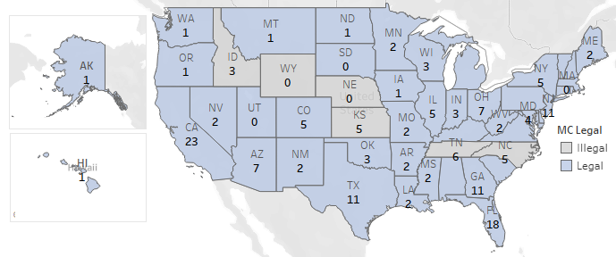

W241 - Experiment
================
Desire to learn about the benefits of medical cannabis for chronic pain?

# Background

Did you know that September is Pain Awareness month?\(^{[1]}\). Pain is
regarded as chronic when it lasts or recurs for more than 6 months.
According to the Centers for Disease Control and Prevention
(CDC)\(^{[2]}\), in 2016, approximately 20% of U.S. adults experienced
chronic pain (approximately 50 million individuals) and 8% of U.S.
adults (approximately 20 million individuals) experienced high-impact
chronic pain. In addition causing literal pain, the CDC\(^{[2]}\)
estimates that chronic pain also costs Americans at least 560 billion
USD per year in medical expenses, lost productivity, and disability
programs. Chronic pain can additionally lead to mental health issues,
including anxiety and depression.

The U.S. Department of Health and Human Services (HHS)\(^{[3]}\) has a
developmental objective to “decrease the prevalence of adults having
high-impact chronic pain”. According to the HHS, treatment for chronic
pain usually focuses not on curing the pain but on managing it -
reducing the pain and increasing people’s ability to move and function
so their day-to-day life can improve. Treatment options include
prescription pain medications, acupuncture, physical therapy, relaxation
techniques, biofeedback, massage therapy, psychotherapy, and behavior
modification.

In the United States, individuals who suffer from pain are often
prescribed opioids\(^{[4]}\) to treat their conditions. Over-dependence
on opioids has contributed to what has been dubbed as an ‘opioid crisis’
in the U.S. The dangers of prescription misuse, opioid use disorder, and
overdose have been a growing problem throughout the U.S. From 1999 to
2018, more than 232,000 people died in the U.S. from overdoses involving
prescription opioids. Overdose deaths involving prescription opioids
were more than four times higher in 2018 than in 1999, according to
CDC\(^{[5]}\). Even as the amount of opioids prescribed and sold for
pain has increased, the amount of pain that Americans report has not
similarly changed. At present, this is almost a disproportionately
American problem - the U.S. constitutes less than 5 percent of the
world’s population yet consumes 80 percent of the world’s opioid
supply.

Doctors now struggle to balance caring for patients with debilitating
pain and meeting new standards and guidelines for opioid prescriptions.
It is clear that opioids cannot be the end solution for chronic pain due
the ongoing opioid crisis in the United States. Solving the ‘chronic
pain problem’ represents a lucrative opportunity. Consequently,
researchers have begun to explore alternatives to opioids, such as
medical marijuana.

According to the National Institutes of Health’s National Center for
Complementary and Integrative Health\(^{[6]}\), medical marijuana, also
known as cannabis, has been used in medical treatment for more than
3,000 years for a plethora of conditions, including pain relief,
digestive issues, and psychological disorders. Some studies have
concluded that medical cannabis may be a viable alternative for
opioids\(^{[7]}\).

# Research Question

It is estimated that 2.1 million Americans (approximately 0.64% of U.S.
adults) use medical cannabis, whereas approximately 50 million Americans
(approximately 20% of U.S. adults) have chronic pain. The World Health
Organization (WHO) reports that an estimated 147 million people, 2.5% of
the world population, consume cannabis annually\(^{[8]}\). The
disparities between these numbers demonstrate the opportunity for
medical cannabis as a painkiller.

In the U.S., the use of cannabis for medical purposes is legal in 33
states (as of before the 2020 election, when several additional states
voted to legalize cannabis for medical purposes), four out of five
permanently inhabited U.S. territories, and the District of
Columbia\(^{[9]}\).

The chemistry of cannabis is anything but straightforward, and its
complexity has made it difficult to discern long and short-term effects
on subjects. Consequently it is difficult to easily write a digestible
FAQ on the benefits and risks of the substance. Furthermore, cannabis is
generally considered to be a political subject in the United States. As
a result of its politicized nature, there are a lot of Americans writing
and sharing opinions about cannabis that do not necessarily rely on data
or scientific analysis. This onslaught of non-scientific information on
the subject has lead to copious amounts of misinformation on the use of
marijuana getting spread to the American population. As people are dying
in the U.S. from overdoses involving prescription opioids, can we
educate people suffering from chronic pain about the benefits of medical
cannabis? If yes, will they opt for medical cannabis?

Our research question is, ***‘Does providing some info on the benefits
of medical cannabis for chronic pain increase participants’ desire to
learn more?’***

# Research Design

## Idealized experimental design

Since chronic pain is a global issue, our idealized experiment would
include subjects living across the globe. We would only select subjects
who experience chronic pain and who live in states or countries where
medical marijuana is legal. Ideally, more than a million subjects would
be recruited to increase the experiment’s accuracy and to ensure the
results could be attributed globally. Subjects on pain medication and
not on medical cannabis could be recruited through social media ads and
print media advertisements. During the experiment execution phase,
subjects will be given one-on-one sessions at their homes on medical
cannabis benefits. We would also like to evaluate the treatment
subjects’ level of knowledge on cannabis by giving a simple exam
before and after the treatment. One-on-one sessions are better as many
people globally don’t have access to the internet or use technology.

A further optimization to this idealized experiment could involve a
natural experiment, in which the researchers put up a control
advertisement in certain cities and a treatment experiment in other
cities. The researchers could then observe subjects interacting with the
advertisements and measure the corresponding effects. This would also
allow us to cluster our subjects based on physical location. We believe
that this idealized natural experiment would have the same properties as
a true, controlled experiment.

An alternative route would be to examine cannabis and opiate-related
advertisements in states where cannabis is legal versus those in states
where cannabis is not legal. This would allow the researchers to get
observational data clustered by city and infer a reasonable conclusion
based on this data.

## Non-idealized, realistic design given constraints

The idealized experimental design involves more time and money than the
researchers have available to them. As a result, the authors of this
paper will narrow the scope of the experimental design to accommodate
our time and money limitations. We will narrow the scope of our subjects
to only U.S. subjects. We will accept subjects from all states and who
are experience all levels of pain (including none at all) and will treat
location and pain-level as covariates.

Due to the ongoing COVID-19 pandemic, we are unable to conduct our
surveys in person. Consequently, we will conduct our research in an
online setting - subjects will be recruited through Amazon MTurk and
will complete a survey through Qualtrics.

Please find our hypotheses for this experiment below.

**Primary Outcome**  
*Desire to learn more about medical cannabis*  
\(H_{0}\): *There is no desire to learn more about medical cannabis’s
benefits for chronic pain after providing some info on medical cannabis
benefits.*

\(H_{a}\): *There is a desire to learn more about medical cannabis’s
benefits for chronic pain after providing some info on medical cannabis
benefits.*

**Other Outcomes**

*Medical cannabis is generally portrayed as more harmful than it
actually is*  
\(H_{0}\): *Cannabis is not portrayed as more harmful than it actually
is.*

\(H_{a}\): *Cannabis is portrayed as more harmful than it actually is.*

*Lot of misinformation about medical cannabis*  
\(H_{0}\): *There is no misinformation about medical cannabis.*

\(H_{a}\): *There is misinformation about medical cannabis.*

*Medical cannabis is addictive*  
\(H_{0}\): *Medical cannabis is not addictive.*

\(H_{a}\): *Medical cannabis is addictive.*

### Observables

Observable variables that may affect our outcome variable include
factors of each subject’s identity. These include location, age, gender,
and self-reported ethnicity. We will detail later in this paper how we
control for these observable covariates.

### Unobservables

There are several unobservable variables that could lead ultimately
affect our outcome variable. We will detail these as part of our
analysis when we discuss omitted variable bias.

### Participants

**How participants are recruited**

The opioid epidemic is by far the most prevalent in the U.S..
Consequently, we believe it is acceptable to limit this experiment to
American subjects (around 250\~500 subjects). Since there is a risk of
non-homogeneity of subjects that we may get through social media,
subjects will be recruited using Amazon Mechanical Turk
(MTurk)\(^{[10]}\).

After a subject from MTurk starts the survey, that subject is randomly
assigned to either the placebo or the treatment group. We are able to
achieve complete randomization by employing Qualtrics’ survey technology
to completely and blindly assign subjects to one group. We recognize
that often times deliberate variation within subgroups via an
intervention can sometimes be more useful in terms of observing a
treatment effect than pure randomization. Having said that, in this
specific case we felt that complete randomization of subjects within age
blocks (as detailed later in this paper) is more appropriate for this
specific experiment. We believe this is the case because we did not want
to further divide subjects based on other subject attributes
(e.g. gender, ethnicity) and potentially introduce bias from the
experimenters’ preconceived notions. Complete randomization within age
blocks allows us to be confident that our experimental results are
representative of American adults.

**Location of participants**

The legalization status of marijuana varies from U.S. state to U.S.
state. Additionally, recent elections have also affected the
legalization of cannabis in different states. Each U.S. state falls into
one of the following categories: (Marijuana is completely illegal, Only
medical marijuana is legal, Recreational and medical marijuana are
legal, Medical marijuana is not yet legal but was legalized in the 2020
election, Recreational marijuana is not yet legal but was legalized in
the 2020 election). We will collect information on what state an
individual is from and the legal status of marijuana in that state and
consider it as a covariate in this analysis. To make sure that the
non-interference assumption is not violated, we will check the location
of each subject taking the survey using the subject’s IP address.

We recognize that we could have considered clustering subjects based on
location (clustering on American state). We do not believe that that
this is appropriate for this experiment. Clustering normally comes into
play when it is impossible to randomly assign subjects to group within a
given attribute like location. Since we are able to randomly assign
subjects to group within location, we choose not to use clustering in
this experimental design.

**Age of participants**

The legal age for consuming cannabis varies from state to state in the
US. Generally the legal age to consume cannabis is 21 years of age or
older. Consequently, we will not examine subjects who are aged less than
21 years old. MTurk blocks subjects at 18-25 and unfortunately we cannot
break this block into the more granular blocks of 18-21 and 21-25. Since
we can only ignore the block of subjects age 18-25, we will only allow
subjects to participate who are at least 25 years old. We believe it is
important to use MTurk’s blocks because it helps us minimize potential
*noncompliance issues*, such as the subjects lying about their age so
that they can get paid to take the survey.

Consequently, our experiment uses blocking. We believe that blocking on
age can only be beneficial to experiment. We believe that normally using
MTurk subjects would cause an imbalance in subject age, likely skewing
younger as younger subjects are more likely to be familiar with MTurk
technology and this employment opportunity. We believe that blocking on
age will allow for more precision by not conducting a randomization on
the age covariate, which we believe would normally be very imbalanced.

The reader should note that excluding subjects that fall within an age
group is common for experiments with small samples. Having said that, we
recognize that this introduces a concern around subject imbalance. We
believe that we are able to maintain an even distribution across age due
to our blocking of age. The consequences of excluding the youngest age
group of adults (age 21-24) is that our subjects will skew older than
the overall adult population of the United States. As a result, this
implies that your experimental results may not be valid for American
adults aged 18-25.

Although out the outset it seems that excluding the youngest age group
of American adults might prove to be a detriment to our experiment, we
believe that ignoring the age block of 21-24 is acceptable sine the CDC
reports\(^{[14]}\) that chronic pain is only present in 8.5 percent of
the population for the age group (18-29). We suspect that this number is
even lower for subjects aged 21-24.

### Block Random Assignment

The subjects are blocked by age a)25-35, b)35-45, c)45-55 and d)55 or
older. This blocking gives similar potential outcomes as the severity of
the chronic pain varies across age groups and increases the statistical
power. This blocking also reduces sampling variability and improves the
precision of the estimated treatment effect. It will help us to do
further analysis based on age groups. Randomization will be done within
each block, and subjects will be assigned to treatment and placebo
groups accordingly.

  
 

### Treatment

All the subjects will be given an initial questionnaire, generated by
Qualtrics, to get information on the covariates. We will randomize the
subjects within the block and assign them to treatment and placebo
groups. Treatment group will be shown videos on Opioids - Risks & Side
effects and Benefits of Medical Cannabis. Placebo group will be shown
videos on Opioids - Risks & Side effects and Benefits of Cycling. In the
end, there will be post-treatment five point Likert scale questions. The
experiment duration will be short and the results will be collected from
the Qualtrics service.

##### Treatment group videos

| Video | Title                          | Link                                              | Duration           |
| ----- | ------------------------------ | ------------------------------------------------- | ------------------ |
| 1     | Opioids - Risks & Side effects | [\[Opioids\]](https://youtu.be/y0mfzDAs1BE)       | 2 min. and 19 sec. |
| 2     | Benefits of Medical Cannabis   | [\[Med. Cannabis\]](https://youtu.be/OhJ0YaJXrJo) | 5 min. and 3 sec.  |

##### Placebo group videos

| Video | Title                          | Link                                                  | Duration           |
| ----- | ------------------------------ | ----------------------------------------------------- | ------------------ |
| 1     | Opioids - Risks & Side effects | [\[Opioids\]](https://youtu.be/y0mfzDAs1BE)           | 2 min. and 19 sec. |
| 2     | Benefits of Cycling            | [\[Cycling\]          ](https://youtu.be/xWo0FOwZVX0) | 5 min. and 3 sec.  |

### Exclusion and Non-Interference

\_\_\_\_TODO\_\_\_\_: How are we handling these? Need a paragraph on
this both the assumptions.  
We will ensure that the excludability assumption is not violated by
showing only the appropriate set of questions and videos to each group.

\#\#\#Consent \_\_\_\_TODO\_\_\_\_:

### Confidentiality

We will not collect any personally identifiable information (PII) or
protected health information (PHI) about the subjects through this
experiment. The data we collect cannot uniquely identify a person and is
used for statistical analysis only. Health Insurance Portability and
Accountability Act (HIPAA) rules will not be violated as we are not
collecting any individually identifiable health information (and
consequently we will not be storing or transmitting this data).  
  

### Risks

We recognize that one major risk to this study is that the current
COVID-19 pandemic might influence the user’s opinion in the
questionnaire. There is no way for us to ensure subjects will respond in
the same way now as they would have before the COVID-19 pandemic.
Another risk is that, due to time and budget constraints, PHI, and HIPAA
regulations, we cannot select only the subjects with chronic pain. A
third risk is that we are choosing not to ask about the severity of each
subject’s chronic pain, where the pain is, how long the pain lasts etc..
We feel justified in this choice as more data we collect we might be
violating PHI regulations as it becomes easy to create a profile of an
individual. However, not collecting this data will make it more
difficult to identify potential covariates or confounding variables. The
final risk that we identify here is that we are having subject’s answer
questions rather than relying on official medical records. Consequently,
there may be some data inaccuracies.

### Unobserved heterogeneity

\_\_\_\_TODO\_\_\_\_:- justify how our experiment allows for unobserved
things to be balanced (randomization,…)

### Pilot experiment

In the pilot experiment, we used 30\~40 subjects from U.S. to improve
upon the research design before full experiment. We used blocking by age
groups 25-30 and 45-55 in order to pilot the experiment with one younger
group and one older group. Based on the pilot data analysis, we changed
the following:

  - Political affiliation question *“Generally speaking, do you usually
    think of yourself as a Republican, a Democrat, an Independent, or
    Something else?”* to *“In general, how would you classify your
    political beliefs? Liberal, Conservative, Independent/Other”* in
    order to generalize political affiliation.
  - We launched the pilot experiment around 5:00 pm (PST) and got most
    of the participants from west coast. So, launched the full
    experiment around 11:00 am (PST) so that we can get participants
    across the U.S.
  - Added one more outcome measure *“Medical cannabis is generally
    portrayed as more harmful than it actually is”* with 5 point Likert
    scale.

**Power**

``` 

     Two-sample t test power calculation 

              n = 146.4383
          delta = 0.3
             sd = 1.03
      sig.level = 0.05
          power = 0.8
    alternative = one.sided

NOTE: n is number in *each* group
```

To achieve 80% power with a treatment effect of \~0.3 and standard
deviation of 1.03, we need \~150 subjects for our Full experiment.

### Full experiment

In the full, non-pilot, experiment, we use 180 subjects to reduce the
variance and improve the results’ accuracy. This subject count will vary
based on the pilot experiment results (treatment effect, standard
deviation, statistical power, etc.). Also, updated blocking, covariates,
and questionnaires will be used based on the pilot experiment’s outcome.
The subjects are recruited from all the states where medical cannabis is
legal and age \>=25 years.  


### Covariates

We monitored some of the covariates like Sex (Male/Female/Other),
Race/Ethnicity (American Indian or Alaska Native, Hispanic or Latino,
White, Black or African American, Asian, Native Hawaiian or Other
Pacific Islander, Other), Education (Less than high school, High school,
Some college, Bachelor’s degree or higher), Employment status (Employed,
Not employed). We also include an important covariate ‘Do you experience
chronic pain?’.

1.  Gender: Male/Female/Other.
2.  Age groups: a)25-35, b)35-45, c)45-55 and d)55 or older.
3.  Ethnic background (White, Black or African American,
    Hispanic/Latino, Asian, Other).
4.  Education (Less than high school, High school, Some college,
    Bachelor’s degree or higher).
5.  Employment status (Employed, Not Employed).
6.  State (available from Qualtrics meta information). Note: Using this
    covariate, we will create another covariate based on the data
    dynamically on cannabis legality type(Legal, Legal for medical use,
    Prohibited).
7.  Political beliefs (Liberal, Conservative, Independent/Other).
8.  Do you experience chronic pain?? (Yes/No).

**Baseline Question**(Likert 5 point scale)

The following question provides the baseline on the subjects knowledge
of prescription opioids and the problems associated with:

9.  Deaths due to overdoses involving prescription opioids are
    increasing.

**Post-treatment Questions**(Likert 5 point scale)

1.  Do you have a desire to learn about the benefits of medical cannabis
    for chronic pain?
2.  There is a lot of misinformation about medical cannabis.
3.  Medical cannabis is addictive.

### Data Quality

To improve the data quality, we will consider the following in our
design:

**1. Fair pay**

Since fair pay and realistic completion times significantly impact data
quality from crowdsourced surveys\(^{[15]}\), we will offer fair
compensation. We calculated fair compensation by first estimating how
long it will take to complete this survey (approximately 10 minutes). We
then looked at the U.S. federal minimum wage (7.25 USD per hour) and
offered each user more than the federal minimum wage by paying them 1.50
USD for 10 minutes of work (or 9 USD per hour).

**2. Attrition check**

<!-- -->

``` 
           
            Complete Incomplete
  Placebo         84          8
  Treatment       78         16
```

``` 

    Pearson's Chi-squared test with Yates' continuity correction

data:  assignmentgroup_progress
X-squared = 2.1747, df = 1, p-value = 0.1403
```

Chi-Square test’s p-value is 0.1403 which is not statistically
significant which makes us believe that there is no differential
attrition.

*Missing participant estimates based on covariates using regression*

|                                |               Placebo |              Treatment |
| :----------------------------- | --------------------: | ---------------------: |
| (Intercept)                    |         0.230 (0.223) | \-0.440**`*`** (0.219) |
| ChronicPain                    |         0.063 (0.042) |          0.041 (0.087) |
| OpioidsDeathsInc               |       \-0.023 (0.029) |          0.070 (0.046) |
| Gender\_Female                 |         0.094 (0.069) |    0.155**. ** (0.087) |
| AgeGroup.L                     | \-0.117**. ** (0.062) |          0.105 (0.074) |
| AgeGroup.Q                     |       \-0.028 (0.062) |          0.004 (0.078) |
| AgeGroup.C                     |       \-0.066 (0.062) |        \-0.046 (0.079) |
| Education.L                    |   0.055**. ** (0.031) |        \-0.076 (0.107) |
| Education.Q                    |       \-0.145 (0.091) |          0.036 (0.096) |
| Employed\_Yes                  |       \-0.180 (0.128) |  0.207**`**`** (0.072) |
| PoliticalBelief\_Conservative  |         0.069 (0.062) |          0.018 (0.086) |
| PoliticalBelief\_Ind./Other    |         0.034 (0.075) |          0.140 (0.107) |
| Ethnicity\_Black or African Am |         0.218 (0.188) |          0.047 (0.120) |
| Ethnicity\_Hispanic/Latino     |       \-0.078 (0.062) |          0.143 (0.128) |
| Ethnicity\_Asian               |       \-0.122 (0.091) |        \-0.155 (0.121) |
| Ethnicity\_Other               |       \-0.102 (0.083) |        \-0.096 (0.115) |

*Extreme Values Bounds*

``` 
           
            No Yes
  Placebo   11  81
  Treatment 11  83
```

``` 
           
            No Yes
  Placebo    2   6
  Treatment  0  16
```

Total participants count is **186**. Total participants who didn’t
finish the Survey is **24**. Participants count after excluding
attrition is **162**.

**3. Compliance check**

**a) Participants from U.S.:** We will make sure that the participants
are from US location by checking the Qualtrics metadata information.

<!-- -->

**b) Prevent Bots**: Include a CAPTCHA at the beginning to prevent bots
from taking the Survey. Qualtrics uses Google reCAPTCHA technology.
According to Qualtrics, if the score is less than 0.5, the response can
be flagged as a bot. We will filter out subjects where the CAPTCHA score
is less than 0.5.

Total participants count is **161**. Total subjects with CAPTCHA score
less than 0.5 are **5**. Participants count after removal of less
CAPTCHA score is **156**.

Total subjects with CAPTCHA score less than 0.5 (includes attrition
data) are **5**. Participants count after removal of less CAPTCHA score
is **179**.

**c) Exceptionally fast outliers:** Based on the Subjects’ total time
taken to complete the Survey, filter out data from the Subjects who are
statistical outliers (1 standard deviations below the mean of the time
taken). Since our videos in treatment and placebo groups will have equal
time, we will also compare these outliers between the treatment and
placebo groups to check for any abnormality. Note: Initially, we thought
of using attention check questions, since there is a threat of
post-treatment bias, we did not use those.

<!-- -->

| Duration | AssignmentGroup | AgeGroup | ResponseId         |
| -------: | :-------------- | :------- | :----------------- |
|      201 | Treatment       | 25-35    | R\_3MPEFlTXmTxsDPu |
|      226 | Treatment       | 25-35    | R\_2YhLXXgz5B2uCGv |
|       54 | Placebo         | 25-35    | R\_RrX64Mgir5Vs3Dz |
|      222 | Treatment       | 25-35    | R\_pugyP51UV2yJRol |
|       77 | Placebo         | 25-35    | R\_DSv0t38U0NrcFDH |
|      153 | Treatment       | 25-35    | R\_1lsheWGWjxQ2raE |
|      215 | Placebo         | 35-45    | R\_2h1FNXe7uNMA2jf |
|      210 | Treatment       | 45-55    | R\_2QXNDX6JrcyS6cZ |

Exceptionally fast outliers count is **8**.

Exceptionally fast outliers (includes attrition data) count is **8**.

**Duplicate subjects:** We apply due diligence to find out duplicate
subjects by checking the hashed IP address and similarity in covariates
and filter them out.

    Duplicate IP addresses (Includes attrition data) 

| AssignmentGroup | Gender | AgeGroup     | Region | ResponseId          |
| :-------------- | :----- | :----------- | :----- | :------------------ |
| Placebo         | Female | 55 and Older | ID     | R\_1CEGVKUl8Gfcp8U  |
| Placebo         | Male   | 55 and Older | ID     | FS\_ezzaqDq7Q40j6sF |

Total subjects after filtering are **148**.  
Total subjects after filtering (includes attrition data) are **169**.


# Observations and Outcome Measures

## Exploratory Data Analysis

### Assignment and Demographic data

<!-- -->

## Attrition

\_\_\_\_TODO\_\_\_\_: - what are the assumptions we are making to remove
those entries … does it have an effect on ATE… what is the distribution
compared to rest of the sample - how does it affect standard errors -
re-weighting - is difference-in-means estimator biased - F statistic (on
r:missing data) should be non-significant to prove no bias (random
missingness) - Extreme value bound vs Trimming value bound (comparison
of these two approach)

– delete later : for reference—- Treatment has an effect on which units
are observed, ruining comparability. Strategies for detecting attrition:
Is there an average effect on attrition on whether people’s outcomes are
measurable? Are covariates still balanced among those for whom the
outcomes are measurable? Try to reduce attrition in design. Design a
measurement procedure that is less sensitive to attrition. – stop delete
—-

## Mediation

\_\_\_\_TODO\_\_\_\_: - Casual Heterogenity

    - Implicit Mediation Analysis
    Theory testing by looking for subgroup effects
     useful for suggesting other treatments
    Does not  ascertain what causes a treatment to work

– delete later : for reference—- The study of why a treatment has an
effect. Fundamentally unanswerable question. Cannot know for sure why a
treatment worked “Implicit mediation” analysis can guide hypothesis
generation. – stop delete —-

## Generalizability

\_\_\_\_TODO\_\_\_\_:

– delete later : for reference—-

Your results pertain only to the sample and context of that particular
study. Cannot ever know for sure how your experiment will differ in
other contexts. Perform other experiments to validate that your results
would replicate in other circumstances. – stop delete —-

## Correlation

<!-- -->

TODO: Provide analysis

**Outcome measures (Excludes Attrition)**

<!-- -->

**Outcome measures (Low value bound)**

<!-- -->

**Outcome measures (High value bound)**

<!-- -->

## Covariate balance check

Much of the analysis we do relies on the assumption that (except for
some key characteristics) subjects are random. By ‘random’, we mean that
subjects have random personal backgrounds and histories (e.g. race,
religion, political affiliation) and that there is not a strong presence
of one background over another in our subject sample.

Practically, it is impossible to enforce complete randomization.
Consequently, in order for our assumption of complete randomness to hold
true, we now conduct a covariate balance check. The purpose of the
covariate balance check is to ensure that we have relatively balanced
responses to each of the potential covariates that we have identified in
this study. For the purposes of this covraiate balance check, we will
examine the factorized version of the covariates only.

It is important to note that age ranges are automatically balanced
because we blocked with an equal number of participants in each age
group and were able to enforce those blocks thanks to MTurk.

To increase our confidence, we also employ Bartlett’s test for
homogeneity of variances. This test will allow us to see if there is
different variation between the variables. The null hypothesis will be
that the variance is equal for all variables, so if we can reject this
null hypothesis then we can be more confident in the fact that the
covariates are balanced.

Please note that we will run these tests on each of the three data
tables that we have due to our handling of the extreme value bounds. One
table removed extreme values, one replaced these values with the lowest
value, and one replaced these values with the highest value.

``` 

    Bartlett test of homogeneity of variances

data:  d$treated and factor(d$AgeGroup)
Bartlett's K-squared = 0.00062919, df = 3, p-value = 1
```

``` 

    Bartlett test of homogeneity of variances

data:  d$treated and factor(d$ChronicPain)
Bartlett's K-squared = 0.00070285, df = 1, p-value = 0.9788
```

``` 

    Bartlett test of homogeneity of variances

data:  d$treated and factor(d$Employed)
Bartlett's K-squared = 0.012805, df = 1, p-value = 0.9099
```

``` 

    Bartlett test of homogeneity of variances

data:  d_low$treated and factor(d_low$AgeGroup)
Bartlett's K-squared = 0.00062919, df = 3, p-value = 1
```

``` 

    Bartlett test of homogeneity of variances

data:  d_low$treated and factor(d_low$ChronicPain)
Bartlett's K-squared = 0.00070285, df = 1, p-value = 0.9788
```

``` 

    Bartlett test of homogeneity of variances

data:  d_low$treated and factor(d_low$Employed)
Bartlett's K-squared = 0.012805, df = 1, p-value = 0.9099
```

``` 

    Bartlett test of homogeneity of variances

data:  d_high$treated and factor(d_high$AgeGroup)
Bartlett's K-squared = 0.00062919, df = 3, p-value = 1
```

``` 

    Bartlett test of homogeneity of variances

data:  d_high$treated and factor(d_high$ChronicPain)
Bartlett's K-squared = 0.00070285, df = 1, p-value = 0.9788
```

``` 

    Bartlett test of homogeneity of variances

data:  d_high$treated and factor(d_high$Employed)
Bartlett's K-squared = 0.012805, df = 1, p-value = 0.9099
```

We can see from our Bartlett’s test of homogeneity of variances that we
cannot reject the null hypothesis that any of these covariates are
homogeneous. The means that we do not have a violation of the
homogeneity of variance between groups with respect to proceeding with
an ANOVA test on the difference in means for our covariates of interest.
This analysis is identical for all three of our tables generated from
our extreme value bounds handling.

``` 

Call:
lm(formula = treated ~ 1 + ChronicPain + Gender + AgeGroup + 
    Education + Employed + PoliticalBelief + Ethnicity)

Residuals:
    Min      1Q  Median      3Q     Max 
-0.8360 -0.4384 -0.1391  0.4532  0.8731 

Coefficients:
                               Estimate Std. Error t value Pr(>|t|)   
(Intercept)                    0.446664   0.161911   2.759  0.00662 **
ChronicPain                   -0.021785   0.100978  -0.216  0.82952   
GenderFemale                   0.002598   0.088642   0.029  0.97666   
AgeGroup.L                     0.009808   0.088233   0.111  0.91166   
AgeGroup.Q                    -0.055957   0.087556  -0.639  0.52385   
AgeGroup.C                     0.073762   0.084837   0.869  0.38616   
Education.L                    0.221090   0.102933   2.148  0.03353 * 
Education.Q                   -0.259502   0.099113  -2.618  0.00986 **
EmployedYes                   -0.110989   0.136025  -0.816  0.41599   
PoliticalBeliefConservative    0.076433   0.096083   0.795  0.42774   
PoliticalBeliefInd./Other      0.129807   0.128697   1.009  0.31499   
EthnicityBlack or African Am.  0.158526   0.169744   0.934  0.35204   
EthnicityHispanic/Latino       0.296684   0.163264   1.817  0.07144 . 
EthnicityAsian                 0.121814   0.235431   0.517  0.60573   
EthnicityOther                 0.066925   0.361889   0.185  0.85356   
---
Signif. codes:  0 '***' 0.001 '**' 0.01 '*' 0.05 '.' 0.1 ' ' 1

Residual standard error: 0.4976 on 133 degrees of freedom
Multiple R-squared:  0.1074,    Adjusted R-squared:  0.01346 
F-statistic: 1.143 on 14 and 133 DF,  p-value: 0.3269
```

    Analysis of Variance Table
    
    Model 1: treated ~ 1 + ChronicPain + Gender + AgeGroup + Education + Employed + 
        PoliticalBelief + Ethnicity
    Model 2: treated ~ 1
      Res.Df    RSS  Df Sum of Sq      F Pr(>F)
    1    133 32.929                            
    2    147 36.892 -14   -3.9626 1.1432 0.3269

``` 

Call:
lm(formula = treated ~ 1 + ChronicPain + Gender + AgeGroup + 
    Education + Employed + PoliticalBelief + Ethnicity)

Residuals:
    Min      1Q  Median      3Q     Max 
-0.8360 -0.4384 -0.1391  0.4532  0.8731 

Coefficients:
                               Estimate Std. Error t value Pr(>|t|)   
(Intercept)                    0.446664   0.161911   2.759  0.00662 **
ChronicPain                   -0.021785   0.100978  -0.216  0.82952   
GenderFemale                   0.002598   0.088642   0.029  0.97666   
AgeGroup.L                     0.009808   0.088233   0.111  0.91166   
AgeGroup.Q                    -0.055957   0.087556  -0.639  0.52385   
AgeGroup.C                     0.073762   0.084837   0.869  0.38616   
Education.L                    0.221090   0.102933   2.148  0.03353 * 
Education.Q                   -0.259502   0.099113  -2.618  0.00986 **
EmployedYes                   -0.110989   0.136025  -0.816  0.41599   
PoliticalBeliefConservative    0.076433   0.096083   0.795  0.42774   
PoliticalBeliefInd./Other      0.129807   0.128697   1.009  0.31499   
EthnicityBlack or African Am.  0.158526   0.169744   0.934  0.35204   
EthnicityHispanic/Latino       0.296684   0.163264   1.817  0.07144 . 
EthnicityAsian                 0.121814   0.235431   0.517  0.60573   
EthnicityOther                 0.066925   0.361889   0.185  0.85356   
---
Signif. codes:  0 '***' 0.001 '**' 0.01 '*' 0.05 '.' 0.1 ' ' 1

Residual standard error: 0.4976 on 133 degrees of freedom
Multiple R-squared:  0.1074,    Adjusted R-squared:  0.01346 
F-statistic: 1.143 on 14 and 133 DF,  p-value: 0.3269
```

    Analysis of Variance Table
    
    Model 1: treated ~ 1 + ChronicPain + Gender + AgeGroup + Education + Employed + 
        PoliticalBelief + Ethnicity
    Model 2: treated ~ 1
      Res.Df    RSS  Df Sum of Sq      F Pr(>F)
    1    133 32.929                            
    2    147 36.892 -14   -3.9626 1.1432 0.3269

``` 

Call:
lm(formula = treated ~ 1 + ChronicPain + Gender + AgeGroup + 
    Education + Employed + PoliticalBelief + Ethnicity)

Residuals:
    Min      1Q  Median      3Q     Max 
-0.8360 -0.4384 -0.1391  0.4532  0.8731 

Coefficients:
                               Estimate Std. Error t value Pr(>|t|)   
(Intercept)                    0.446664   0.161911   2.759  0.00662 **
ChronicPain                   -0.021785   0.100978  -0.216  0.82952   
GenderFemale                   0.002598   0.088642   0.029  0.97666   
AgeGroup.L                     0.009808   0.088233   0.111  0.91166   
AgeGroup.Q                    -0.055957   0.087556  -0.639  0.52385   
AgeGroup.C                     0.073762   0.084837   0.869  0.38616   
Education.L                    0.221090   0.102933   2.148  0.03353 * 
Education.Q                   -0.259502   0.099113  -2.618  0.00986 **
EmployedYes                   -0.110989   0.136025  -0.816  0.41599   
PoliticalBeliefConservative    0.076433   0.096083   0.795  0.42774   
PoliticalBeliefInd./Other      0.129807   0.128697   1.009  0.31499   
EthnicityBlack or African Am.  0.158526   0.169744   0.934  0.35204   
EthnicityHispanic/Latino       0.296684   0.163264   1.817  0.07144 . 
EthnicityAsian                 0.121814   0.235431   0.517  0.60573   
EthnicityOther                 0.066925   0.361889   0.185  0.85356   
---
Signif. codes:  0 '***' 0.001 '**' 0.01 '*' 0.05 '.' 0.1 ' ' 1

Residual standard error: 0.4976 on 133 degrees of freedom
Multiple R-squared:  0.1074,    Adjusted R-squared:  0.01346 
F-statistic: 1.143 on 14 and 133 DF,  p-value: 0.3269
```

    Analysis of Variance Table
    
    Model 1: treated ~ 1 + ChronicPain + Gender + AgeGroup + Education + Employed + 
        PoliticalBelief + Ethnicity
    Model 2: treated ~ 1
      Res.Df    RSS  Df Sum of Sq      F Pr(>F)
    1    133 32.929                            
    2    147 36.892 -14   -3.9626 1.1432 0.3269

We can see that the p-value for our F-test is greater than 0.02, which
means that we cannot reject that there is variance. In the context of
this experiment, this is a good result, as this likely in turn means
that there is variance and the covariates are balanced. This analysis is
identical for all three of our tables generated from our extreme value
bounds handling.

One note for the reader: we examined whether it was appropriate to use a
difference-in-difference (DID) check to further validate our examination
of the placebo and treatment groups. These techniques typically require
time series data from a control and a treatment group over time to
examine whether there is a difference between the changes in the two
groups over time. Since this experiment does not use any time series
data, we believe that it is not appropriate to use DID techniques for
this experiment, and thus we have not included this sort of analysis in
this paper.

## Regression Analysis

``` 

1) Desire to learn about the benefits of medical cannabis for chronic pain?
----------------------------------------------------------------------
                          Desire to learn about Medical Cannabis      
                    Non-attriters | Low value bound | High value bound
                         (1)              (2)               (3)       
----------------------------------------------------------------------
treated                0.692*           0.692*             0.692*     
                       (0.390)          (0.390)           (0.390)     
treated:ChronicPain    -0.476           -0.476             -0.476     
                       (0.436)          (0.436)           (0.436)     
ChronicPain           0.918***         0.918***           0.918***    
                       (0.320)          (0.320)           (0.320)     
OpioidsDeathsInc        0.082            0.082             0.082      
                       (0.156)          (0.156)           (0.156)     
AgeGroup.L            -0.403**         -0.403**           -0.403**    
                       (0.176)          (0.176)           (0.176)     
AgeGroup.Q              0.106            0.106             0.106      
                       (0.182)          (0.182)           (0.182)     
AgeGroup.C             -0.151           -0.151             -0.151     
                       (0.190)          (0.190)           (0.190)     
GenderFemale           -0.154           -0.154             -0.154     
                       (0.193)          (0.193)           (0.193)     
Constant              2.909***         2.909***           2.909***    
                       (0.803)          (0.803)           (0.803)     
N                        148              148               148       
R2                      0.149            0.149             0.149      
Adjusted R2             0.100            0.100             0.100      
F Statistic           3.034***         3.034***           3.034***    
----------------------------------------------------------------------
*p < .1; **p < .05; ***p < .01                                        
```

TODO: Analysis

``` 

2) Medical cannabis is generally portrayed as more harmful than it actually is
--------------------------------------------------------------------------------
                                    Medical cannabis portrayed as harmful       
                              Non-attriters | Low value bound | High value bound
                                   (1)              (2)               (3)       
--------------------------------------------------------------------------------
treated                          -0.108           -0.108             -0.108     
                                 (0.208)          (0.208)           (0.208)     
ChronicPain                      0.436*           0.436*             0.436*     
                                 (0.263)          (0.263)           (0.263)     
OpioidsDeathsInc                  0.032            0.032             0.032      
                                 (0.175)          (0.175)           (0.175)     
GenderFemale                     -0.167           -0.167             -0.167     
                                 (0.199)          (0.199)           (0.199)     
AgeGroup.L                       -0.162           -0.162             -0.162     
                                 (0.194)          (0.194)           (0.194)     
AgeGroup.Q                        0.146            0.146             0.146      
                                 (0.214)          (0.214)           (0.214)     
AgeGroup.C                        0.204            0.204             0.204      
                                 (0.215)          (0.215)           (0.215)     
PoliticalBeliefConservative      -0.076           -0.076             -0.076     
                                 (0.221)          (0.221)           (0.221)     
PoliticalBeliefInd./Other        -0.308           -0.308             -0.308     
                                 (0.307)          (0.307)           (0.307)     
EthnicityBlack or African Am.    0.636**          0.636**           0.636**     
                                 (0.259)          (0.259)           (0.259)     
EthnicityHispanic/Latino         -0.123           -0.123             -0.123     
                                 (0.418)          (0.418)           (0.418)     
EthnicityAsian                    0.079            0.079             0.079      
                                 (0.811)          (0.811)           (0.811)     
EthnicityOther                   -0.200           -0.200             -0.200     
                                 (2.372)          (2.372)           (2.372)     
Constant                        3.467***         3.467***           3.467***    
                                 (0.826)          (0.826)           (0.826)     
N                                  148              148               148       
R2                                0.076            0.076             0.076      
Adjusted R2                      -0.013           -0.013             -0.013     
F Statistic                       0.851            0.851             0.851      
--------------------------------------------------------------------------------
*p < .1; **p < .05; ***p < .01                                                  
```

TODO: Analysis

``` 

3) There is a lot of misinformation about medical cannabis
--------------------------------------------------------------------------------
                                    Misinformation about medical cannabis       
                              Non-attriters | Low value bound | High value bound
                                   (1)              (2)               (3)       
--------------------------------------------------------------------------------
treated                           0.206            0.206             0.206      
                                 (0.156)          (0.156)           (0.156)     
OpioidsDeathsInc                 0.206*           0.206*             0.206*     
                                 (0.114)          (0.114)           (0.114)     
ChronicPain                      0.352**          0.352**           0.352**     
                                 (0.177)          (0.177)           (0.177)     
GenderFemale                     -0.030           -0.030             -0.030     
                                 (0.182)          (0.182)           (0.182)     
AgeGroup.L                       -0.015           -0.015             -0.015     
                                 (0.172)          (0.172)           (0.172)     
AgeGroup.Q                       -0.204           -0.204             -0.204     
                                 (0.168)          (0.168)           (0.168)     
AgeGroup.C                        0.034            0.034             0.034      
                                 (0.152)          (0.152)           (0.152)     
PoliticalBeliefConservative       0.068            0.068             0.068      
                                 (0.173)          (0.173)           (0.173)     
PoliticalBeliefInd./Other        -0.018           -0.018             -0.018     
                                 (0.247)          (0.247)           (0.247)     
EthnicityBlack or African Am.    -0.231           -0.231             -0.231     
                                 (0.313)          (0.313)           (0.313)     
EthnicityHispanic/Latino         -0.708*          -0.708*           -0.708*     
                                 (0.415)          (0.415)           (0.415)     
EthnicityAsian                   -0.210           -0.210             -0.210     
                                 (0.458)          (0.458)           (0.458)     
EthnicityOther                   -0.884           -0.884             -0.884     
                                 (0.842)          (0.842)           (0.842)     
Constant                        3.000***         3.000***           3.000***    
                                 (0.565)          (0.565)           (0.565)     
N                                  148              148               148       
R2                                0.108            0.108             0.108      
Adjusted R2                       0.022            0.022             0.022      
F Statistic                       1.252            1.252             1.252      
--------------------------------------------------------------------------------
*p < .1; **p < .05; ***p < .01                                                  
```

TODO: Analysis

``` 

4) Medical cannabis is addictive
--------------------------------------------------------------------------------
                                        Medical cannabis is addictive           
                              Non-attriters | Low value bound | High value bound
                                   (1)              (2)               (3)       
--------------------------------------------------------------------------------
treated                          -0.120           -0.120             -0.120     
                                 (0.222)          (0.222)           (0.222)     
OpioidsDeathsInc                  0.205            0.205             0.205      
                                 (0.169)          (0.169)           (0.169)     
ChronicPain                       0.362            0.362             0.362      
                                 (0.254)          (0.254)           (0.254)     
GenderFemale                     -0.011           -0.011             -0.011     
                                 (0.236)          (0.236)           (0.236)     
AgeGroup.L                       -0.055           -0.055             -0.055     
                                 (0.210)          (0.210)           (0.210)     
AgeGroup.Q                       -0.345           -0.345             -0.345     
                                 (0.219)          (0.219)           (0.219)     
AgeGroup.C                       -0.209           -0.209             -0.209     
                                 (0.224)          (0.224)           (0.224)     
PoliticalBeliefConservative      0.587**          0.587**           0.587**     
                                 (0.260)          (0.260)           (0.260)     
PoliticalBeliefInd./Other        -0.399           -0.399             -0.399     
                                 (0.282)          (0.282)           (0.282)     
EthnicityBlack or African Am.    1.394**          1.394**           1.394**     
                                 (0.547)          (0.547)           (0.547)     
EthnicityHispanic/Latino         -0.043           -0.043             -0.043     
                                 (0.478)          (0.478)           (0.478)     
EthnicityAsian                    0.858            0.858             0.858      
                                 (0.578)          (0.578)           (0.578)     
EthnicityOther                   -1.760*          -1.760*           -1.760*     
                                 (0.940)          (0.940)           (0.940)     
Constant                         1.681**          1.681**           1.681**     
                                 (0.797)          (0.797)           (0.797)     
N                                  148              148               148       
R2                                0.234            0.234             0.234      
Adjusted R2                       0.160            0.160             0.160      
F Statistic                     3.153***         3.153***           3.153***    
--------------------------------------------------------------------------------
*p < .1; **p < .05; ***p < .01                                                  
```

TODO: Analysis

As expected, applying the treatment on a subject generally causes that
subject to view medical cannabis more favorably. The subjects in the
treatment group agree more about the benefits of medical cannabis on
chronic pain and believe that there is lot of misinformation about
medical cannabis. They also tend to agree more that medical cannabis is
NOT addictive.

One element to consider in this analysis is the potential for omitted
variable bias. Omitted variable bias occurs when the researchers do not
control for a covariate that might correlate with the treatment effect.
In this case, the researchers controlled for several elements (e.g. age)
that we felt might cause a correlation with the treatment effect. Having
said that, we recognized that there are several potential variables that
we did not examine that could have an effect on the measured treatment
effect. For example there are several ‘chronic pain variables’ that we
did not explicitly measure, such as duration of pain, intensity of pain,
and type of pain. We also chose not to measure a subject’s history with
painkillers, as we were concerned about the potential ethics of asking
for and storing this personal medical information. These variables would
be if a subject is already a medical cannabis user, if the subject is
already on an opiate, if the subject is already using a third type of
painkiller. Although these variables could potentially lead to some sort
of omitted variable bias, we are confident that such bias is likely
relatively low since we controlled for the most important variables
already.

# Conclusion

TODO

# Limitations of Experiment and Future Enhancements

1.  In a future experiment, it will be good to include socioeconomic
    status\(^{[12]}\) by considering the family size and household
    income.  
2.  The current design doesn’t include subjects from ages 21 to 24. In
    the future, have them also in the experiment with tight control on
    compliance issues.

# References

\[1\] [U.S. Pain Foundation](https://uspainfoundation.org/)  
\[2\] [CDC: Prevalence of Chronic Pain Among U.S.
Adults](https://www.cdc.gov/mmwr/volumes/67/wr/mm6736a2.htm)  
\[3\] [U.S. Department of Health and Human
Services](https://www.healthypeople.gov/)  
\[4\] [NIH: Opioids and the Treatment of Chronic
Pain](https://www.ncbi.nlm.nih.gov/pmc/articles/PMC2711509/)  
\[5\] [CDC: Opioid Overdose in
U.S.](https://www.cdc.gov/drugoverdose/data/prescribing/overview.html)  
\[6\] [NIH: Cannabis (Marijuana) - What You Need To
Know](https://nccih.nih.gov/health/marijuana)  
\[7\] [Medical Cannabis for Chronic
Pain](https://www.uspharmacist.com/article/medical-cannabis-for-chronic-pain)  
\[8\] [WHO: Global Cannabis
consumption](www.who.int/substance_abuse/facts/cannabis/en)  
\[9\] [Legalization of medical cannabis in the
U.S.](https://en.wikipedia.org/wiki/Medical_cannabis_in_the_United_States)  
\[10\] [Amazon Mechanical Turk](https://www.mturk.com/)  
\[11\] [Cannabis laws by
state](https://weedmaps.com/learn/laws-and-regulations/)  
\[12\] [HHS: Poverty guidelines and
poverty](https://aspe.hhs.gov/frequently-asked-questions-related-poverty-guidelines-and-poverty)  
\[13\] [Types of Survey
Questions](https://conjointly.com/kb/types-of-survey-questions/)  
\[14\] [CDC: Chronic Pain Among U.S.
Adults, 2019](https://www.cdc.gov/nchs/products/databriefs/db390.htm)  
\[15\] [Data Quality from Crowdsourced
Surveys](https://iaap-journals.onlinelibrary.wiley.com/doi/epdf/10.1111/apps.12124)

# Appendix

## Questions

**1. What is your Gender?**

  - Male
  - Female
  - Other

**2. Please specify your ethnicity**

  - White
  - Black or African American
  - Hispanic/Latino
  - Asian
  - Other

**3. What is the highest level of school you have completed or the
highest degree you have received?**

  - Less than high school
  - High school
  - Some college
  - Bachelor’s degree or higher

**4. What is your Employment status?**

  - Employed
  - Not Employed

**5. In general, how would you classify your political beliefs?**

  - Liberal
  - Conservative
  - Independent/Other

**6. Do you experience chronic pain?**

  - Yes
  - No

### Baseline question

**7. Deaths due to overdoses involving prescription opioids are
increasing.**

  - Strongly agree
  - Somewhat agree
  - Neither agree nor disagree
  - Somewhat disagree
  - Strongly disagree

### Outcome questions

**8. Do you have a desire to learn about the benefits of medical
cannabis for chronic pain?**

  - Strongly agree
  - Somewhat agree
  - Neither agree nor disagree
  - Somewhat disagree
  - Strongly disagree

**9. Medical cannabis is generally portrayed as more harmful than it
actually is**

  - Strongly agree
  - Somewhat agree
  - Neither agree nor disagree
  - Somewhat disagree
  - Strongly disagree

**10. There is a lot of misinformation about medical cannabis**

  - Strongly agree
  - Somewhat agree
  - Neither agree nor disagree
  - Somewhat disagree
  - Strongly disagree

**11. Medical cannabis is addictive**

  - Strongly agree
  - Somewhat agree
  - Neither agree nor disagree
  - Somewhat disagree
  - Strongly disagree

## Videos

### Both Treatment and Placebo groups (Opioids - Risks and Side effects)

[](https://youtu.be/y0mfzDAs1BE)

### Treatment group (Benefits of Medical Cannabis)

[](https://youtu.be/OhJ0YaJXrJo)

### Placebo group (Benefits of Cycling)

[](https://youtu.be/xWo0FOwZVX0)

## Additional EDA

### Desire to learn about the benefits of medical cannabis for chronic pain?

<!-- -->

<!-- -->

### Medical cannabis is generally portrayed as more harmful than it actually is

<!-- -->

<!-- -->

### There is a lot of misinformation about medical cannabis

<!-- -->

<!-- -->

### Medical cannabis is addictive

<!-- -->

<!-- -->

## User Consent

We are conducting an academic survey about opinions on various
painkillers - *notably opioids and medical cannabis*.

This online survey will ask you about your *history with pain as well
(if you have any)*. Your participation in this online survey is
*voluntary*. You may choose not to participate.

The procedure involves filling an online survey that will take
approximately 10 minutes. Your responses will be *confidential* and we
do not collect information that will personally identify you.

We will do our best to keep your information confidential. All data is
stored in a password protected electronic format.

**By participating in this Survey, you are agreeing to the following**:

1.  you have read the above information
2.  you voluntarily agree to participate
3.  you are at least 21 years of age

If you choose to proceed, please select the link below to complete the
survey. At the end of the survey, you will receive a code to paste into
the box below to receive credit for taking our survey.
