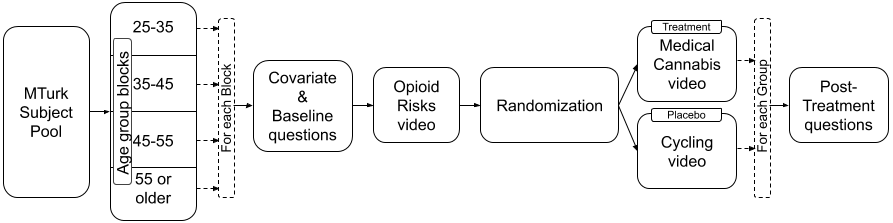

```{r include=FALSE, message = FALSE, warning = FALSE}
#output_format = c('github_document', 'pdf_document'))
# load packages
library(data.table)
library(foreign)
library(knitr)                          
library(AER)
library(dplyr) 
library(sandwich)   
library(ggplot2)
library(corrplot)
library(RColorBrewer)
#install.packages("ggthemes")
#install.packages("egg")
library(egg)
library(ggthemes)
library(cowplot)
library(lmtest)
library(multiwayvcov)                  
library(stargazer)
```

```{r echo = FALSE, include=FALSE, message = FALSE}
# Clear environment
rm(list = ls())

# Removes hash from output
knitr::opts_chunk$set(comment = NA)


# Set default theme for ggplot
theme_set(theme_bw())

# Calculates robust standard errors
compute_robut_se <- function(m) {
  # Robust standard errors are calculated using the sandwich package, and via 
  # the vcovHC function call, which is the Variance CoVariance estimator that is
  # Heteroskedastic Consistent.
  m$vcovHC_ <- vcovHC(m)
  m$coeftest_ <- coeftest(m, vcov. = m$vcovHC_)
  return(m)
}

# Displays the report using stargazer with robust standard errors
display_robust_se_report <- function(m) {
  suppressWarnings(
    stargazer(
      m,
      se = list(sqrt(diag(m$vcovHC_))), type = "text", report = ("vcsp*"),
      ci.level = 0.95, align = TRUE, no.space = FALSE, single.row = FALSE
    )
  )
}

```


```{r echo = FALSE, include=FALSE, message = FALSE}
# Load data
d <- fread("./Pilot-Data.csv")
d[1:10]
``` 


```{r echo = FALSE, include=FALSE, message = FALSE}
# Add/Rename columns
# Surya

# Rename columns
setnames(d, 
         c("LocationLatitude","LocationLongitude","Q_RecaptchaScore","Duration (in seconds)","OpiodsDeathsIncreasing"), 
         c("Latitude", "Longitude", "RecaptchaScore","Duration","OpioidsDeathsIncreasing"))
```

```{r echo = FALSE, include=FALSE, message = FALSE}
# Display column names
column_names <- colnames(d)
#cat(paste(shQuote(column_names, type="cmd"), collapse=", "))
cat(paste(column_names, collapse=", "))
```

```{r echo = FALSE, include=FALSE, message = FALSE}
# Select required columns for analysis. Add additional columns based on the need

d <- d[, c(
  "Duration", "Finished", "RecaptchaScore", "Gender", 
  "AgeGroup","Ethnicity","Education","EmploymentStatus","PoliticalAffiliation",
  "ExperienceChronicPain","OpioidsDeathsIncreasing","AssignmentGroup",
  "MC_DesireToLearn","MC_MisInfo","MC_Addictive","IPAddress","Country",
  "ResponseId"
)]


```

```{r echo = FALSE, include=FALSE, message = FALSE}
# Only required columns
d[1:10]
```


```{r echo = FALSE, include=FALSE, message = FALSE}
# Add columns
# Treatment
d[,treated:=ifelse(AssignmentGroup=='Treatment',1,0)]

# TODO: Add any derived columns based on the need

# Factors
# stackoverflow.com/questions/39279238/why-use-as-factor-instead-of-just-factor
# Use the complete scale. Otherwise, we might miss the ordering if one value
# is missing in the total responses

# AgeGroup
# Blocked by age
d[, AgeGroup_f := factor(AgeGroup, levels = c("25-30", "45-55"), 
                         ordered = TRUE)]

# Gender
# What is your Gender?
d[, Gender_f := factor(Gender, levels = c("Male", "Female", "Other"), 
                       ordered = FALSE)]

# Ethnicity
# Please specify your ethnicity
d[, Ethnicity_f := factor(Ethnicity,
  levels = c(
    "White", "Black or African American",
    "Hispanic/Latino", "Asian", "Other"
  ),
  ordered = FALSE
)]

# Education
# What is the highest level of school you have completed or the highest degree
# you have received?
d[, Education_f := factor(Education,
  levels = c(
    "Less than high school", "High school",
    "Some college",
    "Bachelor's degree or higher"
  ),
  ordered = TRUE
)]

# EmploymentStatus
# What is your Employment status?
# TODO: Check on the ordering
d[, EmploymentStatus_f := factor(EmploymentStatus,
  levels = c(
    "Not Employed",
    "Employed"
  ),
  ordered = TRUE
)]

# PoliticalAffiliation
# Generally speaking, do you usually think of yourself as a Republican,
# a Democrat, an Independent, or Something else?
d[, PoliticalAffiliation_f := factor(PoliticalAffiliation,
  levels = c(
    "Republican",
    "Democrat",
    "Independent",
    "Something else"
  ),
  ordered = FALSE
)]

# ExperienceChronicPain
# Do you experience chronic pain?
d[, ExperienceChronicPain_f := factor(ExperienceChronicPain,
  levels = c("No", "Yes"),
  ordered = FALSE
)]


# Handle Likert scale
# Add the new variables based on likert scale

# Numeric values for likert scale
likertscale <- c(
  "Strongly disagree" = 1,
  "Somewhat disagree" = 2,
  "Neither agree nor disagree" = 3,
  "Somewhat agree" = 4,
  "Strongly agree" = 5
)

likertscale_breaks <- c( "1", "2", "3", "4", "5")
likertscale_labels <- c( "Strongly disagree", "Somewhat disagree", 
                         "Neither agree nor disagree", "Somewhat agree", 
                         "Strongly agree")

# Q: Deaths due to overdoses involving prescription opioids are increasing.
# Baseline/pre-treatment
d[, OpioidsDeathsIncreasing_n := likertscale[OpioidsDeathsIncreasing]]
likert_levels <- c(1, 2, 3, 4, 5)
d[, OpioidsDeathsIncreasing_nf := factor(OpioidsDeathsIncreasing_n,
  levels = likert_levels, ordered = TRUE
)]

# Q: Do you have a desire to learn about the benefits of medical cannabis for 
# chronic pain?
# MC-DesireToLearn
d[, MC_DesireToLearn_n := likertscale[MC_DesireToLearn]]
d[, MC_DesireToLearn_nf := factor(MC_DesireToLearn_n,
  levels = likert_levels, ordered = TRUE
)]


# Q:There is a lot of misinformation about medical cannabis.
# MC-MisInfo
d[, MC_MisInfo_n := likertscale[MC_MisInfo]]
d[, MC_MisInfo_nf := factor(MC_MisInfo_n,
  levels = likert_levels, ordered = TRUE
)]


# Q: Medical cannabis is addictive.
# MC-Addictive
d[, MC_Addictive_n := likertscale[MC_Addictive]]
d[, MC_Addictive_nf := factor(MC_Addictive_n,
  levels = likert_levels, ordered = TRUE
)]

```

```{r echo = FALSE, include=FALSE, message = FALSE}
# Order the columns (Treatment, Outcomes, covariates, other)
d <- d[, c( # Treatment dummy
  "treated",

  # Outcome variables
  "MC_DesireToLearn", "MC_DesireToLearn_n", "MC_DesireToLearn_nf",
  "MC_MisInfo", "MC_MisInfo_n", "MC_MisInfo_nf",
  "MC_Addictive", "MC_Addictive_n", "MC_Addictive_nf",

  # Baseline/Pre-treatment
  "OpioidsDeathsIncreasing", "OpioidsDeathsIncreasing_n",
  "OpioidsDeathsIncreasing_nf",

  # Covariates
  "ExperienceChronicPain", "ExperienceChronicPain_f",
  "Gender", "Gender_f",
  "AgeGroup", "AgeGroup_f",
  "Education", "Education_f",
  "EmploymentStatus", "EmploymentStatus_f",
  "PoliticalAffiliation", "PoliticalAffiliation_f",
  "Ethnicity", "Ethnicity_f",

  # Other
  "AssignmentGroup",
  "RecaptchaScore",
  "Duration",
  "Finished",
  "IPAddress",
  "Country",
  "ResponseId"
)]

```

```{r echo = FALSE, include=FALSE, message = FALSE}
d[1:10]
```


```{r echo = FALSE, include=FALSE, message = FALSE}
# descriptive statistics
# Surya

d_original = copy(d) 

#summary(d)
summary(d[,list(treated,MC_DesireToLearn_nf,MC_MisInfo_nf,MC_Addictive_nf,OpioidsDeathsIncreasing_nf,ExperienceChronicPain_f,Gender_f, AgeGroup_f,Education_f,EmploymentStatus_f,PoliticalAffiliation_f,Ethnicity_f,RecaptchaScore,Duration,Finished)])

```


\begin{center}
Abstract
\end{center}
\begin{center}
TODO - this will have to come last, after the results are in
\end{center}

# Background  

Did you know that September is Pain Awareness month?$^{[1]}$. Pain is regarded as chronic when it lasts or recurs for more than 6 months. According to the Centers for Disease Control and Prevention (CDC)$^{[2]}$, in 2016, approximately 20% of U.S. adults had chronic pain (approximately 50 million individuals) and 8% of U.S. adults (approximately 20 million individuals) had high-impact chronic pain. In addition to the literal pain caused by this problem, the CDC$^{[2]}$ estimates that the chronic pain also costs Americans at least 560 billion USD per year in medical expenses, lost productivity, and disability programs. Having chronic pain can additionally lead to other health issues, including anxiety and depression.

The U.S. Department of Health and Human Services (HHS)$^{[3]}$ has a developmental objective to “decrease the prevalence of adults having high-impact chronic pain”. No matter the cause, treatment for chronic pain usually focuses not on curing it but on managing it - reducing the pain and increasing people’s ability to move and function so their day-to-day life can improve. Treatment options include prescription pain medications, acupuncture, physical therapy, relaxation techniques, biofeedback, massage therapy, psychotherapy, and behavior modification.  

In the United States, individuals who suffer from pain are often prescribed opioids$^{[4]}$ to treat their conditions. Over-dependence on opioids has contributed to an opioid crisis in the U.S. Many doctors struggle to balance caring for patients with debilitating pain and meeting new standards and guidelines for opioid prescriptions.  

The dangers of prescription misuse, opioid use disorder, and overdose have been a growing problem throughout the U.S. From 1999 to 2018, more than 232,000 people died in the U.S. from overdoses involving prescription opioids. Overdose deaths involving prescription opioids were more than four times higher in 2018 than in 1999, according to CDC$^{[5]}$. Even as the amount of opioids prescribed and sold for pain has increased, the amount of pain that Americans report has not similarly changed. At present, this is almost a disproportionately American problem - the U.S. constitutes less than 5 percent of the world’s population yet consumes 80 percent of the world's opioid supply.  

It is clear that opioids cannot be the end solution for chronic pain due the ongoing opioid crisis in the United States. Solving the 'chronic pain problem' represents a lucrative opportunity. Consequently, researchers have begun to explore alternatives to opioids, such as medical marijuana.

According to the National Institutes of Health’s National Center for Complementary and Integrative Health$^{[6]}$, medical marijuana, also known as cannabis, has been used in medical treatment for more than 3,000 years for a plethora of conditions, including pain relief, digestive issues, and psychological disorders. Some studies have concluded that medical cannabis may be a viable alternative for opioids$^{[7]}$.  

# Research Question  

It is estimated that 2.1 million Americans (approximately 0.64% of U.S. adults) use medical cannabis, whereas approximately 50 million Americans (approximately 20% of U.S. adults) have chronic pain. The World Health Organization (WHO) reports that an estimated 147 million people, 2.5% of the world population, consume cannabis annually$^{[8]}$.  

In the U.S., the use of cannabis for medical purposes is legal in 33 states (as of before the 2020 election), four out of five permanently inhabited U.S. territories, and the District of Columbia$^{[9]}$.  

The chemistry of cannabis is anything but straightforward, and its complexity has made it difficult to discern long and short-term effects on subjects. Consequently it is difficult to easily write a digestible FAQ on the benefits and risks of the substance. Furthermore, cannabis is generally considered to be a political subject in the United States. As a result of its politicized nature, there are a lot of Americans writing and sharing opinions about cannabis that do not necessarily rely on data or scientific analysis. This onslaught of non-scientific information on the subject has lead to copious amounts of misinformation on the subject getting spread to the American population. As people are dying in the U.S. from overdoses involving prescription opioids, can we educate people suffering from chronic pain about the benefits of medical cannabis? If yes, will they opt for medical cannabis?

Our research question is, __*‘Does providing some info on the benefits of medical cannabis for chronic pain increase participants' desire to learn more?’*__  

# Research Design  

## Idealized experimental design
Since chronic pain is a global issue, our idealized experiment would include subjects living across the globe. We would only select subjects who experience chronic pain and who live in states or countries where medical marijuana is legal. Ideally, more than a million subjects would be recruited to increase the experiment’s accuracy and to ensure the results could be attributed globally. Subjects on pain medication and not on medical cannabis could be recruited through social media ads and print media advertisements. During the experiment execution phase, subjects will be given one-on-one sessions at their homes on medical cannabis benefits. We would also like to evaluate the treatment subjects' level of knowledge on cannabis by giving a simple exam before and after the treatment. One-on-one sessions are better as many people globally don’t have access to the internet or use technology. 

## Non-idealized, realistic design given constraints
The idealized experimental design involves a lot of time and money. The authors of this paper do not have enough of either to conduct this experiment. Instead, we will narrow the scope of our subjects to only U.S. subjects. We will accept subjects from all states and who are experience all levels of pain (including none at all) and will treat location and pain-level as covariates. Due to the ongoing COVID-19 pandemic, we are unable to conduct our surveys in person. Consequently, we will conduct our research in an online setting - subjects will be recruited through Amazon MTurk and will complete a survey through Qualtrics.

Please find our hypotheses for this experiment below.

__Primary Outcome__  
*Desire to learn more about medical cannabis*  
$H_{0}$: *There is no desire to learn more about medical cannabis's benefits for chronic pain after providing some info on medical cannabis benefits.*

$H_{a}$: *There is a desire to learn more about medical cannabis's benefits for chronic pain after providing some info on medical cannabis benefits.*


__Other Outcomes__  
*Lot of misinformation about medical cannabis*  
$H_{0}$: *There is no misinformation about medical cannabis.*

$H_{a}$: *There is misinformation about medical cannabis.*

*Medical cannabis is addictive*  
$H_{0}$: *Medical cannabis is not addictive.*

$H_{a}$: *Medical cannabis is addictive.*


### Participants


__How participants are recruited__   

The opioid epidemic is by far the most prevalent in the U.S.. Consequently, we believe it is acceptable to limit this experiment to American subjects (around 250~500 subjects). Since there is a risk of non-homogeneity of subjects that we may get through social media, subjects will be recruited using Amazon Mechanical Turk$^{[10]}$. 

__Location of participants__   

The legalization status of marijuana varies from U.S. state to U.S. state. Additionally, recent elections have also affected the legalization of cannabis in different states. Each U.S. state falls into one of the following categories: (Marijuana is completely illegal, Only medical marijuana is legal, Recreational and medical marijuana are legal, Medical marijuana is not yet legal but was legalized in the 2020 election, Recreational marijuana is not yet legal but was legalized in the 2020 election). We will collect information on what state an individual is from and the legal status of marijuana in that state and consider it as a covariate in this analysis. To make sure that the non-interference assumption is not violated, we will check the location of each subject taking the survey using the subject's IP address.  


__Age of participants__   

The legal age for consuming cannabis varies from state to state in the US. Generally the legal age to consume cannabis is 21 years of age or older. Consequently, we will not examine subjects who are aged less than 21 years old. MTurk blocks subjects at 18-25 and unfortunately we cannot break this block into the more granular blocks of 18-21 and 21-25. Since we can only ignore the block of subjects age 18-25, we will only allow subjects to participate who are at least 25 years old.  We believe it is important to use MTurk's blocks because it helps us minimize potential *noncompliance issues*, such as the subjects lying about their age so that they can get paid to take the survey.  

Functionally, we believe that ignoring the age block of 18-25 is acceptable sine the CDC reports$^{[14]}$ that chronic pain is only present in 8.5 percent of the population for the age group (18-29).  
**TODO: Check with Micah on not considering age from 21-24 in the experiment. We will mention about it under 'Limitations of Experiment and Future Enhancements' section.**  

### Block Random Assignment  

The subjects are blocked by age a)25-35, b)35-45, c)45-55 and d)55 or older.  This blocking gives similar potential outcomes as the severity of the chronic pain varies across age groups and increases the statistical power. This blocking also reduces sampling variability and improves the precision of the estimated treatment effect. It will help us to do further analysis based on age groups. Randomization will be done within each block, and subjects will be assigned to treatment and placebo groups accordingly.  

  
&nbsp;
```{r echo=FALSE, fig.align = 'center', fig.id="randomization_chart", fig.cap="Randomization flowchart", fig.cap.style="Image Caption", out.width = "100%"}
#
```

### Treatment  

All the subjects will be given an initial questionnaire, generated by Qualtrics, to get information on the covariates. We will randomize the subjects within the block and assign them to treatment and placebo groups. Treatment group will be shown videos on Opioids - Risks & Side effects and Benefits of Medical Cannabis. Placebo group will be shown videos on Opioids - Risks & Side effects and Benefits of Cycling. In the end, there will be post-treatment five point Likert scale questions. We will ensure that the excludability assumption is not violated by showing only the appropriate set of questions and videos to each group. The experiment duration will be short and the results will be collected from the Qualtrics service.  

##### Treatment group videos  

| Video     | Title     | Link     |  Duration            |
|--------------|--------------|--------------|--------------|
| 1 | Opioids - Risks & Side effects | [[Opioids]](https://youtu.be/y0mfzDAs1BE)| 2 min. and 19 sec. |
| 2| Benefits of Medical Cannabis | [[Med. Cannabis]](https://youtu.be/OhJ0YaJXrJo)  | 5 min. and 3 sec. |


##### Placebo group videos  

| Video     | Title     | Link     |  Duration            |
|--------------|--------------|--------------|--------------|
| 1 | Opioids - Risks & Side effects | [[Opioids]](https://youtu.be/y0mfzDAs1BE)| 2 min. and 19 sec. |
| 2 | Benefits of Cycling | [[Cycling]&nbsp;&nbsp;&nbsp;&nbsp;&nbsp;&nbsp;&nbsp;&nbsp;&nbsp;&nbsp;](https://youtu.be/xWo0FOwZVX0)  | 5 min. and 3 sec.  |


### Confidentiality  

We will not collect any personally identifiable information (PII) or protected health information (PHI) about the subjects through this experiment. The data we collect cannot uniquely identify a person and is used for statistical analysis only. Health Insurance Portability and Accountability Act (HIPAA) rules will not be violated as we are not collecting any individually identifiable health information (and consequently we will not be storing or transmitting this data).

### Risks  

We recognize that one major risk to this study is that the current COVID-19 pandemic might influence the user’s opinion in the questionnaire. There is no way for us to ensure subjects will respond in the same way now as they would have before the COVID-19 pandemic. Another risk is that, due to time and budget constraints, PHI, and HIPAA regulations, we cannot select only the subjects with chronic pain. A third risk is that we are choosing not to ask about the severity of each subject's chronic pain, where the pain is, how long the pain lasts etc.. We feel justified in this choice as more data we collect we might be violating PHI regulations as it becomes easy to create a profile of an individual. However, not collecting this data will make it more difficult to identify potential covariates or confounding variables. The final risk that we identify here is that we are having subject's answer questions rather than relying on official medical records. Consequently, there may be some data inaccuracies.

### Pilot experiment  

In the pilot experiment, we used 30~40 subjects from U.S. to improve upon the research design before full experiment. We used blocking by age groups 25-30 and 45-55 in order to pilot the experiment with one younger group and one older group. Based on the pilot data analysis, we changed the political affiliation question "Generally speaking, do you usually think of yourself as a Republican, a Democrat, an Independent, or Something else?" to "In general, how would you classify your political beliefs? Liberal,  Conservative, Independent/Other" in order to generalize political affiliation.  

__Power__
```{r echo = FALSE, message = FALSE}
# All

#https://www.rdocumentation.org/packages/stats/versions/3.6.2/topics/power.t.test

# standard deviation calculation
#d_sd <- d[, sd(MC_DesireToLearn_n, na.rm=TRUE)]
# The SD above will have some noise as we are cleaning up the data later. If we call this function at the end of it, we will get SD as 1.03. Otherwise, we get 1.004.
# So, hardcoded sd here as 1.03
d_sd <- 1.03
#power - power of test (1 minus Type II error probability)
p <- power.t.test(delta=0.3, sd=d_sd, sig.level = 0.05, power = 0.80, 
                 alternative = "one.sided")
p

```
To achieve 80% power with a treatment effect of ~0.3 and standard deviation of 1.03, we need ~150 subjects for our Full experiment.

### Full experiment  
In the full, non-pilot, experiment, we use 200~250 subjects to reduce the variance and improve the results' accuracy. This subject count will vary based on the pilot experiment results (treatment effect, standard deviation, statistical power, etc.). Also, updated blocking, covariates, and questionnaires will be used based on the pilot experiment's outcome. The subjects are recruited from all the states where medical cannabis is legal and age >=25 years.

### Covariates  
We monitored some of the covariates like Sex (Male/Female/Other), Race/Ethnicity (American Indian or Alaska Native, Hispanic or Latino, White, Black or African American, Asian, Native Hawaiian or Other Pacific Islander, Other), Education (Less than high school, High school, Some college, Bachelor’s degree or higher), Employment status (Employed, Not employed). We also include an important covariate ‘Do you experience chronic pain?’.  

1. Gender: Male/Female/Other.
2. Age groups: a)25-35, b)35-45, c)45-55 and d)55 or older.
3. Ethnic background (White, Black or African American, Hispanic/Latino, Asian, Other).
4. Education (Less than high school, High school, Some college, Bachelor’s degree or higher).
5. Employment status (Employed, Not Employed).
6. State (available from Qualtrics meta information). Note: Using this covariate, we will create another covariate based on the data dynamically on cannabis legality type(Legal, Legal for medical use, Prohibited).
7. Political beliefs (Liberal, Conservative, Independent/Other).
8. Do you experience chronic pain?? (Yes/No).  

__Baseline Question__(Likert 5 point scale)    

The following question provides the baseline on the subjects knowledge of prescription opioids and the problems associated with:  

9. Deaths due to overdoses involving prescription opioids are increasing.  


__Post-treatment Questions__(Likert 5 point scale)    

1. Do you have a desire to learn about the benefits of medical cannabis for chronic pain?
2. There is a lot of misinformation about medical cannabis.
3. Medical cannabis is addictive.  

### Data Quality
To improve the data quality, we will consider the following in our design:  

__1. Prevent Bots__  

Include a CAPTCHA at the beginning to prevent bots from taking the Survey. Qualtrics uses Google reCAPTCHA technology. According to Qualtrics, if the score is less than 0.5, the response can be flagged as a bot. We will filter out subjects where the CAPTCHA score is less than 0.5.  

```{r echo = FALSE, message = FALSE}
# Find the records whose RecaptchaScore is less and 
# filter them out after some analysis.
low_recaptcha_score_count <- d[RecaptchaScore < 0.5, .N]
```
Total subjects with CAPTCHA score less than 0.5 are **`r low_recaptcha_score_count`**.  


__2. Fair pay__  

Since fair pay and realistic completion times significantly impact data quality from crowdsourced surveys$^{[15]}$, we will offer fair compensation. We calculated fair compensation by first estimating how long it will take to complete this survey (approximately 10 minutes). We then looked at the U.S. federal minimum wage (7.25 USD per hour) and offered each user more than the federal minimum wage by paying them 1.50 USD for 10 minutes of work (or 9 USD per hour). 

__3. Attrition check__ 

```{r echo = FALSE, message = FALSE}
# Find the records who doesn't complete (Finished = FALSE) and 
# filter them out after some analysis.
not_finished_count <- d[Finished == FALSE, .N ]
```

Total subjects who didn't finish the Survey is **`r not_finished_count`**.  
TODO: Add info. on subjects who didn't complete the Survey, if there are any, in final experiment.    

__4. Complier check__  

**Participants from U.S.:** We will make sure that the participants are from US location by checking the Qualtrics metadata information. 

```{r echo = FALSE, message = FALSE, fig.height=3.6, fig.width=7}
# EDA
# Surya

# Country
# ggplot(data = d) +geom_bar(mapping = aes(x = Country, fill=Country))
p <- ggplot(data = d, aes(x = Country, fill = Country)) +
  geom_bar(fill = "slategray2", color = "black") +
  geom_text(stat = "count", aes(label = ..count..), vjust = -0.2)

plot_grid(p, nrow = 1, ncol = 2)

# TODO: Provide description
d <- d[Country == "United States", ]
```

**Exceptionally fast outliers:** Based on the Subjects' total time taken to complete the Survey, filter out data from the Subjects who are statistical outliers (1 standard deviations below the mean of the time taken). Since our videos in treatment and placebo groups will have equal time, we will also compare these outliers between the treatment and placebo groups to check for any abnormality. Note: Initially, we thought of using attention check questions, since there is a threat of post-treatment bias, we did not use those.  

```{r echo = FALSE, message = FALSE, fig.height=3, fig.width=7}
p <- ggplot(d, aes(x = Duration)) +
  geom_histogram(fill = "slategray2", color = "black", bins = 16) +
  labs(x = "Duration (seconds)", y = "Subject Count", title = "")
p + geom_vline(aes(xintercept = mean(Duration)),
  color = "blue", linetype = "dashed", size = 1
)

```


```{r echo = FALSE, message = FALSE}
sd_duration <- sd(d$Duration)
```


```{r echo = FALSE, message = FALSE}
# TODO: Include the records whose Duration is less and
# filter them out after some analysis.
duration_mean <- mean(d$Duration)
duration_sd <- sd(d$Duration)
# s[(Duration <  (duration_mean -duration_sd)) |
# (Duration >  (duration_mean +duration_sd)),]

# TODO: Check on higher duration as well. We might not remove them as there
# are chances that people might delay due to some unexpected work and continue
# after few minutes
less_duration <- d[
  Duration < (duration_mean - duration_sd),
  list(
    Duration, AssignmentGroup, IPAddress,
    ResponseId
  )
]
kable(less_duration)

# TODO: Finalize on the cutoff time (consider the speed of 1.5 minutes 
# and calculate the total time required). 

d <- d[Duration >= (duration_mean - duration_sd), ]
```

**Duplicate subjects:** We apply due diligence to find out duplicate subjects by checking IP address, latitude, longitude, and similarity in covariates and filter them out. 

```{r echo = FALSE, message = FALSE}
# TODO: Find the records whose IPAddress is duplicated and
# filter them out after some analysis.
dup_ip_addresses <-
  duplicated(pull(d, IPAddress)) |
    duplicated(pull(d, IPAddress), fromLast = TRUE)
dup_ip_addresses <- d[dup_ip_addresses, ]

#head(dup_ip_addresses, n = 10)

kable(dup_ip_addresses[, .(AssignmentGroup, Gender, AgeGroup, IPAddress, ResponseId )])
dup_ip_address_responses <- dup_ip_addresses[, ResponseId]

d <- d[!ResponseId %in% dup_ip_address_responses, ]

```

Total subjects after filtering are **`r nrow(d)`**.  


# Observations and Outcome Measures

## Exploratory Data Analysis


### Assignment and Demographic data

```{r echo = FALSE, message = FALSE, fig.height=8, fig.width=7}

p1 <- ggplot(data = d, aes(x = AssignmentGroup, fill = AssignmentGroup)) +
  geom_bar() +scale_fill_brewer(palette = "Pastel1")+
  theme(legend.position = "none") +
  theme(axis.text.x = element_text(angle = 90, vjust = 0.5, hjust = 1)) +
  geom_text(stat = "count", aes(label = ..count..), vjust = -0.2)
p2 <- ggplot(data = d, aes(x = ExperienceChronicPain, 
                           fill = ExperienceChronicPain)) +
  geom_bar()  + scale_fill_brewer(palette = "Pastel1")+
  theme(legend.position = "none") +
  theme(axis.text.x = element_text(angle = 90, vjust = 0.5, hjust = 1)) +
  geom_text(stat = "count", aes(label = ..count..), vjust = -0.2)

p3 <- ggplot(data = d, aes(x = Gender, fill = Gender)) +
  geom_bar()  + scale_fill_brewer(palette = "Pastel1")+
  theme(legend.position = "none") +
  theme(axis.text.x = element_text(angle = 90, vjust = 0.5, hjust = 1)) +
  geom_text(stat = "count", aes(label = ..count..), vjust = -0.2)

p4 <- ggplot(data = d, aes(x = AgeGroup, fill = AgeGroup)) +
  geom_bar()  + scale_fill_brewer(palette = "Pastel1")+
  theme(legend.position = "none") +
  theme(axis.text.x = element_text(angle = 90, vjust = 0.5, hjust = 1)) +
  geom_text(stat = "count", aes(label = ..count..), vjust = -0.2)

p5 <- ggplot(data = d, aes(x = Education, fill = Education)) +
  geom_bar() + scale_fill_brewer(palette = "Pastel1")+
  theme(legend.position = "none") +
  theme(axis.text.x = element_text(angle = 90, vjust = 0.5, hjust = 1)) +
  geom_text(stat = "count", aes(label = ..count..), vjust = -0.2)

p6 <- ggplot(data = d, aes(x = EmploymentStatus, fill = EmploymentStatus)) +
  geom_bar() + scale_fill_brewer(palette = "Pastel1")+
  theme(legend.position = "none") +
  theme(axis.text.x = element_text(angle = 90, vjust = 0.5, hjust = 1)) +
  geom_text(stat = "count", aes(label = ..count..), vjust = -0.2)

p7 <- ggplot(data = d, aes(x = PoliticalAffiliation, 
                           fill = PoliticalAffiliation)) +
  geom_bar() + scale_fill_brewer(palette = "Pastel1")+
  theme(legend.position = "none") +
  theme(axis.text.x = element_text(angle = 90, vjust = 0.5, hjust = 1)) +
  geom_text(stat = "count", aes(label = ..count..), vjust = -0.2)

p8 <- ggplot(data = d, aes(x = Ethnicity, fill = Ethnicity)) +
  geom_bar() + scale_fill_brewer(palette = "Pastel1")+
  theme(legend.position = "none") +
  theme(axis.text.x = element_text(angle = 90, vjust = 0.5, hjust = 1)) +
  geom_text(stat = "count", aes(label = ..count..), vjust = -0.2)

plot_grid(p1, p2, p3, p4, p5, p6, p7, p8, nrow = 2, ncol = 4)
#plot_grid(p1, p2, p3, p4, nrow = 1, ncol = 4)

```

```{r echo = FALSE, message = FALSE}
# TODO: Add baseline/pre-treatment analysis. It has likert scale
```

## Correlation

```{r echo = FALSE, message = FALSE, fig.height=9, fig.width=8}
# Correlation between pre-treatment/outcome variables
par(mfrow=c(2,1))
d_c <- d[, .(OpioidsDeathsIncreasing_n, MC_DesireToLearn_n, MC_MisInfo_n, 
             MC_Addictive_n)]
d_n <- sapply(d_c,as.numeric)
c1 <- corrplot(cor(d_n), tl.col="black", method="square")

# Correlation between all (TODO: Check)
d_c <- d[, .(Gender_f, AgeGroup_f, Education_f, EmploymentStatus_f, 
             PoliticalAffiliation_f, Ethnicity_f, ExperienceChronicPain_f, 
             OpioidsDeathsIncreasing_n, MC_DesireToLearn_n, MC_MisInfo_n, 
             MC_Addictive_n)]
d_n <- sapply(d_c,as.numeric)
c2 <- corrplot(cor(d_n), tl.col="black", method="square")

```

TODO: Provide analysis  


```{r echo = FALSE, message = FALSE, fig.height=8, fig.width=7}
title_text <- 
  "Desire to learn about the benefits of medical cannabis for chronic pain?"

p1 <- ggplot(data = d) +
  geom_boxplot(aes(x = AssignmentGroup, y = MC_DesireToLearn_n, 
                   fill = AssignmentGroup), show.legend = FALSE) + scale_fill_brewer(palette = "Pastel1")+
  labs(x = "", y = "Desire to Learn benefits aboout MC", title = "")+
  scale_y_continuous(labels=likertscale_labels)

p2 <- ggplot(data = d) +
  geom_boxplot(aes(x = AssignmentGroup, y = MC_MisInfo_n, 
                   fill = AssignmentGroup), show.legend = FALSE) + scale_fill_brewer(palette = "Pastel1")+
  labs(x = "", y = "Lot of Misinformation about MC", title = "")+
  scale_y_continuous(labels=likertscale_labels)

p3 <- ggplot(data = d) +
  geom_boxplot(aes(x = AssignmentGroup, y = MC_Addictive_n, 
                   fill = AssignmentGroup), show.legend = FALSE) + scale_fill_brewer(palette = "Pastel1")+
  labs(x = "Group", y = "MC is addictive", title = "")+
  scale_y_continuous(labels=likertscale_labels)

plot_grid(p1, p2, p3, nrow = 3, ncol = 1)
```

## Covariate balance check

Much of the analysis we do relies on the assumption that (except for some key characteristics) subjects are random. By 'random', we mean that subjects have random personal backgrounds and histories (e.g. race, religion, political affiliation) and that there is not a strong presence of one background over another in our subject sample.

Practically, it is impossible to enforce complete randomization. Consequently, in order for our assumption of complete randomness to hold true, we now conduct a covariate balance check. The purpose of the covariate balance check is to ensure that we have relatively balanced responses to each of the potential covariates that we have identified in this study. For the purposes of this covraiate balance check, we will examine the factorized version of the covariates only.

It is important to note that age ranges are automatically balanced because we blocked with an equal number of participants in each age group and were able to enforce those blocks thanks to MTurk.

To increase our confidence, we also employ Bartlett's test for homogeneity of variances. This test will allow us to see if there is different variation between the variables. The null hypothesis will be that the variance is equal for all variables, so if we can reject this null hypothesis then we can be more confident in the fact that the covariates are balanced.

```{r echo = FALSE, message = FALSE}

bartlett.test(d$treated, factor(d$AgeGroup_f))
bartlett.test(d$treated, factor(d$ExperienceChronicPain_f))
bartlett.test(d$treated, factor(d$EmploymentStatus_f))

# TODO - delete
# For some reason the below lines do not work
#
# bartlett.test(d$treated, factor(d$Gender_f))
# bartlett.test(d$treated, factor(d$Education_f))
# bartlett.test(d$treated, factor(d$PoliticalAffiliation_f))
# bartlett.test(d$treated, factor(d$Ethnicity_f))

```
We can see from our Bartlett's test of homogeneity of variances taht we cannot reject the null hypothesis that any of these covariates are homogeneous. The measn that we do not have a violation of the homogeneity of variance between groups with respect to proceeding with an ANOVA test on teh difference in means for our covariates of interest.

```{r echo = FALSE, message = FALSE}

## First, fit the simplest model
null_mod <- d[ , lm(treated ~ 1)]
# summary(null_mod)


## Now, the more complex model 
full_mod <- d[ , lm(treated ~ 1 + ExperienceChronicPain_f + 
  Gender_f + 
  AgeGroup_f + 
  Education_f + 
  EmploymentStatus_f + 
  PoliticalAffiliation_f + 
  Ethnicity_f)]
summary(full_mod)

# use an F-test to evaluate whether the additional model terms were useful in predicting whether someone was in the treatment or the control group
anova_mod <- anova(full_mod, null_mod, test = 'F')
anova_mod

```
We can see that the p-value for our F-test is greater than 0.02, which means that we cannot reject that there is variance. In the context of this experiment, this is a good result, as this likely in turn means that there  is variance and the covariates are balanced.

## Regression Analysis
```{r include=FALSE, message = FALSE, warning = FALSE}
##############################################################################
# NOTE: This chunk is not knitted at present. We will use it for Full experiment.
# Next chunk is knitted for Pilot report.
#############################################################################

# Jeya
calculate_clustered_robust_se <- function(model, cluster) {
  model$cvcov1 <- vcovCL(model, cluster=cluster)
  return (coeftest(model, vcov. = model$cvcov1))
}

calculate_robust_se <- function(model) {
  model$vcovHC <- vcovHC(model, type="HC1")
  return(coeftest(model, vcov. = model$vcovHC))
}

display_conf_int <- function(conf_int_lower, conf_int_upper) {
  cat(crayon::underline(crayon::bold("\n\n Confidence Interval is \n\n")))
  cat("2.5% ", conf_int_lower, "\n")
  cat("97.5% ", conf_int_upper, "\n")
}

gen_and_display_conf_int_95 <- function(coeff_results) {
  conf_int_lower <- coeff_results[2,1] - 1.96 * coeff_results[2,2]
  conf_int_upper <- coeff_results[2,1] + 1.96 * coeff_results[2,2]
  display_conf_int(conf_int_lower, conf_int_upper)
}

cat("LM Model for predicting MC_DesireToLearn_n when model includes all attributes \n\n")
model <- d[, lm(MC_DesireToLearn_n ~ treated+ OpioidsDeathsIncreasing_n +AgeGroup_f + Gender_f + Ethnicity_f + Education_f  + PoliticalAffiliation_f + EmploymentStatus_f + ExperienceChronicPain_f )]
coeff_results <- calculate_robust_se(model)
coeff_results
#gen_and_display_conf_int_95(coeff_results)

cat("LM Model for predicting MC_MisInfo_n when model includes all attributes\n\n")
model <- d[, lm(MC_MisInfo_n ~ treated + OpioidsDeathsIncreasing_n + AgeGroup_f + Gender_f + Ethnicity_f + Education_f  + PoliticalAffiliation_f + EmploymentStatus_f + ExperienceChronicPain_f )]
coeff_results <- calculate_robust_se(model)
coeff_results
#gen_and_display_conf_int_95(coeff_results)

cat("LM Model for predicting MC_Addictive_n when model includes all attributes \n\n")
model <- d[, lm(MC_Addictive_n ~ treated + OpioidsDeathsIncreasing_n + AgeGroup_f + Gender_f + Ethnicity_f + Education_f  + PoliticalAffiliation_f + EmploymentStatus_f + ExperienceChronicPain_f )]
coeff_results <- calculate_robust_se(model)
coeff_results
#gen_and_display_conf_int_95(coeff_results)

# James
# INTERACTION MODELS START HERE
# TODO Remove intercept from each of these (see example_2.pdf)
#
cat("LM Model for predicting MC_DesireToLearn_n when model including all attributes and all interaction terms\n\n")
model <- d[, lm(MC_DesireToLearn_n ~ treated+ OpioidsDeathsIncreasing_n +AgeGroup_f + Gender_f + Ethnicity_f + Education_f  + PoliticalAffiliation_f + EmploymentStatus_f + ExperienceChronicPain_f + treated:OpioidsDeathsIncreasing_n
                + treated:AgeGroup_f
                  + treated:Gender_f
                  + treated:Ethnicity_f
                  + treated:Education_f
                  + treated:PoliticalAffiliation_f
                  + treated:EmploymentStatus_f
                  + treated:ExperienceChronicPain_f
                + OpioidsDeathsIncreasing_n:AgeGroup_f
                  + OpioidsDeathsIncreasing_n:Gender_f
                  + OpioidsDeathsIncreasing_n:Ethnicity_f
                  + OpioidsDeathsIncreasing_n:Education_f
                  + OpioidsDeathsIncreasing_n:PoliticalAffiliation_f
                  + OpioidsDeathsIncreasing_n:EmploymentStatus_f
                  + OpioidsDeathsIncreasing_n:ExperienceChronicPain_f+ treated:OpioidsDeathsIncreasing_n:AgeGroup_f
                  + treated:OpioidsDeathsIncreasing_n:Gender_f
                  + treated:OpioidsDeathsIncreasing_n:Ethnicity_f
                  + treated:OpioidsDeathsIncreasing_n:Education_f
                  + treated:OpioidsDeathsIncreasing_n:PoliticalAffiliation_f
                  + treated:OpioidsDeathsIncreasing_n:EmploymentStatus_f
                  + treated:OpioidsDeathsIncreasing_n:ExperienceChronicPain_f)]
coeff_results <- calculate_robust_se(model)
coeff_results
#gen_and_display_conf_int_95(coeff_results)

cat("LM Model for predicting MC_MisInfo_n when model includes all attributes and all interaction terms\n\n")
model <- d[, lm(MC_MisInfo_n ~ treated + OpioidsDeathsIncreasing_n + AgeGroup_f + Gender_f + Ethnicity_f + Education_f  + PoliticalAffiliation_f + EmploymentStatus_f + ExperienceChronicPain_f + treated:OpioidsDeathsIncreasing_n
                + treated:AgeGroup_f
                  + treated:Gender_f
                  + treated:Ethnicity_f
                  + treated:Education_f
                  + treated:PoliticalAffiliation_f
                  + treated:EmploymentStatus_f
                  + treated:ExperienceChronicPain_f
                + OpioidsDeathsIncreasing_n:AgeGroup_f
                  + OpioidsDeathsIncreasing_n:Gender_f
                  + OpioidsDeathsIncreasing_n:Ethnicity_f
                  + OpioidsDeathsIncreasing_n:Education_f
                  + OpioidsDeathsIncreasing_n:PoliticalAffiliation_f
                  + OpioidsDeathsIncreasing_n:EmploymentStatus_f
                  + OpioidsDeathsIncreasing_n:ExperienceChronicPain_f+ treated:OpioidsDeathsIncreasing_n:AgeGroup_f
                  + treated:OpioidsDeathsIncreasing_n:Gender_f
                  + treated:OpioidsDeathsIncreasing_n:Ethnicity_f
                  + treated:OpioidsDeathsIncreasing_n:Education_f
                  + treated:OpioidsDeathsIncreasing_n:PoliticalAffiliation_f
                  + treated:OpioidsDeathsIncreasing_n:EmploymentStatus_f
                  + treated:OpioidsDeathsIncreasing_n:ExperienceChronicPain_f)]
coeff_results <- calculate_robust_se(model)
coeff_results
#gen_and_display_conf_int_95(coeff_results)

cat("LM Model for predicting MC_Addictive_n when model includes all attributes and all interaction terms\n\n")
model <- d[, lm(MC_Addictive_n ~ treated + OpioidsDeathsIncreasing_n + AgeGroup_f + Gender_f + Ethnicity_f + Education_f  + PoliticalAffiliation_f + EmploymentStatus_f + ExperienceChronicPain_f  + treated:OpioidsDeathsIncreasing_n
                + treated:AgeGroup_f
                  + treated:Gender_f
                  + treated:Ethnicity_f
                  + treated:Education_f
                  + treated:PoliticalAffiliation_f
                  + treated:EmploymentStatus_f
                  + treated:ExperienceChronicPain_f
                + OpioidsDeathsIncreasing_n:AgeGroup_f
                  + OpioidsDeathsIncreasing_n:Gender_f
                  + OpioidsDeathsIncreasing_n:Ethnicity_f
                  + OpioidsDeathsIncreasing_n:Education_f
                  + OpioidsDeathsIncreasing_n:PoliticalAffiliation_f
                  + OpioidsDeathsIncreasing_n:EmploymentStatus_f
                  + OpioidsDeathsIncreasing_n:ExperienceChronicPain_f+ treated:OpioidsDeathsIncreasing_n:AgeGroup_f
                  + treated:OpioidsDeathsIncreasing_n:Gender_f
                  + treated:OpioidsDeathsIncreasing_n:Ethnicity_f
                  + treated:OpioidsDeathsIncreasing_n:Education_f
                  + treated:OpioidsDeathsIncreasing_n:PoliticalAffiliation_f
                  + treated:OpioidsDeathsIncreasing_n:EmploymentStatus_f
                  + treated:OpioidsDeathsIncreasing_n:ExperienceChronicPain_f)]
coeff_results <- calculate_robust_se(model)
coeff_results
#gen_and_display_conf_int_95(coeff_results)

# TODO add treatment effect

# INTERACTION MODELS END HERE

# Calculate Placebo effects (without considering the effect of non-compliers) - CACE

itt_treatment_desiretolearn = d[AssignmentGroup == 'Treatment', mean(MC_DesireToLearn_n)] - d[AssignmentGroup == 'Placebo', mean(MC_DesireToLearn_n)]
itt_d_desiretolearn = d[AssignmentGroup == "Treatment", mean(MC_DesireToLearn_n)]
cace_treatment_desiretolearn = itt_treatment_desiretolearn/itt_d_desiretolearn
#cat('\n\n\t Raw CACE for MC_DesireToLearn_n for receiving treatment is (without considering the effect of non-compliers):', cace_treatment_desiretolearn)

itt_treatment_misinfo = d[AssignmentGroup == 'Treatment', mean(MC_MisInfo_n)] - d[AssignmentGroup == 'Placebo', mean(MC_MisInfo_n)]
itt_d_misinfo = d[AssignmentGroup == "Treatment", mean(MC_MisInfo_n)]
cace_treatment_misinfo = itt_treatment_misinfo/itt_d_misinfo
#cat('\n\n\t CACE for MC_MisInfo_n for receiving treatment is (without considering the effect of non-compliers):', cace_treatment_misinfo)


itt_treatment_addictive = d[AssignmentGroup == 'Treatment', mean(MC_Addictive_n)] - d[AssignmentGroup == 'Placebo', mean(MC_Addictive_n)]
itt_d_addictive = d[AssignmentGroup == "Treatment", mean(MC_Addictive_n)]
cace_treatment_addictive = itt_treatment_addictive/itt_d_addictive
#cat('\n\n\t CACE for MC_Addictive_n for receiving treatment is (without considering the effect of non-compliers):', cace_treatment_addictive)

#Estimating the CACE of receiving the treatment by by including the effects of non-compliers
num_treatment_group = nrow(d[AssignmentGroup == 'Treatment'])
num_placebo_group = nrow(d[AssignmentGroup == 'Placebo'])
num_treatment_compliers = nrow(d[AssignmentGroup == 'Treatment' & Finished == TRUE])
num_placebo_compliers = nrow(d[AssignmentGroup == 'Placebo' & Finished == TRUE])
itt_d = (num_treatment_compliers + num_placebo_compliers)/(num_treatment_group + num_placebo_group)

cace_treatment_desiretolearn = itt_treatment_desiretolearn/itt_d
#cat('\n\n\t CACE for MC_DesireToLearn_n for receiving treatment is (considering the effect of non-compliers):', cace_treatment_desiretolearn)

cace_treatment_misinfo = itt_treatment_misinfo/itt_d
#cat('\n\n\t CACE for MC_MisInfo_n for receiving treatment is (considering the effect of non-compliers):', cace_treatment_misinfo)

cace_treatment_addictive = itt_treatment_addictive/itt_d
#cat('\n\n\t CACE for MC_Addictive_n for receiving treatment is (considering the effect of non-compliers):', cace_treatment_addictive)


```


```{r echo = FALSE, message = FALSE}
# NOTE: This is for Pilot

calculate_robust_se <- function(model) {
  model$vcovHC <- vcovHC(model)
  return(coeftest(model, vcov. = model$vcovHC))
}

# Desire to learn models
model_1_1 <- d[, lm(MC_DesireToLearn_n ~ treated+ OpioidsDeathsIncreasing_n +ExperienceChronicPain_f + ExperienceChronicPain_f*treated+ AgeGroup_f  )]
model_1_1_se <- (sqrt(diag(vcovHC(model_1_1 ))))

model_1_2 <- d[, lm(MC_DesireToLearn_n ~ treated+ OpioidsDeathsIncreasing_n +ExperienceChronicPain_f + ExperienceChronicPain_f*treated+ AgeGroup_f + Gender_f  )]
model_1_2_se <- (sqrt(diag(vcovHC(model_1_2 ))))

model_1_3 <- d[, lm(MC_DesireToLearn_n ~ treated+ OpioidsDeathsIncreasing_n +ExperienceChronicPain_f+ ExperienceChronicPain_f*treated+AgeGroup_f + Gender_f + Ethnicity_f )]
model_1_3_se <- (sqrt(diag(vcovHC(model_1_3 ))))

model_1_4 <- d[, lm(MC_DesireToLearn_n ~ treated+ OpioidsDeathsIncreasing_n +ExperienceChronicPain_f+ ExperienceChronicPain_f*treated+AgeGroup_f + Gender_f + Ethnicity_f + PoliticalAffiliation_f )]
model_1_4_se <- (sqrt(diag(vcovHC(model_1_4 ))))

suppressWarnings(
stargazer(model_1_1, model_1_2, model_1_3,model_1_4, type = "text",header=FALSE,
          align = TRUE, ci.level = 0.95,  no.space = TRUE, single.row = FALSE,
          se = list(model_1_1_se, model_1_2_se, model_1_3_se, model_1_4_se),
          order=c("treated", "ExperienceChronicPain_fYes","treated:ExperienceChronicPain_fYes", "OpioidsDeathsIncreasing_n"),
          omit.stat=c("LL","ser"),
          df = FALSE  ,
          title="1) Desire to learn about the benefits of medical cannabis for chronic pain?"
         )
)

```

```{r echo = FALSE, message = FALSE}
# There is a lot of misinformation about medical cannabis
model_2_1 <- d[, lm(MC_MisInfo_n ~ treated+OpioidsDeathsIncreasing_n+ExperienceChronicPain_f)]
model_2_1_se <- (sqrt(diag(vcovHC(model_2_1 ))))


model_2_2 <- d[, lm(MC_MisInfo_n ~ treated+OpioidsDeathsIncreasing_n+ExperienceChronicPain_f+Gender_f)]
model_2_2_se <- (sqrt(diag(vcovHC(model_2_2 ))))

model_2_3 <- d[, lm(MC_MisInfo_n ~ treated+OpioidsDeathsIncreasing_n+ExperienceChronicPain_f+Gender_f+AgeGroup_f+AgeGroup_f)]
model_2_3_se <- (sqrt(diag(vcovHC(model_2_3 ))))

model_2_4 <- d[, lm(MC_MisInfo_n ~ treated+OpioidsDeathsIncreasing_n+ExperienceChronicPain_f+Gender_f+AgeGroup_f+PoliticalAffiliation_f )]
model_2_4_se <- (sqrt(diag(vcovHC(model_2_4 ))))


model_2_5 <- d[, lm(MC_MisInfo_n ~ treated+OpioidsDeathsIncreasing_n+ExperienceChronicPain_f+Gender_f+AgeGroup_f+PoliticalAffiliation_f+Ethnicity_f  )]
model_2_5_se <- (sqrt(diag(vcovHC(model_2_5))))

suppressWarnings(
stargazer(model_2_1, model_2_2, model_2_3,model_2_4,model_2_5, type = "text",header=FALSE,
          align = TRUE, ci.level = 0.95,  no.space = TRUE, single.row = FALSE,
          se = list(model_2_1_se, model_2_2_se, model_2_3_se, model_2_4_se, model_2_5_se),
          omit.stat=c("LL","ser"),
          df = FALSE,
          title="2) There is a lot of misinformation about medical cannabis"
         )
)
```

```{r echo = FALSE, message = FALSE}
# Medical cannabis is addictive
model_3_1 <- d[, lm(MC_Addictive_n ~ treated+OpioidsDeathsIncreasing_n+ExperienceChronicPain_f+treated*ExperienceChronicPain_f)]
model_3_1_se <- (sqrt(diag(vcovHC(model_3_1 ))))


model_3_2 <- d[, lm(MC_Addictive_n ~ treated+OpioidsDeathsIncreasing_n+ExperienceChronicPain_f+Gender_f)]
model_3_2_se <- (sqrt(diag(vcovHC(model_3_2 ))))

model_3_3 <- d[, lm(MC_Addictive_n ~ treated+OpioidsDeathsIncreasing_n+ExperienceChronicPain_f+Gender_f+AgeGroup_f)]
model_3_3_se <- (sqrt(diag(vcovHC(model_3_3 ))))

model_3_4 <- d[, lm(MC_Addictive_n ~ treated+OpioidsDeathsIncreasing_n+ExperienceChronicPain_f+Gender_f+AgeGroup_f+PoliticalAffiliation_f )]
model_3_4_se <- (sqrt(diag(vcovHC(model_3_4 ))))


model_3_5 <- d[, lm(MC_Addictive_n ~ treated+OpioidsDeathsIncreasing_n+ExperienceChronicPain_f+Gender_f+AgeGroup_f+PoliticalAffiliation_f+Ethnicity_f  )]
model_3_5_se <- (sqrt(diag(vcovHC(model_3_5))))

suppressWarnings(
stargazer(model_3_1, model_3_2, model_3_3,model_3_4,model_3_5, type = "text",header=FALSE,
          align = TRUE, ci.level = 0.95,  no.space = TRUE, single.row = FALSE,
          se = list(model_3_1_se, model_3_2_se, model_3_3_se, model_3_4_se, model_3_5_se),
          omit.stat=c("LL","ser"),
          df = FALSE,
          title="3) Medical cannabis is addictive"
         )
)
```


As expected, applying the treatment on a subject generally causes that subject to view medical cannabis more favorably. The subjects in the treatment group agree more about the benefits of medical cannabis on chronic pain and believe that there is lot of misinformation about medical cannabis. They also tend to agree more that medical cannabis is NOT addictive.

# Conclusion
TODO

# Limitations of Experiment and Future Enhancements

1. In a future experiment, it will be good to include socioeconomic status$^{[12]}$ by considering the family size and household income.  
2. The current design doesn't include subjects from ages 21 to 24. In the future, have them also in the experiment with tight control on compliance issues.    


# References
[1] [U.S. Pain Foundation](https://uspainfoundation.org/)  
[2] [CDC: Prevalence of Chronic Pain Among U.S. Adults](https://www.cdc.gov/mmwr/volumes/67/wr/mm6736a2.htm)  
[3] [U.S. Department of Health and Human Services](https://www.healthypeople.gov/)  
[4] [NIH: Opioids and the Treatment of Chronic Pain](https://www.ncbi.nlm.nih.gov/pmc/articles/PMC2711509/)  
[5] [CDC: Opioid Overdose in U.S.](https://www.cdc.gov/drugoverdose/data/prescribing/overview.html)  
[6] [NIH: Cannabis (Marijuana) - What You Need To Know](https://nccih.nih.gov/health/marijuana)  
[7] [Medical Cannabis for Chronic Pain](https://www.uspharmacist.com/article/medical-cannabis-for-chronic-pain)  
[8] [WHO: Global Cannabis consumption](www.who.int/substance_abuse/facts/cannabis/en)  
[9] [Legalization of medical cannabis in the U.S.](https://en.wikipedia.org/wiki/Medical_cannabis_in_the_United_States)  
[10] [Amazon Mechanical Turk](https://www.mturk.com/)  
[11] [Cannabis laws by state](https://weedmaps.com/learn/laws-and-regulations/)  
[12] [HHS: Poverty guidelines and poverty](https://aspe.hhs.gov/frequently-asked-questions-related-poverty-guidelines-and-poverty)  
[13] [Types of Survey Questions](https://conjointly.com/kb/types-of-survey-questions/)  
[14] [CDC: Chronic Pain Among U.S. Adults, 2019](https://www.cdc.gov/nchs/products/databriefs/db390.htm)  
[15] [Data Quality from Crowdsourced Surveys](https://iaap-journals.onlinelibrary.wiley.com/doi/epdf/10.1111/apps.12124) 

# Appendix
## Questions  
__1. What is your Gender?__   

* Male
* Female
* Other


__2. Please specify your ethnicity__  

* White
* Black or African American
* Hispanic/Latino
* Asian
* Other

__3. What is the highest level of school you have completed or the highest degree you have received?__  

* Less than high school
* High school
* Some college
* Bachelor's degree or higher

__4. What is your Employment status?__  

* Employed
* Not Employed

__5. In general, how would you classify your political beliefs?__  

* Liberal
* Conservative
* Independent/Other

__6. Do you experience chronic pain?__  

* Yes
* No

### Baseline question  

__7. Deaths due to overdoses involving prescription opioids are increasing.__  

* Strongly agree
* Somewhat agree
* Neither agree nor disagree
* Somewhat disagree
* Strongly disagree

### Outcome questions  

__8. Do you have a desire to learn about the benefits of medical cannabis for chronic pain?__  

* Strongly agree
* Somewhat agree
* Neither agree nor disagree
* Somewhat disagree
* Strongly disagree

__9. Medical cannabis is generally portrayed as more harmful than it actually is__

* Strongly agree
* Somewhat agree
* Neither agree nor disagree
* Somewhat disagree
* Strongly disagree


__10. There is a lot of misinformation about medical cannabis__  

* Strongly agree
* Somewhat agree
* Neither agree nor disagree
* Somewhat disagree
* Strongly disagree

__11. Medical cannabis is addictive__  

* Strongly agree
* Somewhat agree
* Neither agree nor disagree
* Somewhat disagree
* Strongly disagree

## Videos
```{r echo=FALSE, fig.align = 'center', fig.id="opioids", fig.cap="Both Treatment and Placebo (Opioids - Risks and Side effects)", fig.cap.style="Image Caption", out.width = "60%"}
#
```
### Both Treatment and Placebo groups (Opioids - Risks and Side effects)
[](https://youtu.be/y0mfzDAs1BE)


```{r echo=FALSE, fig.align = 'center', fig.id="medical_marijuana", fig.cap="Treatment (Benefits of Medical Cannabis)", fig.cap.style="Image Caption", out.width = "60%"}
#
```
### Treatment group (Benefits of Medical Cannabis)
[](https://youtu.be/OhJ0YaJXrJo)

```{r echo=FALSE, fig.align = 'center', fig.id="cycling", fig.cap="Placebo (Benefits of Cycling)", fig.cap.style="Image Caption", out.width = "60%"}
#
```

### Placebo group (Benefits of Cycling)
[](https://youtu.be/xWo0FOwZVX0)

## Additional EDA
### Desire to learn about the benefits of medical cannabis for chronic pain?   

```{r echo = FALSE, message = FALSE, fig.height=8.5, fig.width=7}
# TODO: Look into histograms

title_text <- 
  "Desire to learn about the benefits of medical cannabis for chronic pain?"

p1 <- ggplot(data = d) +
  geom_boxplot(aes(x = OpioidsDeathsIncreasing_nf, y = MC_DesireToLearn_n, 
                   fill = AssignmentGroup)) + scale_fill_brewer(palette = "Pastel1")+
  labs(x = "Opiods Deaths are Increasing", y = "Desire to Learn", title = "") +
  theme(axis.text.x = element_text(angle = 90, vjust = 0.5, hjust = 1))

p2 <- ggplot(data = d) +
  geom_boxplot(aes(x = ExperienceChronicPain_f, y = MC_DesireToLearn_n, 
                   fill = AssignmentGroup)) + scale_fill_brewer(palette = "Pastel1")+
  labs(x = "Experience Chronic Pain", y = "Desire to Learn", title = "") +
  theme(axis.text.x = element_text(angle = 90, vjust = 0.5, hjust = 1))


p3 <- ggplot(data = d) +geom_boxplot(aes(x=Gender_f, y=MC_DesireToLearn_n, 
                                         fill=AssignmentGroup))+ scale_fill_brewer(palette = "Pastel1")+
  labs(x="Gender",y="Desire to Learn",title="")+
  theme(axis.text.x = element_text(angle = 90, vjust = 0.5, hjust = 1)) 

p4<- ggplot(data = d) +geom_boxplot(aes(x=AgeGroup_f, y=MC_DesireToLearn_n, 
                                        fill=AssignmentGroup))+ scale_fill_brewer(palette = "Pastel1")+
  labs(x="Age Group",y="Desire to Learn",title="")+
  theme(axis.text.x = element_text(angle = 90, vjust = 0.5, hjust = 1)) 

plot_grid(p1, p2, p3, p4, nrow = 2, ncol = 2)
```


```{r echo = FALSE, message = FALSE, fig.height=8.5, fig.width=7}

p5 <- ggplot(data = d) +geom_boxplot(aes(x=Education_f, y=MC_DesireToLearn_n, 
                                         fill=AssignmentGroup))+ scale_fill_brewer(palette = "Pastel1")+
  labs(x="Education",y="Desire to Learn",title="")+
  theme(axis.text.x = element_text(angle = 90, vjust = 0.5, hjust = 1)) 

p6<- ggplot(data = d) +geom_boxplot(aes(x=EmploymentStatus_f, 
                                        y=MC_DesireToLearn_n, 
                                        fill=AssignmentGroup))+ scale_fill_brewer(palette = "Pastel1")+
  labs(x="Employment Status",y="Desire to Learn",title="")+
  theme(axis.text.x = element_text(angle = 90, vjust = 0.5, hjust = 1)) 

p7 <- ggplot(data = d) +geom_boxplot(aes(x=PoliticalAffiliation_f, 
                                         y=MC_DesireToLearn_n, 
                                         fill=AssignmentGroup)) + 
  scale_fill_brewer(palette = "Pastel1")+
  labs(x="Political Affiliation",y="Desire to Learn",title="")+
  theme(axis.text.x = element_text(angle = 90, vjust = 0.5, hjust = 1)) 


p8<- ggplot(data = d) +geom_boxplot(aes(x=Ethnicity_f, y=MC_DesireToLearn_n, 
                                        fill=AssignmentGroup)) + 
  scale_fill_brewer(palette = "Pastel1")+
  labs(x="Ethnicity",y="Desire to Learn",title="")+
  theme(axis.text.x = element_text(angle = 90, vjust = 0.5, hjust = 1)) 

plot_grid(p5, p6, p7, p8, nrow = 2, ncol = 2)
```

### There is a lot of misinformation about medical cannabis  

```{r echo = FALSE, message = FALSE, fig.height=8.5, fig.width=7}
title_text <- 
  "Lot of misinformation about medical cannabis"

p1 <- ggplot(data = d) +
  geom_boxplot(aes(x = OpioidsDeathsIncreasing_nf, y = MC_MisInfo_n, 
                   fill = AssignmentGroup))  + 
  scale_fill_brewer(palette = "Pastel1")+
  labs(x = "Opiods Deaths are Increasing", y = "Misinformation", title = "") +
  theme(axis.text.x = element_text(angle = 90, vjust = 0.5, hjust = 1))


p2 <- ggplot(data = d) +
  geom_boxplot(aes(x = ExperienceChronicPain_f, y = MC_MisInfo_n, 
                   fill = AssignmentGroup))  + 
  scale_fill_brewer(palette = "Pastel1")+
  labs(x = "Experience Chronic Pain", y = "Misinformation", title = "") +
  theme(axis.text.x = element_text(angle = 90, vjust = 0.5, hjust = 1))

p3 <- ggplot(data = d) +geom_boxplot(aes(x=Gender_f, y=MC_MisInfo_n, 
                                         fill=AssignmentGroup)) + 
  scale_fill_brewer(palette = "Pastel1")+
  labs(x="Gender",y="Misinformation",title="")+
  theme(axis.text.x = element_text(angle = 90, vjust = 0.5, hjust = 1)) 

p4<- ggplot(data = d) +geom_boxplot(aes(x=AgeGroup_f, y=MC_MisInfo_n, 
                                        fill=AssignmentGroup)) + 
  scale_fill_brewer(palette = "Pastel1")+
  labs(x="Age Group",y="Misinformation",title="")+
  theme(axis.text.x = element_text(angle = 90, vjust = 0.5, hjust = 1)) 

plot_grid(p1, p2, p3, p4, nrow = 2, ncol = 2)
```


```{r echo = FALSE, message = FALSE, fig.height=8, fig.width=7}

p5 <- ggplot(data = d) +geom_boxplot(aes(x=Education_f, y=MC_MisInfo_n, 
                                         fill=AssignmentGroup)) + 
  scale_fill_brewer(palette = "Pastel1")+
  labs(x="Education",y="Misinformation",title="")+
  theme(axis.text.x = element_text(angle = 90, vjust = 0.5, hjust = 1)) 

p6<- ggplot(data = d) +geom_boxplot(aes(x=EmploymentStatus_f, 
                                        y=MC_MisInfo_n, 
                                        fill=AssignmentGroup)) + 
  scale_fill_brewer(palette = "Pastel1")+
  labs(x="Employment Status",y="Misinformation",title="")+
  theme(axis.text.x = element_text(angle = 90, vjust = 0.5, hjust = 1)) 

p7 <- ggplot(data = d) +geom_boxplot(aes(x=PoliticalAffiliation_f, 
                                         y=MC_MisInfo_n, 
                                         fill=AssignmentGroup)) + 
  scale_fill_brewer(palette = "Pastel1")+
  labs(x="Political Affiliation",y="Misinformation",title="")+
  theme(axis.text.x = element_text(angle = 90, vjust = 0.5, hjust = 1)) 


p8<- ggplot(data = d) +geom_boxplot(aes(x=Ethnicity_f, y=MC_MisInfo_n, 
                                        fill=AssignmentGroup)) + 
  scale_fill_brewer(palette = "Pastel1")+
  labs(x="Ethnicity",y="Misinformation",title="")+
  theme(axis.text.x = element_text(angle = 90, vjust = 0.5, hjust = 1)) 

plot_grid(p5, p6, p7, p8, nrow = 2, ncol = 2)
```

### Medical cannabis is addictive  

```{r echo = FALSE, message = FALSE, fig.height=8, fig.width=7}
title_text <- 
  "Medical cannabis is addictive."

p1 <- ggplot(data = d) +
  geom_boxplot(aes(x = OpioidsDeathsIncreasing_nf, y = MC_Addictive_n, 
                   fill = AssignmentGroup))  + 
  scale_fill_brewer(palette = "Pastel1")+
  labs(x = "Opiods Deaths are Increasing", y = "Addictive", title = "") +
  theme(axis.text.x = element_text(angle = 90, vjust = 0.5, hjust = 1))


p2 <- ggplot(data = d) +
  geom_boxplot(aes(x = ExperienceChronicPain_f, y = MC_Addictive_n, 
                   fill = AssignmentGroup))  + 
  scale_fill_brewer(palette = "Pastel1")+
  labs(x = "Experience Chronic Pain", y = "Addictive", title = "") +
  theme(axis.text.x = element_text(angle = 90, vjust = 0.5, hjust = 1))


p3 <- ggplot(data = d) +geom_boxplot(aes(x=Gender_f, y=MC_Addictive_n, 
                                         fill=AssignmentGroup)) +
  scale_fill_brewer(palette = "Pastel1")+
  labs(x="Gender",y="Addictive",title="")+
  theme(axis.text.x = element_text(angle = 90, vjust = 0.5, hjust = 1)) 

p4<- ggplot(data = d) +geom_boxplot(aes(x=AgeGroup_f, y=MC_Addictive_n, 
                                        fill=AssignmentGroup)) + 
  scale_fill_brewer(palette = "Pastel1")+
  labs(x="Age Group",y="Addictive",title="")+
  theme(axis.text.x = element_text(angle = 90, vjust = 0.5, hjust = 1)) 

plot_grid(p1, p2, p3, p4, nrow = 2, ncol = 2)
```


```{r echo = FALSE, message = FALSE, fig.height=8, fig.width=7}

p5 <- ggplot(data = d) +geom_boxplot(aes(x=Education_f, y=MC_Addictive_n, 
                                         fill=AssignmentGroup)) + 
  scale_fill_brewer(palette = "Pastel1")+
  labs(x="Education",y="Addictive",title="")+
  theme(axis.text.x = element_text(angle = 90, vjust = 0.5, hjust = 1)) 

p6<- ggplot(data = d) +geom_boxplot(aes(x=EmploymentStatus_f, 
                                        y=MC_Addictive_n, 
                                        fill=AssignmentGroup)) + 
  scale_fill_brewer(palette = "Pastel1")+
  labs(x="Employment Status",y="Addictive",title="")+
  theme(axis.text.x = element_text(angle = 90, vjust = 0.5, hjust = 1)) 

p7 <- ggplot(data = d) +geom_boxplot(aes(x=PoliticalAffiliation_f, 
                                         y=MC_Addictive_n, 
                                         fill=AssignmentGroup)) + 
  scale_fill_brewer(palette = "Pastel1")+
  labs(x="Political Affiliation",y="Addictive",title="")+
  theme(axis.text.x = element_text(angle = 90, vjust = 0.5, hjust = 1)) 


p8<- ggplot(data = d) +geom_boxplot(aes(x=Ethnicity_f, y=MC_Addictive_n, 
                                        fill=AssignmentGroup)) + 
  scale_fill_brewer(palette = "Pastel1")+
  labs(x="Ethnicity",y="Addictive",title="")+
  theme(axis.text.x = element_text(angle = 90, vjust = 0.5, hjust = 1)) 

plot_grid(p5, p6, p7, p8, nrow = 2, ncol = 2)
```
