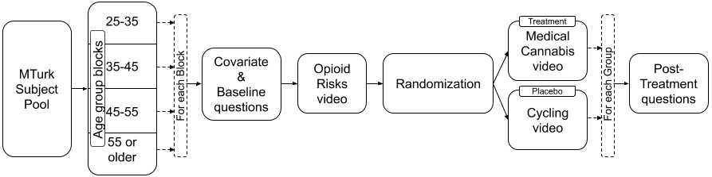

W241 - Pilot Experiment
================
Desire to learn about the benefits of medical cannabis for chronic pain?

# Background

Did you know that September is Pain Awareness month?\(^{[1]}\). Pain is
regarded as chronic when it lasts or recurs for more than 6 months.
According to the Centers for Disease Control and Prevention
(CDC)\(^{[2]}\), in 2016, approximately 20% of U.S. adults had chronic
pain (approximately 50 million individuals) and 8% of U.S. adults
(approximately 20 million individuals) had high-impact chronic pain. In
addition to the literal pain caused by this problem, the CDC\(^{[2]}\)
estimates that the chronic pain also costs Americans at least 560
billion USD per year in medical expenses, lost productivity, and
disability programs. Having chronic pain can additionally lead to other
health issues, including anxiety and depression.

The U.S. Department of Health and Human Services (HHS)\(^{[3]}\) has a
developmental objective to “decrease the prevalence of adults having
high-impact chronic pain”. No matter the cause, treatment for chronic
pain usually focuses not on curing it but on managing it - reducing the
pain and increasing people’s ability to move and function so their
day-to-day life can improve. Treatment options include prescription pain
medications, acupuncture, physical therapy, relaxation techniques,
biofeedback, massage therapy, psychotherapy, and behavior modification.

In the United States, individuals who suffer from pain are often
prescribed opioids\(^{[4]}\) to treat their conditions. Over-dependence
on opioids has contributed to an opioid crisis in the U.S. Many doctors
struggle to balance caring for patients with debilitating pain and
meeting new standards and guidelines for opioid prescriptions.

The dangers of prescription misuse, opioid use disorder, and overdose
have been a growing problem throughout the U.S. From 1999 to 2018, more
than 232,000 people died in the U.S. from overdoses involving
prescription opioids. Overdose deaths involving prescription opioids
were more than four times higher in 2018 than in 1999, according to
CDC\(^{[5]}\). Even as the amount of opioids prescribed and sold for
pain has increased, the amount of pain that Americans report has not
similarly changed. At present, this is almost a disproportionately
American problem - the U.S. constitutes less than 5 percent of the
world’s population yet consumes 80 percent of the world’s opioid
supply.

It is clear that opioids cannot be the end solution for chronic pain due
the ongoing opioid crisis in the United States. Solving the ‘chronic
pain problem’ represents a lucrative opportunity. Consequently,
researchers have begun to explore alternatives to opioids, such as
medical marijuana.

According to the National Institutes of Health’s National Center for
Complementary and Integrative Health\(^{[6]}\), medical marijuana, also
known as cannabis, has been used in medical treatment for more than
3,000 years for a plethora of conditions, including pain relief,
digestive issues, and psychological disorders. Some studies have
concluded that medical cannabis may be a viable alternative for
opioids\(^{[7]}\).

# Research Question

It is estimated that 2.1 million Americans (approximately 0.64% of U.S.
adults) use medical cannabis, whereas approximately 50 million Americans
(approximately 20% of U.S. adults) have chronic pain. The World Health
Organization (WHO) reports that an estimated 147 million people, 2.5% of
the world population, consume cannabis annually\(^{[8]}\).

In the U.S., the use of cannabis for medical purposes is legal in 33
states (as of before the 2020 election), four out of five permanently
inhabited U.S. territories, and the District of Columbia\(^{[9]}\).

The chemistry of cannabis is anything but straightforward, and its
complexity has made it difficult to discern long and short-term effects
on subjects. Consequently it is difficult to easily write a digestible
FAQ on the benefits and risks of the substance. Furthermore, cannabis is
generally considered to be a political subject in the United States. As
a result of its politicized nature, there are a lot of Americans writing
and sharing opinions about cannabis that do not necessarily rely on data
or scientific analysis. This onslaught of non-scientific information on
the subject has lead to copious amounts of misinformation on the subject
getting spread to the American population. As people are dying in the
U.S. from overdoses involving prescription opioids, can we educate
people suffering from chronic pain about the benefits of medical
cannabis? If yes, will they opt for medical cannabis?

Our research question is, ***‘Does providing some info on the benefits
of medical cannabis for chronic pain increase participants’ desire to
learn more?’***

# Research Design

## Idealized experimental design

Since chronic pain is a global issue, our idealized experiment would
include subjects living across the globe. We would only select subjects
who experience chronic pain and who live in states or countries where
medical marijuana is legal. Ideally, more than a million subjects would
be recruited to increase the experiment’s accuracy and to ensure the
results could be attributed globally. Subjects on pain medication and
not on medical cannabis could be recruited through social media ads and
print media advertisements. During the experiment execution phase,
subjects will be given one-on-one sessions at their homes on medical
cannabis benefits. We would also like to evaluate the treatment
subjects’ level of knowledge on cannabis by giving a simple exam
before and after the treatment. One-on-one sessions are better as many
people globally don’t have access to the internet or use technology.

## Non-idealized, realistic design given constraints

The idealized experimental design involves a lot of time and money. The
authors of this paper do not have enough of either to conduct this
experiment. Instead, we will narrow the scope of our subjects to only
U.S. subjects. We will accept subjects from all states and who are
experience all levels of pain (including none at all) and will treat
location and pain-level as covariates. Due to the ongoing COVID-19
pandemic, we are unable to conduct our surveys in person. Consequently,
we will conduct our research in an online setting - subjects will be
recruited through Amazon MTurk and will complete a survey through
Qualtrics.

Please find our hypotheses for this experiment below.

**Primary Outcome**  
*Desire to learn more about medical cannabis*  
\(H_{0}\): *There is no desire to learn more about medical cannabis’s
benefits for chronic pain after providing some info on medical cannabis
benefits.*

\(H_{a}\): *There is a desire to learn more about medical cannabis’s
benefits for chronic pain after providing some info on medical cannabis
benefits.*

**Other Outcomes**  
*Lot of misinformation about medical cannabis*  
\(H_{0}\): *There is no misinformation about medical cannabis.*

\(H_{a}\): *There is misinformation about medical cannabis.*

*Medical cannabis is addictive*  
\(H_{0}\): *Medical cannabis is not addictive.*

\(H_{a}\): *Medical cannabis is addictive.*

### Participants

**How participants are recruited**

The opioid epidemic is by far the most prevalent in the U.S..
Consequently, we believe it is acceptable to limit this experiment to
American subjects (around 250\~500 subjects). Since there is a risk of
non-homogeneity of subjects that we may get through social media,
subjects will be recruited using Amazon Mechanical Turk\(^{[10]}\).

**Location of participants**

The legalization status of marijuana varies from U.S. state to U.S.
state. Additionally, recent elections have also affected the
legalization of cannabis in different states. Each U.S. state falls into
one of the following categories: (Marijuana is completely illegal, Only
medical marijuana is legal, Recreational and medical marijuana are
legal, Medical marijuana is not yet legal but was legalized in the 2020
election, Recreational marijuana is not yet legal but was legalized in
the 2020 election). We will collect information on what state an
individual is from and the legal status of marijuana in that state and
consider it as a covariate in this analysis. To make sure that the
non-interference assumption is not violated, we will check the location
of each subject taking the survey using the subject’s IP address.

**Age of participants**

The legal age for consuming cannabis varies from state to state in the
US. Generally the legal age to consume cannabis is 21 years of age or
older. Consequently, we will not examine subjects who are aged less than
21 years old. MTurk blocks subjects at 18-25 and unfortunately we cannot
break this block into the more granular blocks of 18-21 and 21-25. Since
we can only ignore the block of subjects age 18-25, we will only allow
subjects to participate who are at least 25 years old. We believe it is
important to use MTurk’s blocks because it helps us minimize potential
*noncompliance issues*, such as the subjects lying about their age so
that they can get paid to take the survey.

Functionally, we believe that ignoring the age block of 18-25 is
acceptable sine the CDC reports\(^{[14]}\) that chronic pain is only
present in 8.5 percent of the population for the age group (18-29).  
**TODO: Check with Micah on not considering age from 21-24 in the
experiment. We will mention about it under ‘Limitations of Experiment
and Future Enhancements’ section.**

### Block Random Assignment

The subjects are blocked by age a)25-35, b)35-45, c)45-55 and d)55 or
older. This blocking gives similar potential outcomes as the severity of
the chronic pain varies across age groups and increases the statistical
power. This blocking also reduces sampling variability and improves the
precision of the estimated treatment effect. It will help us to do
further analysis based on age groups. Randomization will be done within
each block, and subjects will be assigned to treatment and placebo
groups accordingly.

  
 

### Treatment

All the subjects will be given an initial questionnaire, generated by
Qualtrics, to get information on the covariates. We will randomize the
subjects within the block and assign them to treatment and placebo
groups. Treatment group will be shown videos on Opioids - Risks & Side
effects and Benefits of Medical Cannabis. Placebo group will be shown
videos on Opioids - Risks & Side effects and Benefits of Cycling. In the
end, there will be post-treatment five point Likert scale questions. We
will ensure that the excludability assumption is not violated by showing
only the appropriate set of questions and videos to each group. The
experiment duration will be short and the results will be collected from
the Qualtrics service.

##### Treatment group videos

| Video | Title                          | Link                                              | Duration           |
| ----- | ------------------------------ | ------------------------------------------------- | ------------------ |
| 1     | Opioids - Risks & Side effects | [\[Opioids\]](https://youtu.be/y0mfzDAs1BE)       | 2 min. and 19 sec. |
| 2     | Benefits of Medical Cannabis   | [\[Med. Cannabis\]](https://youtu.be/OhJ0YaJXrJo) | 5 min. and 3 sec.  |

##### Placebo group videos

| Video | Title                          | Link                                                  | Duration           |
| ----- | ------------------------------ | ----------------------------------------------------- | ------------------ |
| 1     | Opioids - Risks & Side effects | [\[Opioids\]](https://youtu.be/y0mfzDAs1BE)           | 2 min. and 19 sec. |
| 2     | Benefits of Cycling            | [\[Cycling\]          ](https://youtu.be/xWo0FOwZVX0) | 5 min. and 3 sec.  |

### Confidentiality

We will not collect any personally identifiable information (PII) or
protected health information (PHI) about the subjects through this
experiment. The data we collect cannot uniquely identify a person and is
used for statistical analysis only. Health Insurance Portability and
Accountability Act (HIPAA) rules will not be violated as we are not
collecting any individually identifiable health information (and
consequently we will not be storing or transmitting this data).

### Risks

We recognize that one major risk to this study is that the current
COVID-19 pandemic might influence the user’s opinion in the
questionnaire. There is no way for us to ensure subjects will respond in
the same way now as they would have before the COVID-19 pandemic.
Another risk is that, due to time and budget constraints, PHI, and HIPAA
regulations, we cannot select only the subjects with chronic pain. A
third risk is that we are choosing not to ask about the severity of each
subject’s chronic pain, where the pain is, how long the pain lasts etc..
We feel justified in this choice as more data we collect we might be
violating PHI regulations as it becomes easy to create a profile of an
individual. However, not collecting this data will make it more
difficult to identify potential covariates or confounding variables. The
final risk that we identify here is that we are having subject’s answer
questions rather than relying on official medical records. Consequently,
there may be some data inaccuracies.

### Pilot experiment

In the pilot experiment, we used 30\~40 subjects from U.S. to improve
upon the research design before full experiment. We used blocking by age
groups 25-30 and 45-55 in order to pilot the experiment with one younger
group and one older group. Based on the pilot data analysis, we changed
the political affiliation question “Generally speaking, do you usually
think of yourself as a Republican, a Democrat, an Independent, or
Something else?” to “In general, how would you classify your political
beliefs? Liberal, Conservative, Independent/Other” in order to
generalize political affiliation.

**Power**

``` 

     Two-sample t test power calculation 

              n = 146.4383
          delta = 0.3
             sd = 1.03
      sig.level = 0.05
          power = 0.8
    alternative = one.sided

NOTE: n is number in *each* group
```

To achieve 80% power with a treatment effect of \~0.3 and standard
deviation of 1.03, we need \~150 subjects for our Full experiment.

### Full experiment

In the full, non-pilot, experiment, we use 200\~250 subjects to reduce
the variance and improve the results’ accuracy. This subject count will
vary based on the pilot experiment results (treatment effect, standard
deviation, statistical power, etc.). Also, updated blocking, covariates,
and questionnaires will be used based on the pilot experiment’s outcome.
The subjects are recruited from all the states where medical cannabis is
legal and age \>=25 years.

### Covariates

We monitored some of the covariates like Sex (Male/Female/Other),
Race/Ethnicity (American Indian or Alaska Native, Hispanic or Latino,
White, Black or African American, Asian, Native Hawaiian or Other
Pacific Islander, Other), Education (Less than high school, High school,
Some college, Bachelor’s degree or higher), Employment status (Employed,
Not employed). We also include an important covariate ‘Do you experience
chronic pain?’.

1.  Gender: Male/Female/Other.
2.  Age groups: a)25-35, b)35-45, c)45-55 and d)55 or older.
3.  Ethnic background (White, Black or African American,
    Hispanic/Latino, Asian, Other).
4.  Education (Less than high school, High school, Some college,
    Bachelor’s degree or higher).
5.  Employment status (Employed, Not Employed).
6.  State (available from Qualtrics meta information). Note: Using this
    covariate, we will create another covariate based on the data
    dynamically on cannabis legality type(Legal, Legal for medical use,
    Prohibited).
7.  Political beliefs (Liberal, Conservative, Independent/Other).
8.  Do you experience chronic pain?? (Yes/No).

**Baseline Question**(Likert 5 point scale)

The following question provides the baseline on the subjects knowledge
of prescription opioids and the problems associated with:

9.  Deaths due to overdoses involving prescription opioids are
    increasing.

**Post-treatment Questions**(Likert 5 point scale)

1.  Do you have a desire to learn about the benefits of medical cannabis
    for chronic pain?
2.  There is a lot of misinformation about medical cannabis.
3.  Medical cannabis is addictive.

### Data Quality

To improve the data quality, we will consider the following in our
design:

**1. Prevent Bots**

Include a CAPTCHA at the beginning to prevent bots from taking the
Survey. Qualtrics uses Google reCAPTCHA technology. According to
Qualtrics, if the score is less than 0.5, the response can be flagged as
a bot. We will filter out subjects where the CAPTCHA score is less than
0.5.

Total subjects with CAPTCHA score less than 0.5 are **0**.

**2. Fair pay**

Since fair pay and realistic completion times significantly impact data
quality from crowdsourced surveys\(^{[15]}\), we will offer fair
compensation. We calculated fair compensation by first estimating how
long it will take to complete this survey (approximately 10 minutes). We
then looked at the U.S. federal minimum wage (7.25 USD per hour) and
offered each user more than the federal minimum wage by paying them 1.50
USD for 10 minutes of work (or 9 USD per hour).

**3. Attrition check**

Total subjects who didn’t finish the Survey is **0**.  
TODO: Add info. on subjects who didn’t complete the Survey, if there are
any, in final experiment.

**4. Complier check**

**Participants from U.S.:** We will make sure that the participants are
from US location by checking the Qualtrics metadata information.

<!-- -->

**Exceptionally fast outliers:** Based on the Subjects’ total time taken
to complete the Survey, filter out data from the Subjects who are
statistical outliers (1 standard deviations below the mean of the time
taken). Since our videos in treatment and placebo groups will have equal
time, we will also compare these outliers between the treatment and
placebo groups to check for any abnormality. Note: Initially, we thought
of using attention check questions, since there is a threat of
post-treatment bias, we did not use those.

<!-- -->

| Duration | AssignmentGroup | IPAddress   | ResponseId         |
| -------: | :-------------- | :---------- | :----------------- |
|      270 | Placebo         | 73.230.6.45 | R\_A1h5TBMES8VRV8R |
|      402 | Placebo         | 69.235.0.51 | R\_2SibeEjM7BYHUPX |

**Duplicate subjects:** We apply due diligence to find out duplicate
subjects by checking IP address, latitude, longitude, and similarity in
covariates and filter them out.

| AssignmentGroup | Gender | AgeGroup | IPAddress     | ResponseId         |
| :-------------- | :----- | :------- | :------------ | :----------------- |
| Placebo         | Male   | 25-30    | 96.255.134.91 | R\_9ZBRV00EfelvR9n |
| Treatment       | Male   | 25-30    | 96.255.134.91 | R\_2s1PIRy4Vd2rtjo |

Total subjects after filtering are **34**.

# Observations and Outcome Measures

## Exploratory Data Analysis

### Assignment and Demographic data

<!-- -->

## Correlation

<!-- -->

TODO: Provide analysis

<!-- -->

## Covariate balance check

Much of the analysis we do relies on the assumption that (except for
some key characteristics) subjects are random. By ‘random’, we mean that
subjects have random personal backgrounds and histories (e.g. race,
religion, political affiliation) and that there is not a strong presence
of one background over another in our subject sample.

Practically, it is impossible to enforce complete randomization.
Consequently, in order for our assumption of complete randomness to hold
true, we now conduct a covariate balance check. The purpose of the
covariate balance check is to ensure that we have relatively balanced
responses to each of the potential covariates that we have identified in
this study. For the purposes of this covraiate balance check, we will
examine the factorized version of the covariates only.

It is important to note that age ranges are automatically balanced
because we blocked with an equal number of participants in each age
group and were able to enforce those blocks thanks to MTurk.

To increase our confidence, we also employ Bartlett’s test for
homogeneity of variances. This test will allow us to see if there is
different variation between the variables. The null hypothesis will be
that the variance is equal for all variables, so if we can reject this
null hypothesis then we can be more confident in the fact that the
covariates are balanced.

``` 

    Bartlett test of homogeneity of variances

data:  d$treated and factor(d$AgeGroup_f)
Bartlett's K-squared = 6.3502e-05, df = 1, p-value = 0.9936
```

``` 

    Bartlett test of homogeneity of variances

data:  d$treated and factor(d$ExperienceChronicPain_f)
Bartlett's K-squared = 0.0014847, df = 1, p-value = 0.9693
```

``` 

    Bartlett test of homogeneity of variances

data:  d$treated and factor(d$EmploymentStatus_f)
Bartlett's K-squared = 0.092863, df = 1, p-value = 0.7606
```

We can see from our Bartlett’s test of homogeneity of variances taht we
cannot reject the null hypothesis that any of these covariates are
homogeneous. The measn that we do not have a violation of the
homogeneity of variance between groups with respect to proceeding with
an ANOVA test on teh difference in means for our covariates of interest.

``` 

Call:
lm(formula = treated ~ 1 + ExperienceChronicPain_f + Gender_f + 
    AgeGroup_f + Education_f + EmploymentStatus_f + PoliticalAffiliation_f + 
    Ethnicity_f)

Residuals:
    Min      1Q  Median      3Q     Max 
-0.6340 -0.3593  0.0000  0.2737  0.7882 

Coefficients: (1 not defined because of singularities)
                                     Estimate Std. Error t value Pr(>|t|)  
(Intercept)                           0.17751    0.36756   0.483   0.6344  
ExperienceChronicPain_fYes            0.16578    0.20679   0.802   0.4322  
Gender_fFemale                        0.33435    0.23180   1.442   0.1647  
Gender_fOther                         1.41063    0.60903   2.316   0.0313 *
AgeGroup_f.L                         -0.24053    0.15875  -1.515   0.1454  
Education_f.L                        -0.44135    0.36728  -1.202   0.2435  
Education_f.Q                         0.25451    0.33773   0.754   0.4599  
Education_f.C                        -0.26280    0.27666  -0.950   0.3535  
EmploymentStatus_f.L                  0.37646    0.19712   1.910   0.0706 .
PoliticalAffiliation_fDemocrat       -0.09007    0.24322  -0.370   0.7150  
PoliticalAffiliation_fIndependent     0.28867    0.33931   0.851   0.4050  
PoliticalAffiliation_fSomething else -0.54618    0.53877  -1.014   0.3228  
Ethnicity_fHispanic/Latino            0.36015    0.56104   0.642   0.5282  
Ethnicity_fAsian                     -0.10799    0.36215  -0.298   0.7686  
Ethnicity_fOther                           NA         NA      NA       NA  
---
Signif. codes:  0 '***' 0.001 '**' 0.01 '*' 0.05 '.' 0.1 ' ' 1

Residual standard error: 0.4872 on 20 degrees of freedom
Multiple R-squared:  0.4416,    Adjusted R-squared:  0.07863 
F-statistic: 1.217 on 13 and 20 DF,  p-value: 0.3367
```

    Analysis of Variance Table
    
    Model 1: treated ~ 1 + ExperienceChronicPain_f + Gender_f + AgeGroup_f + 
        Education_f + EmploymentStatus_f + PoliticalAffiliation_f + 
        Ethnicity_f
    Model 2: treated ~ 1
      Res.Df    RSS  Df Sum of Sq      F Pr(>F)
    1     20 4.7464                            
    2     33 8.5000 -13   -3.7536 1.2166 0.3367

We can see that the p-value for our F-test is greater than 0.02, which
means that we cannot reject that there is variance. In the context of
this experiment, this is a good result, as this likely in turn means
that there is variance and the covariates are balanced.

## Regression Analysis

``` 

1) Desire to learn about the benefits of medical cannabis for chronic pain?
=======================================================================
                                            Dependent variable:        
                                     ----------------------------------
                                             MC_DesireToLearn_n        
                                       (1)      (2)     (3)      (4)   
-----------------------------------------------------------------------
treated                              1.573***  1.461   1.499    1.363  
                                     (0.596)                           
treated:ExperienceChronicPain_fYes   -1.356*  -1.353   -1.547   -1.438 
                                     (0.693)                           
ExperienceChronicPain_fYes            1.264*   1.293   1.410    1.318  
                                     (0.681)                           
OpioidsDeathsIncreasing_n             0.219    0.228   0.257    0.316  
                                     (0.204)                           
AgeGroup_f.L                          0.273    0.112   0.018    -0.018 
                                     (0.241)                           
Gender_fFemale                                 0.336   0.408    0.450  
                                                                       
Gender_fOther                                  1.016   1.034    1.216  
                                                                       
Ethnicity_fHispanic/Latino                             -0.455   -0.442 
                                                                       
Ethnicity_fAsian                                       -1.096   -1.373 
                                                                       
Ethnicity_fOther                                       -2.679   -2.557 
                                                                       
PoliticalAffiliation_fDemocrat                                  0.068  
                                                                       
PoliticalAffiliation_fIndependent                               0.459  
                                                                       
PoliticalAffiliation_fSomething else                                   
                                                                       
Constant                             2.032**   1.819   1.819    1.536  
                                     (0.884)                           
-----------------------------------------------------------------------
Observations                            34      34       34       34   
R2                                    0.379    0.409   0.678    0.690  
Adjusted R2                           0.268    0.250   0.537    0.513  
F Statistic                          3.417**  2.574** 4.834*** 3.891***
=======================================================================
Note:                                       *p<0.1; **p<0.05; ***p<0.01
```

``` 

2) There is a lot of misinformation about medical cannabis
========================================================================
                                             Dependent variable:        
                                     -----------------------------------
                                                MC_MisInfo_n            
                                       (1)    (2)    (3)    (4)    (5)  
------------------------------------------------------------------------
treated                               0.170  0.218  0.043  -0.246 -0.065
                                     (0.455)                            
OpioidsDeathsIncreasing_n             0.184  0.148  0.132  -0.013 -0.072
                                     (0.297)                            
ExperienceChronicPain_fYes            0.145  0.170  0.281  0.587  0.775 
                                     (0.510)                            
Gender_fFemale                               -0.104 0.353  0.602  0.451 
                                                                        
Gender_fOther                                -0.789 -0.110 -0.003 -0.470
                                                                        
AgeGroup_f.L                                        -0.567 -0.630 -0.524
                                                                        
PoliticalAffiliation_fDemocrat                             -0.486 -0.447
                                                                        
PoliticalAffiliation_fIndependent                          -0.065 -0.574
                                                                        
PoliticalAffiliation_fSomething else                       -3.324 -3.360
                                                                        
Ethnicity_fHispanic/Latino                                        -2.066
                                                                        
Ethnicity_fAsian                                                  1.007 
                                                                        
Ethnicity_fOther                                                        
                                                                        
Constant                             2.760** 2.956  2.793  3.633  3.794 
                                     (1.260)                            
------------------------------------------------------------------------
Observations                           34      34     34     34     34  
R2                                    0.032  0.046  0.139  0.377  0.526 
Adjusted R2                          -0.065  -0.124 -0.052 0.143  0.288 
F Statistic                           0.332  0.273  0.728  1.613  2.215*
========================================================================
Note:                                        *p<0.1; **p<0.05; ***p<0.01
```

``` 

3) Medical cannabis is addictive
========================================================================
                                             Dependent variable:        
                                     -----------------------------------
                                               MC_Addictive_n           
                                       (1)    (2)    (3)    (4)    (5)  
------------------------------------------------------------------------
treated                              -0.096  -0.362 -0.595 -0.760 -0.499
                                     (1.190)                            
OpioidsDeathsIncreasing_n             0.038  0.146  0.124  0.020  0.128 
                                     (0.391)                            
ExperienceChronicPain_fYes            0.781  0.304  0.451  0.644  0.688 
                                     (0.767)                            
treated:ExperienceChronicPain_fYes   -0.658                             
                                     (1.350)                            
Gender_fFemale                               -1.024 -0.417 -0.253 -0.540
                                                                        
Gender_fOther                                -1.285 -0.383 -0.404 -0.698
                                                                        
AgeGroup_f.L                                        -0.753 -0.767 -0.762
                                                                        
PoliticalAffiliation_fDemocrat                             -0.181 -0.134
                                                                        
PoliticalAffiliation_fIndependent                          -0.050 -0.327
                                                                        
PoliticalAffiliation_fSomething else                       -2.113 -1.919
                                                                        
Ethnicity_fHispanic/Latino                                        -3.032
                                                                        
Ethnicity_fAsian                                                  0.278 
                                                                        
Ethnicity_fOther                                                        
                                                                        
Constant                              2.551  2.905  2.688  3.183  2.799 
                                     (1.754)                            
------------------------------------------------------------------------
Observations                           34      34     34     34     34  
R2                                    0.069  0.182  0.278  0.332  0.452 
Adjusted R2                          -0.060  0.036  0.117  0.081  0.178 
F Statistic                           0.535  1.244  1.730  1.324  1.651 
========================================================================
Note:                                        *p<0.1; **p<0.05; ***p<0.01
```

As expected, applying the treatment on a subject generally causes that
subject to view medical cannabis more favorably. The subjects in the
treatment group agree more about the benefits of medical cannabis on
chronic pain and believe that there is lot of misinformation about
medical cannabis. They also tend to agree more that medical cannabis is
NOT addictive.

# Conclusion

TODO

# Limitations of Experiment and Future Enhancements

1.  In a future experiment, it will be good to include socioeconomic
    status\(^{[12]}\) by considering the family size and household
    income.  
2.  The current design doesn’t include subjects from ages 21 to 24. In
    the future, have them also in the experiment with tight control on
    compliance issues.

# References

\[1\] [U.S. Pain Foundation](https://uspainfoundation.org/)  
\[2\] [CDC: Prevalence of Chronic Pain Among U.S.
Adults](https://www.cdc.gov/mmwr/volumes/67/wr/mm6736a2.htm)  
\[3\] [U.S. Department of Health and Human
Services](https://www.healthypeople.gov/)  
\[4\] [NIH: Opioids and the Treatment of Chronic
Pain](https://www.ncbi.nlm.nih.gov/pmc/articles/PMC2711509/)  
\[5\] [CDC: Opioid Overdose in
U.S.](https://www.cdc.gov/drugoverdose/data/prescribing/overview.html)  
\[6\] [NIH: Cannabis (Marijuana) - What You Need To
Know](https://nccih.nih.gov/health/marijuana)  
\[7\] [Medical Cannabis for Chronic
Pain](https://www.uspharmacist.com/article/medical-cannabis-for-chronic-pain)  
\[8\] [WHO: Global Cannabis
consumption](www.who.int/substance_abuse/facts/cannabis/en)  
\[9\] [Legalization of medical cannabis in the
U.S.](https://en.wikipedia.org/wiki/Medical_cannabis_in_the_United_States)  
\[10\] [Amazon Mechanical Turk](https://www.mturk.com/)  
\[11\] [Cannabis laws by
state](https://weedmaps.com/learn/laws-and-regulations/)  
\[12\] [HHS: Poverty guidelines and
poverty](https://aspe.hhs.gov/frequently-asked-questions-related-poverty-guidelines-and-poverty)  
\[13\] [Types of Survey
Questions](https://conjointly.com/kb/types-of-survey-questions/)  
\[14\] [CDC: Chronic Pain Among U.S.
Adults, 2019](https://www.cdc.gov/nchs/products/databriefs/db390.htm)  
\[15\] [Data Quality from Crowdsourced
Surveys](https://iaap-journals.onlinelibrary.wiley.com/doi/epdf/10.1111/apps.12124)

# Appendix

## Questions

**1. What is your Gender?**

  - Male
  - Female
  - Other

**2. Please specify your ethnicity**

  - White
  - Black or African American
  - Hispanic/Latino
  - Asian
  - Other

**3. What is the highest level of school you have completed or the
highest degree you have received?**

  - Less than high school
  - High school
  - Some college
  - Bachelor’s degree or higher

**4. What is your Employment status?**

  - Employed
  - Not Employed

**5. In general, how would you classify your political beliefs?**

  - Liberal
  - Conservative
  - Independent/Other

**6. Do you experience chronic pain?**

  - Yes
  - No

### Baseline question

**7. Deaths due to overdoses involving prescription opioids are
increasing.**

  - Strongly agree
  - Somewhat agree
  - Neither agree nor disagree
  - Somewhat disagree
  - Strongly disagree

### Outcome questions

**8. Do you have a desire to learn about the benefits of medical
cannabis for chronic pain?**

  - Strongly agree
  - Somewhat agree
  - Neither agree nor disagree
  - Somewhat disagree
  - Strongly disagree

**9. Medical cannabis is generally portrayed as more harmful than it
actually is**

  - Strongly agree
  - Somewhat agree
  - Neither agree nor disagree
  - Somewhat disagree
  - Strongly disagree

**10. There is a lot of misinformation about medical cannabis**

  - Strongly agree
  - Somewhat agree
  - Neither agree nor disagree
  - Somewhat disagree
  - Strongly disagree

**11. Medical cannabis is addictive**

  - Strongly agree
  - Somewhat agree
  - Neither agree nor disagree
  - Somewhat disagree
  - Strongly disagree

## Videos

### Both Treatment and Placebo groups (Opioids - Risks and Side effects)

[](https://youtu.be/y0mfzDAs1BE)

### Treatment group (Benefits of Medical Cannabis)

[](https://youtu.be/OhJ0YaJXrJo)

### Placebo group (Benefits of Cycling)

[](https://youtu.be/xWo0FOwZVX0)

## Additional EDA

### Desire to learn about the benefits of medical cannabis for chronic pain?

<!-- -->

<!-- -->

### There is a lot of misinformation about medical cannabis

<!-- -->

<!-- -->

### Medical cannabis is addictive

<!-- -->

<!-- -->
